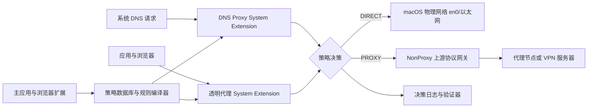

# NonProxy 完整产品方案

> 版本：V1.0
> 目标平台：macOS 首发，Windows 后续
> 产品目标：让不懂网络规则的用户，只需选择一个应用或点击一个网站，即可稳定、可验证地决定其流量“直连”或“走 VPN/代理”。

## 0. 执行结论

NonProxy 不应被设计成“向任意现有 VPN 配置里写几条规则”的小工具。要达到完整、稳定、可验证的效果，它必须成为电脑上的唯一流量决策点。

推荐的最终架构是：

1. 使用 `NETransparentProxyProvider` 接收系统 TCP/UDP 流量。
2. 用户标记为直连的流量直接交还 macOS，由物理网卡发出。
3. 需要代理的流量由 NonProxy 接管，发送到内置的上游协议网关。
4. 使用 `NEDNSProxyProvider` 统一处理 DNS、域名归属、直连 DNS 与代理 DNS。
5. 使用 Safari/Chromium 浏览器扩展完成“一键让当前网站直连”和标签页级关联域名学习。
6. 对能够公开配置的 VPN 提供适配器；对可导出标准协议的 VPN 直接导入；对封闭专有 VPN 提供隔离胶囊作为高级兜底，但不承诺无条件兼容。

Apple 明确允许透明代理根据流量来源应用或目标决定“接管”还是“交还系统处理”。这正好满足应用级直连需求：

- [Apple：Handling Flow Copying](https://developer.apple.com/documentation/networkextension/handling-flow-copying)
- [Apple：NETransparentProxyNetworkSettings](https://developer.apple.com/documentation/networkextension/netransparentproxynetworksettings)
- [Apple：Network Extension 部署要求](https://developer.apple.com/documentation/technotes/tn3134-network-extension-provider-deployment)

## 1. 产品定位

### 1.1 一句话定位

NonProxy 是一个面向普通用户的 macOS 智能分流网关：用户只选择应用或网站，系统自动完成进程识别、关联域名发现、DNS 分流、流量路由和结果验证。

### 1.2 核心用户

- 长期开启 VPN，但银行、支付、办公、政务、游戏等软件需要直连的用户。
- 使用多个 VPN/代理客户端，不理解规则语法的用户。
- 不知道软件实际访问哪些 API、CDN、登录服务的用户。
- 需要证明某个应用或网站确实没有经过代理出口的用户。

### 1.3 产品承诺

在支持的运行模式中，NonProxy 必须做到：

- 选择应用即可让该应用全部直连，不需要用户提供域名。
- 点击当前网站即可创建网站直连策略。
- 自动发现网站关联的 API、登录、静态资源和 CDN 域名。
- 明确显示每条连接命中了什么策略、走了哪个出口。
- 配置错误能够自动回滚。
- 不解密 HTTPS，不安装中间人根证书，不采集正文内容。

### 1.4 明确不承诺的事情

- 不绕过企业 MDM、强制 Always-On VPN 或组织安全策略。
- 不保证在一个封闭 VPN 已强制接管全部流量时，从其外部抢夺路由权。
- 不保证所有专有 VPN 都能导入或运行在隔离环境中。
- 不隐藏系统中存在 VPN/虚拟网卡的事实。主动检测 VPN 环境的软件仍可能发现它。
- 不通过 TLS 中间人方式识别网站内容。

## 2. 为什么不能只做“通用配置器”

当前 Mac 的默认 IPv4 路由已由 `utun` 接管。这类 VPN 的直连权通常掌握在隧道提供者手里。Apple 的 `includedRoutes`、`excludedRoutes` 和 `includeAllNetworks` 也都是由 VPN 提供者配置：

- [Apple：Routing your VPN network traffic](https://developer.apple.com/documentation/networkextension/routing-your-vpn-network-traffic)

因此，仅靠修改系统 HTTP 代理、PAC、浏览器“不使用代理”、`route` 或 `pf`，都不能形成稳定的通用产品：

- 系统代理不覆盖所有软件。
- 路由表只能可靠匹配 IP，无法稳定表达域名、CDN 和共享 IP。
- IPv4、IPv6、QUIC、DNS 和网络切换会让静态路由持续失效。
- 第二个普通应用无法保证覆盖现有 VPN 的 `includeAllNetworks` 或强制路由。
- macOS 原生 Per-App VPN 的很多配置路径面向受管理设备，不适合作为普通消费级产品的唯一基础。

完整产品必须改变拓扑：主机基础网络保持直连，由 NonProxy 决定哪些连接送入代理，而不是先让所有连接进入第三方 VPN，再尝试把少数连接捞出来。

## 3. 总体架构



### 3.1 控制面

由以下组件组成：

- Avalonia 12 桌面应用，macOS 与 Windows 共用 C#/AXAML 页面和 ViewModel。
- 跨平台系统托盘与原生菜单快捷控制。
- 策略编辑器。
- VPN/代理导入器。
- 连接学习与诊断界面。
- Safari Web Extension。
- Chrome、Edge、Firefox Manifest V3 扩展。
- 本地策略数据库。
- 适配器管理器。

控制面只管理配置，不直接转发大流量。

### 3.2 决策面

决策面把所有用户选择编译成不可歧义的策略快照：

- 应用身份。
- 网站域名。
- 网络环境。
- 目标端口和协议。
- 出站动作。
- 失败策略。
- 规则来源与优先级。

策略快照通过受控 IPC 下发给 System Extension，并带版本号、哈希和回滚点。

### 3.3 数据面

推荐使用两类 Network Extension：

1. `NETransparentProxyProvider`
   - 接收 TCP/UDP 流。
   - 获取来源应用、远端地址和可用主机名信息。
   - DIRECT 流量返回给系统直接处理。
   - PROXY 流量进入 NonProxy 上游网关。

2. `NEDNSProxyProvider`
   - 接管系统 DNS。
   - 根据应用和域名决定直连解析或代理解析。
   - 维护域名、CNAME、IP、TTL 和策略归属映射。
   - 支持 UDP DNS、TCP DNS、DoH 和 DoT 上游。

Apple 文档明确说明 DNS Proxy 可以接管系统 DNS 查询：

- [Apple：DNS proxy provider](https://developer.apple.com/documentation/networkextension/dns-proxy-provider)

### 3.4 上游协议网关

上游网关负责把 PROXY 流量送入用户的代理/VPN：

- HTTP CONNECT。
- SOCKS5。
- Shadowsocks。
- VMess/VLESS。
- Trojan。
- Hysteria 2。
- TUIC。
- WireGuard。
- OpenVPN。
- OpenConnect。
- 供应商提供的本地代理端口。

开发早期可使用成熟路由内核验证协议覆盖，但发布前必须完成许可证审查。sing-box 当前使用 GPLv3，不能假设“作为子进程运行”就自动消除许可证义务：

- [sing-box 官方仓库与许可证](https://github.com/SagerNet/sing-box)
- [sing-box 路由字段](https://sing-box.sagernet.org/configuration/route/rule/)

推荐决策：

- 内部自用或完整开源产品：可以优先采用 sing-box，加快协议和路由能力交付。
- 闭源商业产品：先做正式法律和许可证评估；必要时拆分协议模块、采购商业实现，或使用许可证更宽松的独立组件。
- WireGuard 可优先评估 MIT 许可的 WireGuardKit：
  [WireGuard Apple 官方镜像](https://github.com/WireGuard/wireguard-apple)

## 4. 三种运行模式

### 4.1 完整网关模式

这是默认模式，也是唯一能够形成统一体验的模式。

工作方式：

1. 用户断开原 VPN 客户端。
2. NonProxy 导入原 VPN 的节点、订阅或标准配置。
3. 主机基础网络恢复为直连。
4. NonProxy 捕获连接并决定 DIRECT/PROXY。
5. 用户不再需要同时运行原 VPN 客户端。

优点：

- 决策权唯一。
- 应用和网站规则结果可证明。
- DNS、IPv4、IPv6、TCP、UDP 和 QUIC 可以统一处理。
- 不受第三方客户端规则语法影响。

限制：

- 需要支持或导入上游协议。
- 专有 VPN 可能无法导入。

### 4.2 客户端适配模式

适用于 Surge、Clash/Mihomo、sing-box 等已有规则能力的客户端。

NonProxy 负责：

- 识别客户端和版本。
- 读取现有配置，不读取明文敏感凭据到日志。
- 生成原生规则。
- 备份和原子更新配置。
- 调用公开 API 或安全重载机制。
- 读取规则命中结果并在统一 UI 展示。

普通登记流程使用系统原生文件选择器，让用户明确选择客户端和当前主配置；系统选择器不可用
时才保留绝对路径粘贴作为高级回退。NonProxy 不扫描任意本机端口，也不遍历第三方私有配置
目录。所选文件始终只是未受信候选，必须经客户端版本检测、原生配置校验、活动配置绑定和
sidecar 路径门禁后才能登记或同步。

该模式可以快速覆盖大量现有用户，但每个适配器都必须声明能力：

```text
支持应用规则：是/否
支持域名规则：是/否
支持 DNS 分流：是/否
支持热重载：是/否
可验证出口：是/否
```

任何适配器不得因为“配置写入成功”就显示“已经直连”，必须以实际连接证据为准。
统一 UI 必须分别展示“客户端候选已校验”“配置已载入”“真实路径已确认”，没有第三级证据
时明确显示“尚未证明绕过 VPN”。

### 4.3 VPN 隔离胶囊模式

这是封闭 VPN 的高级兜底方案，不作为首发默认能力。

拓扑：

1. macOS 主机保持直连。
2. 专有 VPN 客户端运行在隔离虚拟机或独立网络设备内。
3. 隔离环境向主机暴露一个受认证的本地 SOCKS/HTTP 网关。
4. NonProxy 把 PROXY 流量送入胶囊，DIRECT 流量留在主机。

优点：

- 不需要修改封闭 VPN。
- 主机直连流量不进入专有 VPN。

限制：

- 资源占用高。
- 供应商可能禁止虚拟机或代理共享。
- 需要单独验证操作系统许可、VPN 服务条款、登录和更新行为。
- 某些 VPN 有设备绑定、反虚拟机或硬件认证，仍然无法支持。

## 5. 用户体验

### 5.1 首次启动

1. 检测系统版本、芯片、物理网卡和当前 VPN/TUN。
2. 检测设备是否受 MDM 管理或存在强制 VPN。
3. 自动识别可适配的客户端和可导入协议。
   - 优先只读发现系统已经公开的 SOCKS/HTTP 代理端点。
   - 不扫描任意本机端口，不读取第三方客户端私有配置或账号密码。
4. 推荐运行模式：
   - 可导入：推荐完整网关模式。
   - 可适配：提供适配模式。
   - 完全封闭：提示有限支持或隔离胶囊。
5. 请求安装并启用 Network/System Extension。
6. 导入配置，凭据存入 Keychain。
7. 运行自检：
   - 物理网络出口。
   - 代理网络出口。
   - DNS 出口。
   - IPv4/IPv6。
   - TCP/UDP。
8. 自检通过后才允许启用默认代理策略；代理握手结果必须属于当前配置且仍在 60 秒
   新鲜窗口内，过期、失败或配置变化后必须重新测试。

首次使用不保存一个永久的“向导已完成”标志。运行概览持续从系统组件、默认代理、活动快照、
数据面确认和 Adapter 登记目录重算两条接入路径；授权撤销或后台离线后立即降级。MDM、
Always-On VPN 与任意第三方 TUN 在平台检测证据落地前不参与自动推荐，避免把猜测显示成
“已识别”。客户端协同即使已登记也保持待取证，不能因为配置同步成功显示已经绕过 VPN。

### 5.2 首页

首页只展示小白真正需要的信息：

```text
NonProxy 已启用
默认：走 VPN
直连应用：8 个
直连网站：16 个

最近连接
招商银行 → 直连
Safari / example.com → 直连
Telegram → 新加坡节点
```

每条记录都可以展开查看：

- 来源应用。
- 目标域名/IP。
- 命中规则。
- DIRECT/PROXY。
- 实际出口接口或节点。
- DNS 路径。
- 建连时间和失败原因。

### 5.3 添加直连应用

入口：

- 拖入 `.app`。
- 从“正在运行的应用”选择。
- 从 `/Applications` 选择。
- 在最近连接中点击“让这个应用始终直连”。

应用身份不能只使用进程名。应保存：

- Bundle Identifier。
- Code Signing Identifier。
- Designated Requirement。
- 主可执行文件。
- Helper/XPC 子进程关联。
- 可选的路径回退。

这样应用升级、改名或迁移路径后仍能匹配，同时避免同名恶意进程冒充。

### 5.4 添加直连网站

主要入口是浏览器扩展：

1. 用户打开网站。
2. 点击“当前网站直连”。
3. 扩展使用 `activeTab` 获取当前站点，尽量避免申请全部浏览历史权限。
4. 使用 Public Suffix List 计算正确的可注册域名，避免简单按最后两段切割。
5. 立即创建主域名规则。
6. 开启 60 秒学习窗口，发现当前标签页关联请求。
7. 把关联域名分成：
   - 必需的一方域名。
   - 高可信 API/登录/CDN。
   - 第三方统计/广告。
8. 只自动添加高可信必需域名；第三方域名让用户确认。

Apple 建议 Safari 扩展优先使用 `activeTab` 和最小化权限：

- [Apple：Managing Safari web extension permissions](https://developer.apple.com/documentation/safariservices/managing-safari-web-extension-permissions)

### 5.5 智能学习

#### 应用学习

用户选择“学习这个应用 60 秒”后：

- 观察应用及其 Helper 的连接。
- 聚合域名、IP、端口和协议。
- 不要求用户理解它们。
- 最终只询问：
  - 整个应用始终直连。
  - 仅当前服务直连。
  - 保持原设置。

如果选择“整个应用直连”，后续新增域名也自动直连，不需要重新学习。

#### 网站学习

网站学习依赖浏览器标签页上下文，避免把其他标签页的请求误归到当前网站。

关联评分至少考虑：

- 请求发起标签页。
- initiator。
- eTLD+1。
- CNAME 链。
- 请求时间窗口。
- 重复频率。
- 资源类型。
- 登录跳转关系。

## 6. 策略模型

### 6.1 用户层只保留两个动作

- `DIRECT`：走物理网络。
- `PROXY`：走选定代理/VPN。

高级版可以增加 `BLOCK`，但首版不应把防火墙产品的复杂度带入核心体验。

### 6.2 策略对象

```text
Policy
  id
  display_name
  source_kind: app | site | cidr | system | adapter
  app_identity
  domain_match
  network_match
  protocol_match
  action: direct | proxy | block
  outbound_id
  failure_mode
  priority
  enabled
  origin
  created_at
  updated_at
```

### 6.3 优先级

从高到低：

1. 系统安全规则：NonProxy 自身、代理服务器连接、Captive Portal、DHCP、必要局域网服务。
2. 用户明确的“应用 + 目标”组合规则。
3. 用户应用规则。
4. 用户网站规则。
5. 当前网络环境规则。
6. 已签名的内置规则集。
7. 默认策略。

同一优先级中：

- 更具体的规则优先。
- 用户规则高于订阅规则。
- 最近修改不能自动改变语义优先级。
- 冲突必须在 UI 中显示，不静默猜测。

### 6.4 网络配置档

支持按网络自动切换：

- 家庭 Wi-Fi。
- 公司网络。
- 手机热点。
- 有线网络。
- 未知公共网络。

普通用户不需要填写 SSID、网关地址或规则表达式。桌面端提供“检测当前网络”，在本机
选择当前可用的最佳脱敏指纹并建议一个通用名称；用户确认名称后点击“让此网络直连”，
应用依次保存网络配置档、创建引用该档案的网络规则并发布快照。界面必须分别显示
“草稿”“等待系统组件确认”和“已应用”，只有 Provider 确认后的 active 状态才能称为
生效。原始 Wi-Fi 名称不进入 UI、RPC、数据库、日志或策略快照。

典型策略：

- 家庭：默认代理，银行和影音直连。
- 公司：办公服务直连，其他代理。
- 公共网络：默认代理，只有用户明确选择的应用直连。

## 7. DNS 与域名设计

DNS 是完整效果的核心，不能作为附属功能。

### 7.1 分流 DNS

- DIRECT 域名：从物理接口访问直连 DNS/DoH。
- PROXY 域名：通过代理通道访问远端 DNS/DoH。
- 内网域名：使用对应网络或企业 DNS。
- DNS 查询结果带策略标签进入缓存。

### 7.2 防止错误分流

- 保存 CNAME 链而不是只保存最终 IP。
- 一个 IP 同时属于多个域名时，不直接把 IP 永久归类。
- 使用 TTL 到期清理映射。
- IPv4 与 IPv6 独立记录。
- 对 CDN 和 Anycast 不生成长期静态路由。
- 支持 Fake-IP 或等价域名映射，但必须排除局域网、Captive Portal 和冲突网段。

### 7.3 加密 DNS 和 ECH

- 应用自带 DoH 时，系统 DNS Proxy 可能看不到原始查询。
- 浏览器扩展可为网站规则补充标签页域名信息。
- TLS SNI 可作为辅助信号，但不能依赖它，因为 ECH 会隐藏 SNI。
- 对完全自带 DoH + ECH、没有浏览器扩展、直接连接 IP 的程序，网站级归属可能无法确定；应用级规则仍然可靠。

## 8. 故障与安全策略

### 8.1 默认失败行为

- DIRECT 规则：始终优先直连。
- 默认 PROXY：代理断开时默认 fail-closed，避免用户以为走代理但实际泄漏到直连。
- 用户可单独开启 fail-open，但必须明确警告。
- 代理服务器自身连接必须强制走物理接口，避免递归回环。

### 8.2 自动恢复

- 每份新策略先编译和校验，再原子切换。
- System Extension 保留上一份已知可用快照。
- 主应用崩溃不应导致所有网络中断。
- 数据面异常时：
  - DIRECT 规则继续交还系统。
  - PROXY 流量按 fail-closed/fail-open 策略处理。
- 检测 DNS 循环、代理循环、默认路由丢失和网卡切换。

### 8.3 紧急关闭

菜单栏提供：

- 暂停 NonProxy 5 分钟。
- 全部直连 5 分钟。
- 全部代理 5 分钟。
- 恢复上一个配置。
- 卸载 System Extension。

“恢复上一个配置”只使用后台返回的上一份真正生效快照，不按版本号减一猜测。操作前再次
核对当前活动版本且要求没有待确认快照；确认后生成新的回滚快照，并同时恢复历史默认路由。
界面在 Provider ACK 前只显示“等待系统组件确认”，不会把请求已保存写成已经恢复。当前
策略草稿保留，便于用户核对后重新发布。暂停、全部直连和全部代理使用独立的 5 分钟
运行态覆盖，不改写持久默认路由；绝对到期时间进入不可变快照，桌面端或 `gatewayd` 退出也
不会延长。安全系统规则始终优先。暂停表示把透明流量交回当前系统路由，因此系统 VPN 仍
可能处理这些流量，且 DNS 使用 SYSTEM 路由；全部直连才使用绑定物理网卡的隔离 DIRECT
路径。全部代理使用当前默认代理并保持 fail-closed。新请求和取消请求都先进入
`PENDING_ACK`，界面在 Provider 确认前不得显示已经生效。详见 ADR-0031。

卸载必须恢复：

- DNS。
- 代理配置。
- 路由。
- 客户端适配器修改。
- 浏览器 Native Messaging 配置。

## 9. 隐私与安全

### 9.1 隐私原则

- 不进行 TLS MITM。
- 不安装根证书。
- 不读取网页正文、表单、Cookie 或请求体。
- 默认仅保存元数据：
  - 应用身份。
  - 域名/IP。
  - 端口和协议。
  - 决策结果。
  - 时间和流量计数。
- 默认日志保留 24 小时，可关闭或调整。
- 敏感域名显示支持模糊化。
- 云同步默认关闭；若提供，必须端到端加密。

### 9.2 凭据

- 节点密码、私钥和 Token 存入 Keychain。
- UI、日志、崩溃报告和诊断包不输出明文凭据。
- 导出诊断包前执行结构化脱敏，并让用户预览。

### 9.3 系统权限

- 直接分发采用 Developer ID 签名、Notarization 和 System Extension。
- 使用 Network Extension entitlement。
- IPC 使用代码签名校验和最小权限。
- 升级包签名验证失败时拒绝安装。
- 规则订阅必须带签名、版本和回滚保护。

### 9.4 企业设备

发现以下任一情况时，默认拒绝启用绕过能力：

- MDM 强制 Always-On VPN。
- 组织强制代理或内容过滤。
- `enforceRoutes` 等受管路由策略。
- 系统策略明确禁止用户修改网络扩展。

产品应说明原因，而不是尝试规避组织策略。

## 10. 技术选型

### 10.1 跨平台桌面应用

- Avalonia 12。
- .NET 10 LTS。
- C# + AXAML。
- CommunityToolkit.Mvvm。
- macOS 与 Windows 共享页面、ViewModel、验证、主题和大部分 UI 自动化。
- 共享 UI 位于 `NonProxy.Desktop.Core`；Mac/Windows 只保留不含页面的薄启动宿主。
- 使用 Avalonia `TrayIcon`、`NativeMenu` 和平台主题适配。
- 通过生成的 Protobuf 控制客户端与 `gatewayd` 通信，不直接访问 SQLite、Network Extension 或 WFP。
- 使用 self-contained 发布，不要求普通用户预装 .NET。
- 平台差异通过 `IPlatformShell`、`ISystemComponentInstaller` 等小接口注入，禁止在 ViewModel 中堆积系统判断。

Avalonia 官方当前把 macOS 26 和 Windows 11 24H2 列为 Tier 1；首发最低版本 macOS 15 仍需要由项目自己的真实设备和 CI 回归矩阵补足：

- [Avalonia 支持平台](https://docs.avaloniaui.net/docs/supported-platforms)
- [Avalonia macOS 平台能力](https://docs.avaloniaui.net/docs/platform-specific-guides/macos)
- [Avalonia TrayIcon](https://docs.avaloniaui.net/controls/navigation/trayicon)

### 10.2 macOS 平台层

- Transparent Proxy Provider：Swift/C++。
- DNS Proxy Provider：Swift/C++。
- System Extension Controller：Avalonia Mac 薄宿主中的 `net10.0-macos` 平台服务；激活请求由最终 containing `.app` 提交。
- System Extension 构建、签名和最终打包：Swift/Xcode + macOS 发布脚本。
- 规则匹配核心可使用 Rust 静态库，以获得内存安全和可测试性。
- 大流量协议实现与 UI 进程隔离。
- IPC 消息使用版本化 schema，拒绝未知或降级不安全的配置。

### 10.3 Windows 平台层

- Windows Service。
- WFP ALE 应用识别、TCP/DNS connect redirect，以及 UDP flow identity。
- 远端非 53 UDP/QUIC 使用 `DATAGRAM_DATA` 有界搬运和 transport receive
  注入，覆盖 connected UDP 与无连接 `sendto`。
- 最小 Callout Driver 只做身份关联、重定向、定界复制和必要数据包构造，不
  包含规则编译、域名解析、代理协议或数据库。
- Service 统一执行 App/网站策略；DIRECT TCP/UDP/DNS 绑定可信物理接口，
  PROXY 保留系统 VPN 路径或使用配置的 SOCKS5 出口。
- Primitive Driver 使用架构修饰的 `DefaultInstall` 与 Driver Store；生产
  Catalog 必须取得 Microsoft Hardware Dev Center 签名。
- 发布目录由固定企业发布者、签名信任文件和完整 SHA-256 清单共同校验，复制
  到 `Program Files` 后再次校验再激活。
- 安装、修复、升级回滚和卸载使用同一受控入口；系统变更必须经过管理员权限与
  双重显式确认，工具不自动重启，卸载默认保留用户规则。
- Avalonia UI 只有在固定发布者的签名 bootstrap 和真实 Windows
  SCM/UAC/Driver 验收完成后，才提供系统组件安装入口。

### 10.4 浏览器扩展

- TypeScript。
- Manifest V3。
- Safari Web Extension 与 Chromium 扩展尽量共享核心代码。
- Safari 优先 `activeTab`。
- Chromium 使用 Native Messaging 与主应用通信。
- Firefox 作为第二阶段支持。

### 10.5 数据存储

建议主要表：

- `policy`
- `app_identity`
- `domain_target`
- `outbound`
- `network_profile`
- `policy_snapshot`
- `connection_decision`
- `dns_observation`
- `adapter_state`
- `health_probe`
- `migration_history`

连接明细与策略配置分库或分表，避免大量日志拖慢规则读取。

## 11. 可观测性与“真的直连”

产品不能把“规则已保存”当成“已经直连”。

每条连接至少形成以下证据：

```text
来源：com.example.bank
目标：api.example.com:443
策略：应用「Example Bank」直连
动作：DIRECT
系统接口：en0
DNS：Direct DoH
IPv4/IPv6：IPv4
连接状态：成功
```

验证层分为四级：

1. 配置证据：策略已生成。
2. 决策证据：连接命中 DIRECT/PROXY。
3. 路径证据：连接绑定物理接口或代理网关。
4. 出口证据：远端探针观察到预期公网 IP。

只有第 3 级以上才能在 UI 显示“已确认直连”。无法访问探针时，显示“路径已确认，公网出口未验证”。

## 12. 性能目标

首个正式版建议使用以下门槛：

- DIRECT 决策 p99 小于 2 ms。
- 策略更新到数据面生效小于 500 ms。
- UI 空闲 CPU 小于 0.5%。
- 所有常驻组件空闲 CPU 小于 1%。
- 常驻内存目标小于 200 MB，不随连接数持续增长。
- PROXY 吞吐相比所采用协议核心的原生基线下降不超过 10%。
- 支持至少 10,000 个并发流而不崩溃。
- 睡眠唤醒恢复目标小于 5 秒。
- Wi-Fi/有线/热点切换不产生永久 DNS 或代理失联。

## 13. 验收矩阵

### 13.1 系统

- Apple Silicon。
- Intel Mac（若决定支持）。
- macOS 15、26。
- 普通用户、管理员用户、多用户切换。
- 有线、Wi-Fi、手机热点。

首发只支持 Apple Silicon + macOS 15 及以上，Intel 和 macOS 14 作为市场需求确认后的扩展范围。

### 13.2 应用类型

- 原生 Swift/AppKit 应用。
- Electron 应用。
- Chromium 多进程应用。
- 沙盒应用。
- 带 XPC/Helper 的应用。
- 命令行程序。
- 游戏和高 UDP 应用。
- App Store 签名应用。
- 自更新并改变路径的应用。

### 13.3 浏览器

- Safari。
- Chrome。
- Edge。
- Firefox。
- 普通窗口、隐私窗口、多个 Profile。
- 多标签页并发。
- HTTP/2、HTTP/3、WebSocket。

### 13.4 网络协议

- IPv4。
- IPv6。
- TCP。
- UDP。
- QUIC。
- DNS UDP/TCP。
- DoH/DoT 上游。
- CNAME/CDN/Anycast。
- Captive Portal。
- 局域网和 mDNS。

### 13.5 上游

- HTTP/SOCKS。
- WireGuard。
- OpenVPN。
- 至少两类现代代理协议。
- 供应商本地代理。
- 节点故障和自动切换。
- 凭据过期。

### 13.6 故障

- 主应用崩溃。
- System Extension 重启。
- 上游协议核心崩溃。
- DNS 上游失败。
- 网络断开重连。
- 睡眠唤醒。
- 策略数据库损坏。
- 升级中断。
- 磁盘空间不足。
- 时钟跳变。

## 14. 核心验收用例

### 14.1 应用直连

1. 默认策略为 PROXY。
2. 将目标应用加入直连。
3. 应用访问多个此前未知的域名、IPv4/IPv6、TCP/UDP。
4. 所有可归属于该应用的连接均命中 DIRECT。
5. DNS 走直连解析路径。
6. 其他应用仍走 PROXY。
7. 应用更新版本后规则仍然有效。

### 14.2 网站直连

1. 默认策略为 PROXY。
2. 在浏览器扩展中点击当前网站直连。
3. 当前站点主域名和已确认依赖走 DIRECT。
4. 同一浏览器的其他标签页仍走 PROXY。
5. 登录跳转和 CDN 依赖不会因漏配而导致页面半加载。
6. 第三方广告/统计域名不会被无条件自动直连。

### 14.3 防泄漏

1. 默认策略为 PROXY 且 fail-closed。
2. 主动断开代理节点。
3. PROXY 流量不得退回物理网络。
4. DIRECT 应用仍可正常上网。
5. DNS 不得为 PROXY 域名静默切换到直连上游。

### 14.4 配置回滚

1. 应用一份故意无效的新配置。
2. 编译检查必须拒绝切换。
3. 当前数据面继续使用上一份有效快照。
4. UI 给出可理解的错误和修复建议。

## 15. 分阶段交付

### Phase 0：架构验证，2～3 周

必须证明：

- Transparent Proxy 能区分来源应用。
- DIRECT 流可以稳定交还物理网络。
- PROXY 流可以通过一个本地 SOCKS/HTTP 上游。
- DNS Proxy 可以记录和路由查询。
- Safari/Chrome 扩展可以把当前标签页规则传给主应用。
- 与当前机器的 `utun` 场景完成冲突检测。
- Avalonia macOS self-contained 应用可以通过平台桥接安装、查询和卸载 System Extension。
- Avalonia 托盘、NativeMenu、主题、辅助功能和窗口恢复满足 macOS 发布门槛。

交付物：

- 无 UI 或极简 UI 的技术原型。
- 真实连接证据。
- 性能和内存基线。
- entitlement、签名和部署风险清单。

### Phase 1：可用 Alpha，4～6 周

- Avalonia 跨平台托盘/菜单栏应用。
- 应用直连。
- 网站直连。
- Safari/Chrome 扩展。
- HTTP/SOCKS 上游。
- 规则优先级。
- 决策日志。
- DNS 分流。
- 原子配置与回滚。

### Phase 2：完整 Beta，6～8 周

- 标准协议导入。
- 订阅管理。
- WireGuard/OpenVPN 或选定现代代理核心。
- 网络 Profile。
- 智能学习。
- Clash/Mihomo、Surge、sing-box 适配器。
- 出口验证。
- 自动更新和诊断包。

### Phase 3：生产化，6～10 周

- 7×24 小时稳定性。
- 大流量和高并发。
- 睡眠唤醒与网络漫游。
- 安全审计。
- 许可证审查。
- Developer ID、Notarization、System Extension 安装和升级。
- 完整卸载恢复。
- 可选隔离胶囊验证。

完整生产级产品，建议按 3～5 人团队、4～6 个月估算。单人可以完成原型和 Alpha，但不应把原型稳定性当成生产完成度。

## 16. 团队配置

建议最小团队：

- 1 名 macOS/Network Extension 工程师。
- 1 名网络协议/DNS 工程师。
- 1 名 .NET/Avalonia 与浏览器扩展工程师。
- 1 名 QA/自动化工程师。
- 产品设计和安全审计可阶段性投入。

## 17. 关键风险与处理

| 风险 | 影响 | 处理 |
|---|---|---|
| 任意 VPN 全兼容不可能 | 用户预期落差 | 能导入、能适配、隔离胶囊三级能力声明 |
| Apple entitlement/系统扩展部署 | 无法安装或分发 | Phase 0 最先验证，不拖到发布前 |
| DNS 与域名误归属 | 网站半加载或泄漏 | DNS Proxy、标签页上下文、TTL/CNAME 模型 |
| 多进程应用归属错误 | 规则漏匹配 | Bundle/签名/Helper 关系，不依赖进程名 |
| 代理断开后直连泄漏 | 安全风险 | 默认 fail-closed，出口验证 |
| 开源内核许可证 | 商业发布风险 | 立项阶段完成许可证路线决策 |
| 高并发 UDP/QUIC | 性能和稳定性 | 独立压力测试、背压、连接上限和快路径 |
| 企业安全策略冲突 | 合规风险 | 检测 MDM/Always-On，拒绝绕过 |
| 浏览器扩展权限过大 | 隐私与商店审核 | 优先 activeTab、可选权限、无正文采集 |
| macOS 15 需要项目自建回归矩阵 | UI 与 System Extension 回归风险 | 项目自建真实设备矩阵，必要时购买商业支持 |
| 误认为跨平台 UI 等于无平台代码 | System Extension/WFP 无法落地 | UI 统一，平台高权限捕获和安装层继续隔离 |

## 18. 最终推荐范围

为了既达到完整效果，又避免项目无限膨胀，首个正式产品建议锁定：

- Apple Silicon。
- macOS 15 及以上。
- 完整网关模式为主。
- Transparent Proxy + DNS Proxy。
- 默认全局 PROXY，用户选择应用/网站 DIRECT。
- Safari、Chrome、Edge。
- HTTP、SOCKS、WireGuard，加一组主流订阅协议。
- Clash/Mihomo、Surge、sing-box 三类适配器。
- 本地优先，不做账号和云同步。
- 不首发隔离胶囊、企业 MDM 管理和 Windows。

这一路线已经覆盖产品最核心的完整体验：

> 用户只选择应用或点击网站；直连流量从未进入 VPN，代理流量由 NonProxy 统一发送；每个结果都有实际路径证据。
