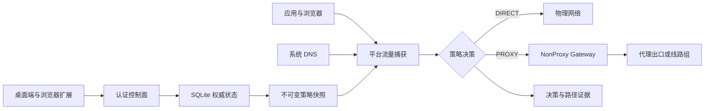

# NonProxy

> 本地优先、可验证的跨平台智能分流网关。

[](https://github.com/fanslead/non_proxy/actions/workflows/ci.yml)
[](https://github.com/fanslead/non_proxy/releases)
[](docs/MACOS_SYSTEM_ACCEPTANCE.md)
[](docs/WINDOWS_SYSTEM_ACCEPTANCE.md)

NonProxy 让用户通过选择应用或网站，明确决定对应流量是直接连接物理网络，还是经指定代理
出口访问。它统一处理应用身份、网站域名、DNS、TCP/UDP、策略发布、故障切换和路径证据，
不要求普通用户理解不同代理客户端的规则语法。

> [!IMPORTANT]
> NonProxy 目前处于 `0.0.x` 开发预览阶段。仓库测试、交叉编译或临时签名不等于正式安装包
> 已通过系统授权和真实 VPN 网络验收。请只从本仓库的
> [Releases](https://github.com/fanslead/non_proxy/releases) 页面下载发布产物，并核对对应版本的
> 签名与 SHA-256 清单。

## 为什么需要 NonProxy

普通 VPN 或代理客户端即使没有启用“全局模式”，仍可能因为系统路由、DNS、虚拟网卡或应用
自身行为接管不希望代理的流量。简单修改系统代理、PAC 或静态路由无法稳定覆盖所有软件、
IPv4/IPv6、TCP/UDP、QUIC、CDN 和网络切换场景。

NonProxy 将自身作为统一的流量决策点：

- 应用规则直接使用签名身份，不依赖容易冲突的进程名。
- 网站规则由浏览器标签页发起，不要求用户查找 API、登录或 CDN 域名。
- `DIRECT` 流量绑定可信物理路径，避免先进入第三方 VPN 再尝试绕出。
- `PROXY` 流量通过受控出口发送，失败时严格执行显式 `fail-closed` 或 `fail-open`。
- 配置、决策、实际路径和公网出口分别取证，不把“保存成功”误报成“已经直连”。

## 核心能力

| 能力 | 当前实现 |
|---|---|
| 应用直连 | macOS 签名应用身份；Windows Win32 Authenticode 与 MSIX/UWP 包身份 |
| 网站直连 | Safari/Chromium 扩展、标签页隔离、候选域名审核与幂等确认 |
| 统一数据面 | macOS Transparent/DNS Provider；Windows WFP TCP、DNS、UDP/QUIC |
| 代理出口 | SOCKS5、HTTP CONNECT、Shadowsocks TCP/UDP |
| 订阅管理 | HTTPS 公网安全获取、节点归属、自动刷新、失败退避和凭据回收 |
| 自动切换 | 有序线路组、固定目标健康探测、新连接切换和去敏审计 |
| 客户端协同 | Surge、Clash/Mihomo、sing-box 的显式登记、原生校验、原子写入与重载 |
| 策略发布 | 版本化快照、Provider ACK、上一有效配置恢复和五分钟紧急覆盖 |
| 可观测性 | 决策记录、物理/代理路径证据、签名出口回执和严格脱敏诊断包 |

当前内置 Shadowsocks 只接受六种 AEAD/AEAD-2022 方法，不接受 `none`、旧式流加密或
SIP003 plugin。VMess/VLESS、Trojan、Hysteria 2、TUIC、WireGuard、OpenVPN 和
OpenConnect 尚未作为内置协议开放。

## 工作原理



控制面只管理配置；高权限平台组件只消费经过认证、版本化和完整校验的不可变快照。代理协议、
订阅解析和数据库操作不会进入 macOS Provider 或 Windows Driver。

## 平台状态

| 平台 | 源码与自动化门禁 | 正式安装与真实网络验收 |
|---|---|---|
| Apple Silicon / macOS 15+ | Avalonia App、System Extensions、LaunchAgent、Safari 扩展及跨语言 E2E 已接入 | 需要 Developer ID、Provisioning Profile、Notarization、系统授权和真实 VPN 矩阵 |
| Windows x64 / ARM64 | 共享桌面端、SCM Service、WFP Driver、安装/回滚工具及 Windows CI 已接入 | 需要企业代码签名、Microsoft 内核签名、WDK/SCM/UAC、Driver Verifier 和真实 VPN 矩阵 |

详细通过标准：

- [macOS 系统组件验收](docs/MACOS_SYSTEM_ACCEPTANCE.md)
- [Safari Web Extension 验收](docs/SAFARI_EXTENSION_ACCEPTANCE.md)
- [Windows 系统组件与真实网络路径验收](docs/WINDOWS_SYSTEM_ACCEPTANCE.md)

## 下载与安装

公开版本统一发布在 [GitHub Releases](https://github.com/fanslead/non_proxy/releases)。资产分为
两类：

- **开发预览版**：Release 标记为 Pre-release，资产名包含 `development`。它用于源码、UI、
  Bundle 和开发签名验证，并保留明确的系统权限限制。
- **正式版本**：完成平台正式签名与真实系统验收后发布。一个正式可安装版本必须同时提供：

- macOS：Developer ID 签名、公证并附票据的 App 安装介质。
- Windows：按 x64/ARM64 分包、固定发布者签名且包含 Microsoft 内核签名 Driver 的安装介质。
- 每个资产对应的 SHA-256 摘要和明确的版本说明。

开发预览版的具体信任步骤和限制见
[开发预览版发布说明](docs/DEVELOPMENT_RELEASE.md)。缺少正式门禁的 CI Artifact、临时签名
App 或测试签名 Driver 不作为面向普通用户的正式安装包发布。

## 从源码开始

### 环境要求

- macOS 开发机：Apple Silicon、macOS 15+、完整 Xcode。
- Windows Driver：Windows 11、Visual Studio 2026（含 Driver Kit 组件）、固定 WDK/SDK NuGet
  包、PowerShell 7.4+。
- 仓库固定版本：.NET 10、Rust、Node.js、pnpm、Buf、Protobuf Compiler 和 just。

macOS 可以把完整工具链安装在仓库自己的 `.tools/`，不会修改系统默认版本：

```bash
./scripts/bootstrap/install-local-tools.sh
source ./scripts/bootstrap/env.sh
./scripts/bootstrap/check-prerequisites.sh
```

### macOS 本机完整运行

macOS 上要先区分两种完全不同的产物：

- `NonProxy-*-macos-universal-development.dmg` 是开发预览包，只用于验证 UI、Bundle、签名来源
  和无需受限权限的本地冒烟。它没有 NonProxy 专用 Provisioning Profile，不能登记完整网关所需的
  App Group、后台项目和 Network/System Extension。
- 完整网关必须由加入 Apple Developer Program 的同一团队签名，并把宿主、两个 System Extension
  和 Safari Web Extension 的有效 Profile 一起嵌入 App。Xcode 的免费 `Personal Team`
  [不支持 Network Extension Provider](https://developer.apple.com/forums/thread/128767)；不能用
  `launchctl`、临时签名或关闭仓库验收门禁代替。

若诊断显示 `NP_MAC_MISSING_ENTITLEMENT`，说明当前 App 缺少完整网关所需的 Profile 或受限签名权限；
`NP_MAC_APP_GROUP_UNAVAILABLE` 则表示签名声明了权限，但运行时仍无法访问
`group.com.nonproxy.shared`。这两种情况都不是重新启动应用就能恢复。Apple 对能力、Profile 和
System Extension 签名的要求见[macOS 支持的能力](https://developer.apple.com/help/account/reference/supported-capabilities-macos)、
[创建开发 Provisioning Profile](https://developer.apple.com/help/account/provisioning-profiles/create-a-development-provisioning-profile/)
和[安装 System Extension](https://developer.apple.com/documentation/systemextensions/installing-system-extensions-and-drivers/)。

#### 用户态开发调试模式

没有付费 Team 或受限 Profile 时，仍可一键启动 `gatewayd`、`adapter-host` 和连接到这两个服务的
macOS 桌面端：

```bash
./scripts/macos/run-development.sh
```

脚本会完成依赖恢复和 Debug 构建，把开发数据库、私有 Socket、能力文件与日志放在
`.artifacts/np-dev/`，关闭桌面端后停止本次启动的两个后台进程，但保留开发数据供
下次继续测试。可以验证：

- 桌面 UI 与控制服务连接、配置读写和诊断；
- 规则与网络出口的创建、编辑、校验和待发布状态；
- 订阅、客户端协同及 Adapter 的本地认证通信；
- `gatewayd` 和 `adapter-host` 的真实进程、私有 Socket 与能力文件。

首次进入“应用直连”会逐个校验本机应用身份和代码签名；应用较多时可能需要几十秒。页面会显示
不确定进度条，并在校验期间暂时禁用相关动作，完成后自动恢复“刷新应用”“从应用程序中选择”
和各行“设为直连”按钮。

只验证服务启动而不打开桌面端：

```bash
./scripts/macos/run-development.sh --smoke
```

需要隔离测试数据时可指定一个较短的绝对目录；脚本会在耗时构建前检查 macOS 的 103 字节
Unix Socket 路径上限：

```bash
./scripts/macos/run-development.sh --state-directory /tmp/nonproxy-dev-test
```

该模式不会登记 System Extension，不会捕获或改写本机真实流量，也不会伪造 Provider ACK、路径证据
或公网出口证据。因此规则可以保存和送达控制面，但可能保持“等待系统组件确认”；诊断继续显示
`NP_MAC_MISSING_ENTITLEMENT` 是预期行为。Transparent Proxy、DNS Proxy、真实分流和 VPN 共存仍需
下面的完整签名流程。

#### 1. 准备签名身份与 Profile

在同一个付费 Team 下注册 App Group `group.com.nonproxy.shared`，并为以下四个显式 App ID
创建 Mac App Development Profile：

| Bundle ID | 必需能力 |
|---|---|
| `com.nonproxy.desktop` | System Extension、Network Extension、App Groups |
| `com.nonproxy.desktop.transparent-proxy` | App Proxy Provider System Extension、App Groups |
| `com.nonproxy.desktop.dns-proxy` | DNS Proxy System Extension、App Groups |
| `com.nonproxy.desktop.safari-web-extension` | App Sandbox、App Groups |

四份 Profile 必须使用同一 Team、未过期，并覆盖仓库对应 `.entitlements` 中声明的权限。Profile
和签名证书属于本机受保护配置，不要复制进仓库、日志或诊断包。

#### 2. 构建完整签名 App

把下面的占位值替换为本机签名身份和四份 Profile 的绝对路径：

```bash
source ./scripts/bootstrap/env.sh

export NONPROXY_RESTRICTED_SIGNING=1
export NONPROXY_CODESIGN_IDENTITY='Apple Development: account@example.com (TEAMID)'
export NONPROXY_HOST_PROFILE='/absolute/path/NonProxyHost.provisionprofile'
export NONPROXY_TRANSPARENT_PROFILE='/absolute/path/NonProxyTransparent.provisionprofile'
export NONPROXY_DNS_PROFILE='/absolute/path/NonProxyDNS.provisionprofile'
export NONPROXY_SAFARI_PROFILE='/absolute/path/NonProxySafari.provisionprofile'

dotnet restore apps/desktop/NonProxy.Desktop.slnx \
  --locked-mode \
  -p:Configuration=Release

dotnet build apps/desktop/NonProxy.Desktop.Mac/NonProxy.Desktop.Mac.csproj \
  --configuration Release \
  --no-restore \
  --no-incremental \
  -p:CodesignKey="$NONPROXY_CODESIGN_IDENTITY"

NONPROXY_RESTRICTED_SIGNING=1 \
./scripts/macos/verify-system-extension-bundle.sh \
  apps/desktop/NonProxy.Desktop.Mac/bin/Release/net10.0-macos/NonProxy.app
```

构建和 Bundle 校验会拒绝缺失 Profile、嵌套签名无效或代码签名权限不完整的 App；后续系统
生命周期查询还会拒绝 Team、Bundle ID 或 Profile 有效期不一致。不要为了得到一个“能打开”的包
把 `NONPROXY_RESTRICTED_SIGNING` 改回 `0`；那会重新退化为只能验证 UI 的开发包。

#### 3. 安装并启用系统组件

退出正在运行的旧版 NonProxy，通过 Finder 将构建出的 `NonProxy.app` 放到 `/Applications`。
System Extension 必须由最终的 `/Applications/NonProxy.app` 发起，不能从 `bin/` 或 DMG 挂载目录运行。

先做只读查询，每次使用新的空证据目录：

```bash
mkdir -p artifacts/macos-system-e2e

./scripts/macos/system-lifecycle-e2e.sh \
  /Applications/NonProxy.app \
  query \
  artifacts/macos-system-e2e/query-001
```

确认允许本机网络接管状态发生变化后，再执行安装：

```bash
NONPROXY_ALLOW_SYSTEM_MUTATION=1 \
./scripts/macos/system-lifecycle-e2e.sh \
  /Applications/NonProxy.app \
  install \
  artifacts/macos-system-e2e/install-001
```

首次安装可能停在“等待系统允许”。进入“系统设置 → 通用 → 登录项与扩展”，分别允许 NonProxy
后台项目和两个网络扩展；返回应用后使用新的空目录（例如 `install-002`）重新执行安装验收。
密码、Touch ID 和系统授权必须由当前 Mac 用户本人完成。

安装通过时，证据必须同时显示：

- `gatewayAgent.ready=true`；
- `adapterHostAgent.ready=true`；
- Transparent Proxy 与 DNS Proxy 均为 `enabled=true`；
- 两份 Network Extension 偏好均为 `enabled=true`；
- `requiresReboot=false`。

#### 4. 配置和验证分流

1. 打开“网络出口”，添加并测试 SOCKS5、HTTP CONNECT 或 Shadowsocks 出口，再明确设为默认代理
   或加入默认线路组。
2. 在“应用直连”或“网站直连”添加目标；保存成功只表示生成了策略，等待活动快照和两个 Provider
   确认后才算进入数据面。
3. 打开“诊断”，确认控制服务、后台项目、两个扩展和网络接管全部就绪。
4. 打开“活动记录”，核对规则决策和物理接口/代理网关路径。只有配置或决策命中，不能声明
   “已确认直连”。

`system-lifecycle-e2e.sh` 证明系统组件生命周期，不自动证明 DIRECT 流量绕过任意第三方 VPN；
VPN 共存仍需按 [macOS 系统组件验收](docs/MACOS_SYSTEM_ACCEPTANCE.md) 保存路径和出口证据。

### 完整验证

```bash
source ./scripts/bootstrap/env.sh
just check
```

`just check` 包含契约生成一致性、格式、lint、Rust/.NET/TypeScript/Swift 测试、桌面构建、
macOS Bundle 检查及控制面、Adapter、Native Messaging、Provider 跨语言冒烟。

常用的定向命令：

```bash
just contracts
just format-check
just lint
just test
just native-bridge-smoke
just gateway-bundle-smoke
```

修改 `.proto` 后还应运行：

```bash
just contracts-breaking
```

## 仓库结构

```text
apps/desktop/   Avalonia 共享桌面 UI 与 macOS/Windows 薄宿主
crates/         Rust 领域模型、策略、DNS、存储、协议和安全核心
services/       gatewayd、adapter-host 与出口探针
platform/       macOS Network/System Extension 与 Windows WFP
adapters/       Surge、Mihomo、sing-box 规则适配器
packages/       Safari/Chromium 浏览器扩展
proto/          跨进程契约的唯一来源
generated/      生成代码，禁止手工编辑
migrations/     只追加的 SQLite migration
scripts/        构建、验证、打包和系统生命周期工具
docs/           技术设计、ADR 与平台验收手册
```

## 安全与隐私

NonProxy 的核心不变量：

- 不进行 TLS MITM，不安装中间人根证书。
- 不读取网页正文、Cookie、表单、请求体或代理凭据。
- 密码、Token 和私钥只进入系统凭据库，不进入 SQLite、日志或诊断包。
- 不绕过 MDM、Always-On VPN 或组织强制安全策略。
- `PROXY` 失败不会未经用户授权静默退回直连。
- UI、浏览器扩展和远程订阅输入均不被高权限组件直接信任。
- 新配置必须先编译校验，再原子发布，并保留可验证的回滚点。

请不要在公开 Issue 中粘贴订阅 URL、代理密码、诊断原文、签名私钥或其他敏感材料。

## 文档

- [完整产品方案](NONPROXY_PRODUCT_SOLUTION.md)
- [技术实现文档](docs/TECHNICAL_IMPLEMENTATION.md)
- [开发预览版构建与签名](docs/DEVELOPMENT_RELEASE.md)
- [架构决策记录](docs/ADR)
- [AI 与工程协作规范](AGENTS.md)

## 参与开发

欢迎通过 [Issue](https://github.com/fanslead/non_proxy/issues) 报告可复现问题或讨论设计。提交代码前：

1. 阅读 [AGENTS.md](AGENTS.md) 和相关 ADR。
2. 保持模块边界，不把平台、高权限和 UI 逻辑耦合进同一文件。
3. 为行为变化补充失败、回滚和敏感信息边界测试。
4. 运行 `just check`，并在 PR 中区分仓库证据与真实设备验收。

## 许可证

仓库当前尚未声明统一的软件许可证。在根目录加入明确的 `LICENSE` 之前，源代码默认保留全部
权利；公开可见不等于获得复制、修改或再分发授权。
