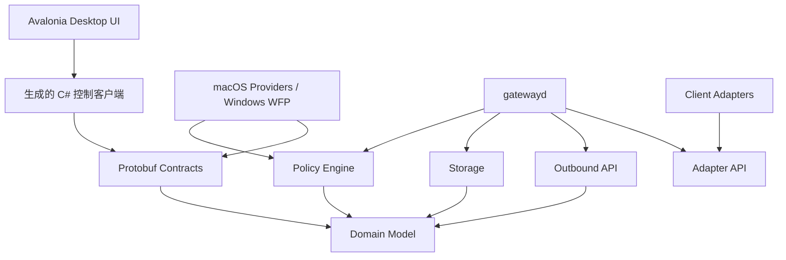
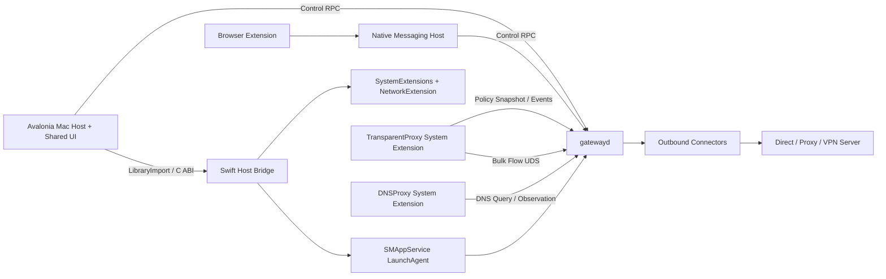
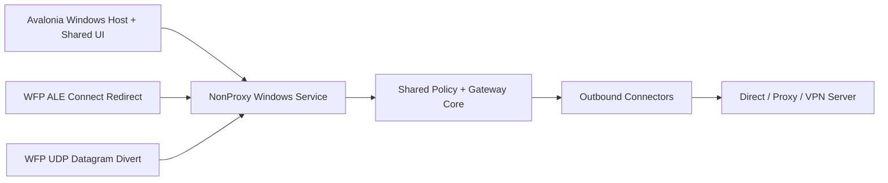

# NonProxy 技术实现文档

> 文档状态：实施基线
> 目标平台：macOS 首发，Windows 后续
> 仓库模式：Monorepo
> 关联产品文档：[NONPROXY_PRODUCT_SOLUTION.md](../NONPROXY_PRODUCT_SOLUTION.md)

## 1. 文档目的

本文把产品方案转换成可以直接用于编码、评审、测试和发布的技术规格，解决以下问题：

- macOS 上如何按应用和网站稳定区分 DIRECT/PROXY。
- 不知道软件请求域名时，如何通过应用身份完成全量直连。
- DNS、IPv4、IPv6、TCP、UDP、QUIC 如何保持一致决策。
- 如何接入不同代理/VPN，同时对封闭 VPN 保持诚实的能力边界。
- 如何建立可复用的跨平台核心，为 Windows WFP 实现保留清晰扩展点。
- 如何通过 Monorepo 管理 Swift、Rust、TypeScript、C# 和 Windows 驱动代码。
- 如何避免将 UI、规则、平台 API、协议和持久化耦合在单文件或单进程中。

本文是实现基线。改变组件边界、数据通路、策略优先级、IPC、失败语义或安全边界时，必须同步更新本文或新增 ADR。

## 2. 架构目标与约束

### 2.1 必须实现

- 用户选择应用后，该应用后续未知目标也能按应用规则处理。
- 用户从浏览器扩展添加网站后，当前站点和确认过的依赖域名按网站规则处理。
- DIRECT 流量在完整网关模式下不进入第三方 VPN。
- PROXY 流量在上游故障时遵循明确的 fail-closed/fail-open 策略。
- 每个连接决策都能追溯到策略版本、规则、应用身份、目标和实际数据路径。
- 数据面在 UI 退出后继续按最后一份有效策略工作。
- 配置切换必须原子化，可回滚。
- 敏感凭据不进入数据库明文字段、日志、崩溃报告或诊断包。

### 2.2 不实现

- 不做 TLS MITM，不安装根证书。
- 不读取 HTTP 正文、表单、Cookie 或请求体。
- 不绕过 MDM、Always-On VPN 或组织强制安全策略。
- 不以修改未公开的第三方客户端内部数据库作为正式兼容方案。
- 不把“配置写入成功”视为“实际直连成功”。

### 2.3 核心架构决策

| 编号 | 决策 |
|---|---|
| BASE-001 | 使用 Monorepo，平台应用、共享核心、协议网关、浏览器扩展和契约在同一仓库版本化 |
| BASE-002 | macOS 默认数据通路使用 Transparent Proxy + DNS Proxy System Extension |
| BASE-003 | 共享领域模型、策略引擎、规则编译器和网关接口使用 Rust |
| BASE-004 | 跨进程、跨语言控制契约使用版本化 Protobuf；大流量转发不走通用 RPC |
| BASE-005 | 完整网关模式捕获策略范围内的连接；DIRECT 由 NonProxy 绑定物理网卡转发，PROXY 进入独立出口 |
| BASE-006 | 数据面使用不可变策略快照，不为每条连接同步查询 UI 或数据库 |
| BASE-007 | Windows 使用 WFP ALE 识别应用；内核驱动只做不可由用户态完成的重定向 |
| BASE-008 | 平台捕获层不实现产品规则语义，协议网关不依赖平台 UI |
| BASE-009 | 所有生成代码集中到 `generated/`，不得手工编辑 |
| BASE-010 | 首发不使用 Bazel；使用 Cargo、SwiftPM/Xcode、pnpm、.NET 各自原生构建，再由根任务统一编排 |
| ADR-0001 | macOS 与 Windows 桌面 UI 统一使用 Avalonia 12 + .NET 10 LTS，平台高权限实现继续隔离 |

选择原生工作区而不是一开始引入 Bazel，是为了降低 Swift System Extension、Xcode 签名和 Windows 驱动构建的集成风险。根级任务只负责统一入口，不隐藏底层构建错误。

ADR-0001 的完整权衡见：

- [ADR-0001：桌面 UI 统一使用 Avalonia](ADR/0001-use-avalonia-for-cross-platform-desktop-ui.md)

## 3. 操作系统实现依据

### 3.1 macOS

`NETransparentProxyProvider` 可以按流决定由扩展处理，或交还系统继续连接；Apple 文档明确给出了按来源应用或目标 IP 决策的场景：

- [Handling Flow Copying](https://developer.apple.com/documentation/networkextension/handling-flow-copying)
- [NETransparentProxyNetworkSettings](https://developer.apple.com/documentation/networkextension/netransparentproxynetworksettings)
- [Network Extension provider deployment](https://developer.apple.com/documentation/technotes/tn3134-network-extension-provider-deployment)

但把 DIRECT flow 直接交还系统，仍可能被另一条已启用的 VPN 路由再次捕获，不能满足“明确不走第三方 VPN”的核心目标。因此完整网关模式由 NonProxy 接收 DIRECT flow，并使用 `NWConnection` 重新连接：

- `NWParameters.requiredInterface` 固定当前首选的有线、Wi-Fi 或蜂窝物理接口：
  [NWParameters.requiredInterface](https://developer.apple.com/documentation/network/nwparameters/requiredinterface)
- `prohibitedInterfaceTypes` 禁止 `.other` 和 `.loopback`，避免把 tunnel interface 当作 DIRECT 出口：
  [NWParameters](https://developer.apple.com/documentation/network/nwparameters)
- 所有 TCP/UDP relay 使用全局流数量、全局缓冲和单 flow 缓冲上限。
- 无可用物理接口时明确拒绝，不静默交回可能受 VPN 接管的系统路径。

该方案不承诺绕过 MDM、Always-On VPN 或系统强制的 `includeAllNetworks` 策略，也不假定多个 Network Extension 的执行顺序。与第三方 VPN 的兼容性必须通过真实软件矩阵和出口证据验收：
[TN3120](https://developer.apple.com/documentation/technotes/tn3120-expected-use-cases-for-network-extension-packet-tunnel-providers)。

`NEDNSProxyProvider` 用于接管系统 DNS 查询：

- [DNS proxy provider](https://developer.apple.com/documentation/networkextension/dns-proxy-provider)

首发采用 System Extension 直接分发路径：

- Avalonia 桌面应用负责跨平台状态展示和配置。
- macOS System Extension Controller 负责安装、启用、签名相关平台操作。
- Transparent Proxy Provider 负责 TCP/UDP 流捕获与流复制。
- DNS Proxy Provider 负责 DNS 观察和分流。
- `gatewayd` 负责策略持久化、上游协议、健康检查和审计。

### 3.2 Windows

Windows 后续使用 Windows Filtering Platform：

- WFP 支持 IPv4/IPv6、按应用、按用户和按连接处理流量：
  [About Windows Filtering Platform](https://learn.microsoft.com/en-us/windows/win32/fwp/about-windows-filtering-platform)
- ALE 是 WFP 中按应用身份分类连接的层：
  [Application Layer Enforcement](https://learn.microsoft.com/en-us/windows/win32/fwp/application-layer-enforcement--ale-)
- 连接重定向代理需要保留和传递 WFP redirect records：
  [SIO_SET_WFP_CONNECTION_REDIRECT_RECORDS](https://learn.microsoft.com/en-us/windows/win32/winsock/sio-set-wfp-connection-redirect-records)

Microsoft 建议：标准 WFP 过滤能完成的事情优先放在用户态，只有必须修改/重注入流量时才编写内核 Callout Driver：

- [Callout Driver Programming Considerations](https://learn.microsoft.com/en-us/windows-hardware/drivers/network/callout-driver-programming-considerations)

macOS 与 Windows UI 统一使用 Avalonia 12 + .NET 10 LTS：

- [Avalonia supported platforms](https://docs.avaloniaui.net/docs/supported-platforms)
- [Avalonia macOS platform guide](https://docs.avaloniaui.net/docs/platform-specific-guides/macos)
- [Avalonia TrayIcon](https://docs.avaloniaui.net/controls/navigation/trayicon)
- [.NET support policy](https://dotnet.microsoft.com/en-us/platform/support/policy)

统一的是 UI、ViewModel、主题和常规 UI 自动化，不是操作系统捕获层。Network Extension、WFP、Driver、安装、签名和系统权限仍然保留独立平台实现。

## 4. Monorepo 结构

目标结构如下：

```text
non_proxy/
├── AGENTS.md
├── NONPROXY_PRODUCT_SOLUTION.md
├── README.md
├── Cargo.toml
├── Cargo.lock
├── rust-toolchain.toml
├── NonProxy.slnx
├── global.json
├── Directory.Build.props
├── Directory.Packages.props
├── NuGet.Config
├── package.json
├── pnpm-lock.yaml
├── pnpm-workspace.yaml
├── justfile
├── buf.yaml
├── buf.gen.yaml
├── .editorconfig
├── .gitignore
├── .swift-format
├── rustfmt.toml
├── apps/
│   └── desktop/
│       ├── NonProxy.Desktop.slnx
│       ├── NonProxy.Desktop.Core/
│       │   ├── App/
│       │   ├── Features/
│       │   ├── Views/
│       │   ├── ViewModels/
│       │   ├── Controls/
│       │   ├── DesignSystem/
│       │   ├── Services/
│       │   ├── Platform/
│       │   └── Assets/
│       ├── NonProxy.Desktop.Mac/
│       │   ├── Program.cs
│       │   ├── MacPlatformServices.cs
│       │   └── SystemExtensionController.cs
│       ├── NonProxy.Desktop.Windows/
│       │   ├── Program.cs
│       │   └── WindowsPlatformServices.cs
│       ├── NonProxy.Desktop.Tests/
│       └── NonProxy.Desktop.E2E/
├── platform/
│   ├── macos/
│   │   ├── NonProxyPlatform.xcworkspace/
│   │   ├── TransparentProxyExtension/
│   │   ├── DNSProxyExtension/
│   │   ├── NativeMessagingHost/
│   │   └── Tests/
│   └── windows/
│       ├── wfp-callout/
│       ├── wfp-controller/
│       ├── dns-integration/
│       ├── service-installer/
│       └── tests/
├── services/
│   ├── gatewayd/
│   ├── adapter-host/
│   └── probe-server/
├── crates/
│   ├── nonproxy-model/
│   ├── nonproxy-policy/
│   ├── nonproxy-policy-compiler/
│   ├── nonproxy-dns/
│   ├── nonproxy-outbound-api/
│   ├── nonproxy-outbounds/
│   ├── nonproxy-storage/
│   ├── nonproxy-contracts/
│   ├── nonproxy-observability/
│   ├── nonproxy-security/
│   ├── nonproxy-adapter-api/
│   ├── nonproxy-config-import/
│   └── nonproxy-testkit/
├── adapters/
│   ├── surge/
│   ├── mihomo/
│   ├── sing-box/
│   ├── local-http/
│   └── local-socks/
├── packages/
│   ├── browser-extension/
│   │   ├── src/
│   │   │   ├── background/
│   │   │   ├── content/
│   │   │   ├── popup/
│   │   │   ├── learning/
│   │   │   └── shared/
│   │   ├── targets/
│   │   │   ├── chromium/
│   │   │   ├── firefox/
│   │   │   └── safari/
│   │   └── tests/
│   └── public-suffix/
├── proto/
│   └── nonproxy/
│       ├── common/v1/
│       ├── control/v1/
│       ├── policy/v1/
│       ├── provider/v1/
│       ├── adapter/v1/
│       └── events/v1/
├── generated/
│   ├── rust/
│   ├── swift/
│   ├── csharp/
│   └── typescript/
├── migrations/
│   └── sqlite/
├── fixtures/
│   ├── policies/
│   ├── dns/
│   ├── imports/
│   └── redacted/
├── tests/
│   ├── contract/
│   ├── integration/
│   ├── e2e-macos/
│   ├── e2e-windows/
│   ├── performance/
│   └── soak/
├── tools/
│   ├── xtask/
│   ├── codegen/
│   ├── fixture-builder/
│   └── release/
├── scripts/
│   ├── bootstrap/
│   ├── build/
│   ├── test/
│   └── release/
├── docs/
│   ├── TECHNICAL_IMPLEMENTATION.md
│   ├── ADR/
│   ├── protocols/
│   ├── testing/
│   ├── security/
│   └── operations/
└── third_party/
    ├── NOTICES.md
    └── licenses/
```

### 4.1 目录职责

`apps/`

- `Core` 只放一套 Avalonia 最终用户 UI；Mac/Windows 项目是薄启动宿主。
- UI 通过控制契约访问服务，不直接打开策略数据库。
- 不在 View/ViewModel 内编译规则、操作隧道或解析订阅。
- 平台差异通过小型接口注入，禁止在 ViewModel 中散布 `OperatingSystem.IsMacOS()`/`IsWindows()`。

`platform/`

- 只放操作系统捕获、系统扩展、驱动和平台安装集成。
- macOS Provider 不直接依赖 Avalonia。
- Windows Callout Driver 不包含产品策略或协议实现。

`crates/`

- 共享领域模型和跨平台核心。
- 不依赖 Avalonia、Swift、C# UI、AppKit、WFP 或 NetworkExtension 类型。
- 共享库通过纯 Rust API或显式 FFI/Protobuf 边界被消费。

`services/`

- 放可执行后台服务。
- `gatewayd` 是策略、持久化、上游网关和健康状态的权威进程。
- `adapter-host` 隔离第三方客户端适配器故障。

`packages/`

- TypeScript workspace。
- 浏览器扩展共享一套领域类型和逻辑，目标浏览器只处理打包差异。

`proto/`

- 是跨进程契约唯一来源。
- 包名必须版本化，例如 `nonproxy.control.v1`。
- 删除字段时必须保留字段号。

`generated/`

- 由固定工具版本生成。
- 可以提交仓库，方便 Xcode/Visual Studio 无网络构建。
- CI 重新生成并检查工作区必须保持干净。
- 任何人和 AI 都不得直接编辑。

`adapters/`

- 每个第三方客户端一个独立包。
- 适配器只能通过 `nonproxy-adapter-api` 与主服务交互。
- 适配器不得直接访问 UI 或策略数据库。

## 5. 构建与工作区管理

### 5.1 Rust

根 `Cargo.toml` 使用 Cargo workspace，所有 Rust 包共享 `Cargo.lock` 和构建配置。Cargo Workspace 官方支持跨包统一命令和共享 lockfile：

- [Cargo Workspaces](https://doc.rust-lang.org/cargo/reference/workspaces.html)

建议：

```toml
[workspace]
resolver = "3"
members = [
  "crates/*",
  "services/*",
  "tools/xtask"
]

[workspace.package]
edition = "2024"
```

实际 Rust 版本必须在 `rust-toolchain.toml` 固定；初始化仓库时再把同一精确版本写入 workspace 的 `rust-version`，不在架构文档中追逐“最新版”。项目总许可证也必须在开源/闭源路线确定后单独决策，不能从第三方内核许可证反推。

### 5.2 TypeScript

使用 pnpm workspace：

- 根 `pnpm-workspace.yaml` 只包含 `packages/*` 和需要 Node 工具的 `tools/*`。
- 根 lockfile 必须提交。
- 浏览器扩展使用共享包，不复制三套业务逻辑。
- [pnpm Workspace](https://pnpm.io/)

### 5.3 .NET/Avalonia

- 使用 Avalonia 12 和 .NET 10 LTS。
- `NonProxy.Desktop.Core` 保存唯一 C#/AXAML UI 源码。
- macOS 薄宿主目标为 `net10.0-macos`，以访问完整 macOS API；最终包必须在 macOS 构建。
- Windows 薄宿主目标为 `net10.0`。
- 使用 CommunityToolkit.Mvvm。
- 发布使用 self-contained 平台包，用户无需预装 .NET。
- 首发不启用 NativeAOT；待反射、序列化、诊断和打包链路稳定后再单独评估。
- C# 控制客户端由 Protobuf 生成，UI 不手写重复 DTO。
- NuGet 依赖集中管理并提交 lockfile。

### 5.4 Swift/Xcode

- Xcode workspace 只包含 Transparent Proxy、DNS Proxy、Native Messaging Host 和平台测试。
- 公共 Swift 平台支持放在本地 Swift Package。
- Xcode target 只负责 Network Extension、平台授权、安装和签名。
- 不在 Swift 平台工程中复制 Avalonia 页面或产品 ViewModel。

### 5.5 Windows

- 不再建立 WinUI 页面；桌面 UI 来自 `apps/desktop/NonProxy.Desktop.Core`。
- 服务宿主可以是 Rust 原生服务，也可以是极薄的 .NET ServiceHost 启动 Rust service。
- WFP Controller 使用 C++/Win32 或 Rust `windows` bindings，取决于 Phase Windows POC。
- Callout Driver 必须使用 WDK/C++，保持最小功能。
- Windows Service、MSIX/安装、驱动和签名配置放在 `platform/windows/`。

### 5.6 根任务

使用 `justfile` 提供清晰入口：

```text
just bootstrap
just generate
just format
just lint
just test
just check
just build-desktop
just test-desktop
just build-macos
just test-macos
just build-windows
just test-windows
just test-browser
just test-integration
just package-macos
just package-windows
```

`just` 只编排，不在一条 recipe 中塞入长脚本。超过约 20 行或包含复杂分支的逻辑放到 `scripts/` 或 `tools/xtask/`。

## 6. 依赖方向

允许的依赖方向：



禁止的依赖：

- `nonproxy-model` 依赖平台 SDK。
- UI 依赖 SQLite schema。
- System Extension 依赖 UI feature。
- Adapter 依赖某个平台 UI。
- Policy Engine 直接发送网络请求。
- Outbound 实现读取用户界面状态。
- Windows Driver 解析 Protobuf、JSON、SQLite 或第三方订阅。

## 7. 进程与组件拓扑

### 7.1 macOS



组件职责：

`NonProxy.Desktop.Core + NonProxy.Desktop.Mac`

- 用户策略、节点和状态界面。
- macOS 与 Windows 共享 Avalonia 页面、ViewModel 和主题。
- Mac 薄宿主从最终 containing app 内通过受版本约束的 Swift C ABI 请求安装/管理 System Extension 和 Network Extension 偏好。
- 不作为权威后台服务。
- 退出不影响既有数据面。

`SystemExtensionController`

- 位于 Mac 薄宿主，只编排 `gatewayd` LaunchAgent、macOS System Extension 和网络偏好的安装、授权、升级与卸载。
- C# 只接收 UTF-8 JSON 领域 DTO；Swift 原生桥持有系统 delegate 并执行框架调用。
- 向 Avalonia UI 返回结构化状态和需要用户完成的系统操作。
- 不包含页面、策略、数据库或代理协议逻辑。

`gatewayd`

- 由 `SMAppService` 作为当前用户的 LaunchAgent 登记，用户登录后可独立于 UI 生命周期运行。
- 单写者策略数据库。
- 规则编译。
- 策略快照发布。
- 上游连接器生命周期。
- 适配器宿主协调。
- 健康检查、审计和诊断。

`TransparentProxyExtension`

- 接收 `NEAppProxyFlow`。
- 解析平台应用身份。
- 对不可变快照执行快速决策。
- DIRECT：返回 `true`，通过绑定物理网卡的本地 TCP/UDP relay 转发。
- PROXY：返回 `true`，通过本地数据通道交给 `gatewayd`。
- 不访问 SQLite，不调用远程 API，不加载订阅。

`DNSProxyExtension`

- 接收 DNS 流。
- 把查询映射到策略上下文。
- 使用直连/代理 DNS resolver。
- 维护短期必要缓存和与 `gatewayd` 的观察事件。

`NativeMessagingHost`

- 只负责浏览器 Native Messaging framing 和本地身份校验。
- 不存规则，不开放公网监听端口。

### 7.2 Windows



Windows Callout Driver 只负责：

- ALE Connect Redirect V4/V6 分类。
- 读取系统提供的应用标识和连接元数据。
- 在 Service 明确启用期间把 TCP 连接重定向到本地服务。
- 写入原始本地/远端地址、进程 ID 和有界 ALE App ID context。
- 使用 redirect handle 判断自身是否已经处理连接，防止递归重定向。
- 在 UDP flow 建立时关联 PID/App ID，在远端 53 之外的出站
  `DATAGRAM_DATA_V4/V6` 只执行有界搬运。
- 按 Service 提交的原始元组构造 UDP/IP 头并注入入站回复。

Windows Service 的 DIRECT 出口不能复用系统默认路由。`nonproxy-windows-network` 在连接时按地址族动态选择可信物理接口：

1. 使用 `GetIfTable2` 读取 operational/hardware/filter/connector/media/endpoint 状态，排除 PPP、loopback、tunnel 和虚拟过滤接口。
2. 使用 `GetIpForwardTable2` 读取 IPv4/IPv6 默认路由。
3. 使用 `GetIpInterfaceEntry` 验证接口 connected、未设置 `DisableDefaultRoutes`，并计算“路由 metric 偏移 + 接口 metric”。
4. 一秒短缓存内优先 connector，其后比较总 metric、链路速度和接口索引；IPv4/IPv6 可以选择不同接口。
5. DIRECT socket 设置 `IP_UNICAST_IF`/`IPV6_UNICAST_IF` 后连接；没有可信物理接口则失败。
6. PROXY socket 不绑定物理接口，只传递 WFP redirect records，保留用户选择的代理/VPN 系统路径。

接口索引是运行时易变值，不进入策略、数据库或长期配置。Windows DIRECT DNS UDP/TCP 与 TCP relay 复用同一 socket 绑定实现。完整决策和限制见 [ADR-0005](ADR/0005-bind-windows-direct-to-physical-interface.md)。

网站规则不能把 DNS 观察到的 CDN IP 永久归类，也不能依赖可能被 ECH 隐藏的
TLS SNI。Windows 采用选择性合成 DNS：只有活动快照中确实存在域名匹配的
A/AAAA 查询才分配 `198.18.0.0/15` 或安装级 IPv6 ULA 地址；30 秒 DNS TTL
和 24 小时 SQLite 绑定使 WFP 代理可以在连接时恢复原始域名。DIRECT 必须另走
绑定物理接口的真实 DNS，PROXY 则把域名交给所选出口解析。启用前必须检测地址
池路由冲突；DoH/DNSSEC/HTTPS-SVCB 的兼容边界不得隐藏。组件边界、失败语义
和依据见 [ADR-0006](ADR/0006-use-selective-synthetic-dns-on-windows.md)。

Windows DNS 运行时分为四个独立模块：

1. `local_dns_server` 只处理 loopback UDP/TCP framing、长度与并发上限。
2. `dns_policy` 把活动快照和严格解析后的问题映射为合成、NODATA 或真实路由。
3. `windows_capture::dns_proxy` 负责合成绑定、物理/代理上游和 Provider 健康。
4. `windows_capture::direct_dns` 只为合成 TCP 目标重新解析真实地址。

Service 启动 DNS 监听前枚举 IPv4 路由；任何与 `198.18.0.0/15` 重叠的非默认
路由都会令该能力硬失败。监听使用随机 loopback 端口，动态 WFP filter 只把
远端 TCP/UDP 53 重定向给它，不修改网卡 DNS。Driver 先进入 DNS-only，生成
一次性随机 `.invalid` 探针域名；只有 Windows 系统 resolver 确实从本地监听
得到 `198.18.0.1` 时，DNS Provider 才确认策略快照，WFP 激活协调器才允许
普通 TCP redirect。探针失效会立即撤销 DNS 确认、把运行时标为 Degraded，并
退回可自恢复的 DNS-only。完整决策见
[ADR-0007](ADR/0007-intercept-windows-dns-with-wfp.md)。

远端 53 之外的 UDP/QUIC 不使用 ALE connect redirect。connected UDP 在
`connect` 与 `send` 分层时存在系统已知丢包问题，因此动态 BFE session 在
`ALE_FLOW_ESTABLISHED_V4/V6` 关联应用身份，在 `DATAGRAM_DATA_V4/V6` 搬运
出站数据报。Service 以 PID + App ID + 原始本地/远端地址建立有界会话，执行
共享策略后使用绑定物理接口的 DIRECT UDP 或 SOCKS5 UDP；回复由 Driver 以
原元组重注入。HTTP CONNECT 不提供 UDP association。内核队列、用户态
channel、活动会话、单会话 backlog、总 payload 和空闲时间均有硬上限；启用
后无法安全搬运的单个数据报 fail-closed 并计数，Service/handle 退出则撤销
整个能力并恢复系统原路径。完整依据和上限见
[ADR-0008](ADR/0008-divert-windows-udp-datagrams.md)。

驱动不得：

- 解析域名订阅。
- 打开数据库。
- 运行代理协议。
- 发送遥测。
- 动态下载规则。
- 在内核中执行复杂正则表达式。

## 8. 控制面 IPC

### 8.1 契约技术

使用 Protobuf 定义跨语言契约：

- Rust：`prost`/`tonic` 或轻量本地 RPC 封装。
- Swift：SwiftProtobuf。
- C#：Google.Protobuf。
- TypeScript：生成只用于 Native Messaging payload 的类型。

使用 Buf 进行：

- 格式化。
- lint。
- 代码生成。
- breaking change 检查。

Buf 官方建议从一开始启用 lint 和 breaking 检查：

- [Buf lint quickstart](https://buf.build/docs/lint/quickstart/)
- [Buf breaking change detection](https://buf.build/docs/cli/quickstart)

### 8.2 控制服务

`ControlService` 最小方法：

```text
GetSystemStatus
GetCapabilities
ListPolicies
UpsertPolicy
DeletePolicy
ApplyPolicySnapshot
RollbackPolicySnapshot
ListOutbounds
ImportConfiguration
TestOutbound
SetDefaultRoute
StartLearningSession
RecordLearningObservation
ListLearningCandidates
StopLearningSession
SubscribeEvents
ExportDiagnostics
```

### 8.3 Provider 服务

`ProviderService` 最小方法：

```text
RegisterProvider
GetCurrentSnapshot
AcknowledgeSnapshot
ReportDecisionBatch
ReportHealth
ResolveDNS
OpenProxyFlow
CloseProxyFlow
```

### 8.4 版本约束

- 包名携带主版本：`nonproxy.control.v1`。
- 每条握手包含：
  - protocol version。
  - component version。
  - build ID。
  - supported capabilities。
  - minimum compatible version。
- 未知字段必须忽略。
- 删除字段时使用 `reserved`。
- breaking change 只能新增 `v2` 包，不能原地破坏 `v1`。

## 9. 大流量数据通道

Protobuf 控制 RPC 不承载网页、下载、视频等数据。

### 9.1 macOS 数据通道

推荐使用受权限保护的 Unix Domain Socket：

- Transparent Proxy Provider 与 `gatewayd` 建立本地 UDS。
- TCP 每个 flow 使用独立逻辑 stream；底层可以多路复用。
- UDP 使用按 flow ID 多路复用的数据报帧。
- Socket 路径不位于世界可写目录。
- 服务端验证对端代码签名/审计身份。

帧协议：

```text
magic        4 bytes  "NPF1"
version      2 bytes
frame_type   1 byte
flags        1 byte
flow_id      16 bytes
sequence     8 bytes
payload_len  4 bytes
payload      N bytes
```

`frame_type`：

- `OPEN_TCP`
- `OPEN_UDP`
- `DATA`
- `DATAGRAM`
- `HALF_CLOSE`
- `CLOSE`
- `WINDOW_UPDATE`
- `ERROR`
- `PING`
- `PONG`

`NPF1` 首版固定使用 36 字节大端序帧头，单帧 payload 上限 256 KiB，`flow_id` 不得全零，收发两个方向的 `sequence` 均从 0 开始严格递增。`OPEN_TCP`/`OPEN_UDP` payload 依次携带 32 字节 Provider capability、长度前缀的 outbound ID、SOCKS 地址格式的目标 endpoint 和 32 位初始接收窗口；该 payload 在解析后归零。`DATAGRAM` 每帧携带独立目标 endpoint，单个 UDP 内容上限 65,000 字节且不支持 SOCKS5 分片。`WINDOW_UPDATE` 只包含 32 位正整数增量。

首版每条 UDS 连接只承载一个 flow，但帧始终携带 `flow_id`，为后续经过独立压测的多路复用保留兼容空间。`gatewayd` 默认在状态目录创建权限为 `0600` 的 `gatewayd-flow.sock`，可通过 `NONPROXY_FLOW_SOCKET_PATH` 覆盖；覆盖路径仍必须与控制 Socket 同处私有状态目录且不能重名。服务端只在验证首个 OPEN 帧、Provider capability、严格序列、出口启用状态和连接上限后建立真实代理连接。

当前 Rust 数据面实现把每条 UDS 限定为一个 flow、全局最多 2,048 个活跃 flow，并以最多 64 个待写帧的有界队列隔离慢消费者。TCP 支持 HTTP CONNECT 与 SOCKS5、保持 `HALF_CLOSE`；UDP 只允许支持 UDP ASSOCIATE 的 SOCKS5 出口。凭据按引用从系统凭据库临时读取，不进入数据库或日志。Provider 侧代码签名/审计身份校验仍是启用真实 System Extension 前的发布门禁，不能用 `0600` 与 capability token 代替。

macOS Transparent Proxy 在每条 PROXY flow 上使用独立 `NWConnection(.unix)` 连接该数据 Socket。Swift 通道在 OPEN 后才向应用侧继续读取，并分别维护双向序列、256 KiB 初始窗口、16 MiB 窗口上限和 64 帧写队列；TCP 保留应用侧与远端半关闭，UDP 每帧保留自己的目标地址。所有 relay 共享 2,048 flow 和 32 MiB 待处理数据预算，停止 Provider 时统一撤销。仓库冒烟会启动真实 `gatewayd` 和本地 HTTP CONNECT 回显夹具，由 Swift 完成 NPF1 OPEN、窗口、数据确认和 CLOSE；该证据覆盖跨语言 Unix Socket 数据面，但不替代签名 System Extension 的真实设备验收。

### 9.2 背压

- 每个 flow 有独立发送窗口。
- Provider 不无限读取本地 flow。
- `gatewayd` 未确认窗口前停止读取。
- TCP 保持半关闭语义。
- UDP 设置单 flow 和全局队列上限。
- 超限记录结构化错误，不阻塞 Provider 主回调线程。

### 9.3 防回环

- loopback/UDS 不进入透明代理。
- macOS 打包时把裸 `gatewayd` 的代码签名 identifier 固定为
  `com.nonproxy.gatewayd`；正式包还会从已签名二进制提取 TeamIdentifier，并通过
  受签名保护的 LaunchAgent 环境传给 `gatewayd`。Bundle 校验会拒绝 identifier
  漂移、正式签名缺少 TeamIdentifier、gatewayd 与宿主 App 签名团队不同，或
  LaunchAgent 声明与二进制签名不一致。
  快照构建器在内存中追加不可由低权限 RPC 创建或覆盖的
  `system-macos-gateway-direct` SYSTEM 规则；Transparent Provider 因而把
  同时匹配固定 identifier 与 TeamIdentifier 的 `gatewayd` 代理服务器连接交给
  物理 DIRECT relay。临时签名开发包没有 TeamIdentifier，只能形成较弱的本地开发
  身份，不能作为发布验收证据。该规则进入快照哈希和 Provider 离线缓存，但不写
  用户策略表、不出现在普通编辑列表或运行状态目录。
- `gatewayd` 在绑定 Provider 控制面前检查 pending 优先、active 兜底的候选快照。
  缺少当前系统规则时，使用候选 payload 原有策略、能力和默认决策重建下一版本；
  旧 pending 的拒绝与新 pending 的写入在同一事务完成，旧 active 在新快照 ACK
  前继续作为决策回退，但不能授权 gatewayd 建立代理上游连接。TCP/UDP 代理、
  代理 DNS 和出口探测共用的连接工厂在当前保护快照激活前失败关闭，并返回可重试的
  `NP_FLOW_SYSTEM_SNAPSHOT_PENDING`（DNS 对外映射为
  `NP_DNS_SYSTEM_SNAPSHOT_PENDING`）；ACK 激活后才原子恢复出站。历史回滚
  同样重建当前系统规则，不能复制旧的受保护身份。
- Windows WFP 配置携带 gatewayd 自身 PID，Callout 不重新重定向代理进程。
- 每个 flow 携带 origin marker。
- Windows 使用 WFP redirect context/records 识别已重定向连接。
- 检测同一目标的递归深度，超过 1 立即失败并报告 `NP_FLOW_LOOP_DETECTED`。

## 10. 领域模型

### 10.1 AppIdentity

跨平台规范：

```text
AppIdentity
  platform
  stable_id
  signer_id
  executable_hash
  executable_path_hint
  display_name
  parent_identity
  helper_group_id
```

macOS：

- `stable_id`：Bundle Identifier 或 Code Signing Identifier。
- `signer_id`：Designated Requirement/Team Identifier 的规范化摘要。
- PID 和路径只作为一次连接的观测信息，不作为唯一长期身份。
- Helper、XPC 和子进程通过签名、父应用和已知 bundle 关系归组。

Windows：

- `stable_id`：WFP ALE App ID 规范化路径或包身份。
- `signer_id`：代码签名发布者/包发布者。
- UWP/MSIX 使用 Package Family Name。
- Win32 可补充文件 hash，但更新后需要签名身份迁移。

### 10.2 Destination

```text
Destination
  hostname
  normalized_domain
  ip
  port
  transport
  ip_family
  interface
```

域名规范化：

- 小写。
- 移除末尾点。
- IDN 使用明确的 U-label/A-label 转换。
- 规则存储使用规范化 ASCII。
- 使用 Public Suffix List 计算 registrable domain。
- 不使用“最后两个标签”这种错误算法。

### 10.3 Decision

```text
Decision
  action: DIRECT | PROXY | BLOCK
  outbound_id
  failure_mode
  matched_policy_id
  matched_rule_id
  snapshot_version
  reason_code
```

### 10.4 Capability

平台和适配器都必须声明能力：

```text
Capability
  app_match
  domain_match
  cidr_match
  tcp
  udp
  ipv4
  ipv6
  dns_split
  hot_reload
  path_evidence
  exit_probe
```

UI 只能根据能力展示可用功能，不能假设所有后端支持相同语义。

## 11. 策略引擎

### 11.1 模块拆分

`nonproxy-policy`

- 纯决策逻辑。
- 输入 `ConnectionContext + CompiledSnapshot`。
- 输出 `Decision`。
- 无 IO、无数据库、无日志副作用。

`nonproxy-policy-compiler`

- 把数据库 Policy 编译成紧凑不可变快照。
- 执行冲突检测、语义校验和能力降级检查。
- 生成版本、内容哈希和统计信息。

`nonproxy-model`

- 领域类型、枚举、ID 和验证规则。

### 11.2 快照结构

```text
CompiledPolicySnapshot
  schema_version
  snapshot_version
  created_at
  content_hash
  default_decision
  system_rules
  scoped_app_destination_rules
  app_rules
  domain_trie
  cidr_radix_v4
  cidr_radix_v6
  network_profile_rules
  network_profile_fingerprint_catalog
  outbound_capabilities
```

`network_profile_fingerprint_catalog` 只包含稳定档案 ID、指纹类型和脱敏值，按 ID
确定性排序并参与内容哈希。用户显示名和 revision 属于控制面元数据，不改变数据面
语义。载荷 format version 2 携带该目录并拒绝悬空网络规则；version 1 历史快照继续
按旧算法读取，任何重建都发布新的 version 2 快照。DNS 的瞬时缓存分区 ID 不得冒充
该稳定档案 ID。

索引：

- App rule：hash map。
- Domain/suffix：反向标签 trie。
- IPv4/IPv6 CIDR：radix tree。
- App + Destination：两级索引。
- 正则域名不进入小白默认功能；高级规则单独分组并限制数量。

### 11.3 优先级

固定优先级：

1. 安全系统规则。
2. App + Destination。
3. App。
4. Domain / CIDR。
5. Network Profile。
6. 内置规则。
7. Default。

优先级不是数据库行顺序。任何 UI 拖动排序都必须映射为显式优先级或 scope，不能依赖偶然顺序。

同一固定层级内先比较显式 `priority`，数值越大越优先；再比较选择器特异性。目标选择器按 Exact Domain、Registrable Domain、Domain Suffix、CIDR 的顺序比较，同类中更深的域名后缀或更长的 CIDR 前缀优先；带签名约束的应用、显式传输协议和更窄的端口范围更具体。最后仅使用稳定 Policy ID 保证确定性。同一层级、同一显式优先级且选择器完全相同的规则属于配置冲突，Compiler 必须拒绝发布，不能依赖插入或数据库行顺序决定结果。

Adapter 输入不拥有单独的优先级层。Compiler 根据它实际包含的维度映射到 App + Destination、App 或 Domain / CIDR 层，避免外部订阅通过来源类型绕过固定优先级。

### 11.4 编译发布

1. UI 调用 Upsert/Delete。
2. `gatewayd` 在事务中写入草稿。
3. Compiler 读取一致性视图。
4. 执行语义校验。
5. 生成快照和 hash。
6. 写入 `policy_snapshot`。
7. 发布给 Provider。
8. Provider 加载后返回 ACK。
9. 达到所需 ACK 策略后标记 active。
10. 失败则继续使用上一份快照。

Rust 服务使用 `Arc`，Swift Provider 使用不可变值和同步只读引用完成原子切换；两端都不得为切换快照暂停全部流量。

### 11.5 默认路由配置与原子发布

普通用户的核心模型是“默认走代理，少数应用或网站直连”。默认路由不是 UI
偏好，也不能在编译器中硬编码。SQLite 使用单例 `routing_settings` 保存：

```text
RoutingSettings
  default_action: DIRECT | PROXY
  default_outbound_id
  revision
  updated_at
```

新安装和旧数据库升级后先保持 `DIRECT`，避免在用户尚未选择并验证代理出口时静默
改变网络路径。用户在“网络出口”页选择默认代理后，桌面端携带当前
`routing_revision` 调用 `SetDefaultRoute`。`gatewayd` 必须在同一个
`BEGIN IMMEDIATE` 事务中完成以下操作：

1. 校验 revision 未过期。
2. 校验代理出口存在、启用且可承载完整网关。
3. 校验当前出口配置 revision 在 60 秒内取得 `READY` 握手观察；进程重启、配置变化、
   失败或过期均必须重新测试。
4. 用所选出口生成 fail-closed 的默认 `PROXY` decision。
5. 编译包含该默认 decision 的完整不可变快照。
6. 更新 `routing_settings` 并递增 revision。
7. 写入唯一 pending 快照和审计事件。

任一步失败都回滚默认路由和快照，不能出现权威配置与待确认快照内容分裂。
每个新快照还会由可信构建器追加 macOS gatewayd 防回环系统规则；客户端提交的
`SYSTEM`、`BUILT_IN`、`ADAPTER`、`SUBSCRIPTION` 来源或保留系统 ID 均在写入前
拒绝，避免低权限控制会话伪造高优先级规则。启动升级和历史回滚都会规范化该规则；
旧 pending 的替换是单事务操作，任何新快照编译或写入失败都会保留原 pending。
如果旧 active 尚不含当前保护规则，gatewayd 会在升级快照激活前阻止所有代理连接
创建，避免 Provider 使用缓存旧快照抢先捕获代理上游。
RPC 成功只表示配置已保存且快照进入
`PENDING_ACK`；只有所需 Provider 全部确认后才能显示为已生效。

`ListOutbounds` 在每页返回同一个 `routing_revision`，并只允许一个出口带
`is_default`。桌面端跨页发现 revision 变化、重复出口或多个默认出口时拒绝该
目录并要求刷新。回滚到历史快照时，`gatewayd` 从历史 payload 解码
`default_decision`，在同一事务内同步恢复 `routing_settings` 和回滚快照；不允许
把回滚默认值硬编码为 `DIRECT`，也不允许原样复制历史版本的受保护系统规则。

当前默认出口不能通过后续导入被改成停用状态或当前完整网关无法承载的 TCP-only
类型；该批次写入必须整体回滚。普通用户可以点击“恢复默认直连”，该操作使用相同的
鉴权、revision、编译、pending ACK 和事务边界，不通过直接改 UI 状态实现。

## 12. macOS Transparent Proxy 实现

### 12.1 文件拆分

建议结构：

```text
TransparentProxyExtension/
├── ExtensionEntry.swift
├── Provider/
│   ├── TransparentProxyProvider.swift
│   ├── ProviderLifecycle.swift
│   └── NetworkSettingsFactory.swift
├── Flow/
│   ├── FlowClassifier.swift
│   ├── TCPFlowRelay.swift
│   ├── UDPFlowRelay.swift
│   ├── FlowBackpressure.swift
│   └── FlowErrorMapper.swift
├── Identity/
│   ├── AppIdentityResolver.swift
│   ├── CodeSignatureResolver.swift
│   └── IdentityCache.swift
├── Policy/
│   ├── PolicySnapshotStore.swift
│   ├── SnapshotValidator.swift
│   ├── CanonicalSnapshotHasher.swift
│   ├── ProviderPolicyEngine.swift
│   └── DecisionMapper.swift
├── IPC/
│   ├── GatewayConnection.swift
│   ├── FrameCodec.swift
│   └── ProviderControlClient.swift
└── Diagnostics/
    ├── ProviderHealth.swift
    └── DecisionBatcher.swift
```

不得把以上内容合并进一个 `PacketTunnelProvider.swift` 或 `TransparentProxyProvider.swift`。

### 12.2 生命周期

状态：

```text
stopped
starting
loadingSnapshot
ready
degraded
stopping
failed
```

`startProxy`：

1. 初始化本地结构化日志。
2. 连接 `gatewayd`。
3. 获取最新已激活快照。
4. 验证快照版本和 hash。
5. 创建 included/excluded network rules。
6. 调用 `setTunnelNetworkSettings`。
7. 健康状态变为 ready。

若 `gatewayd` 不可用：

- 可以加载经过验证的本地缓存快照。
- DIRECT 规则可继续工作。
- PROXY 流量按 fail-closed/fail-open 处理。
- 不得无提示全部直连。

### 12.3 `handleNewFlow`

逻辑：

1. 提取 TCP/UDP、远端 endpoint、hostname。
2. 解析来源应用身份。
3. 构造 `ConnectionContext`。
4. 调用经过跨语言黄金向量验证的 Swift 纯函数策略运行时。
5. 记录轻量 decision event。
6. DIRECT：
   - 返回 `true`。
   - 选择当前首选物理网卡。
   - 使用设置了 `requiredInterface` 且禁止 tunnel/loopback 类型的连接转发。
   - 没有物理网卡或达到有界资源上限时以稳定错误码关闭。
7. PROXY：
   - 返回 `true`。
   - 建立本地 flow relay。
8. BLOCK：
   - 返回 `true` 后用明确错误关闭。

回调必须快速返回；代码签名解析和磁盘 IO 不得阻塞回调线程。身份解析使用缓存和异步预热。

### 12.4 应用身份

- 优先使用系统 flow metadata/audit token。
- 从 audit token 获取签名身份。
- 缓存键包含可执行文件签名标识，不仅是 PID。
- PID 复用后必须重新校验。
- 无法识别时使用 `unknown-app`，按默认策略处理并显示证据不足。
- 不因身份解析失败而擅自把 PROXY 流量变为 DIRECT。

### 12.5 Network Settings

- included rules 覆盖所需 outbound TCP/UDP。
- excluded rules 排除 loopback、必要本地控制通道和明确系统控制流量。
- 局域网策略由 Policy 决定，不使用一个隐式全局布尔值掩盖行为。
- Provider 启动前解析代理服务器 endpoints，避免隧道回环。
- 网卡变化时重建设置并保持快照版本不变。

## 13. macOS DNS Proxy 实现

建议结构：

```text
DNSProxyExtension/
├── ExtensionEntry.swift
├── Provider/
│   ├── DNSProxyProvider.swift
│   └── DNSProviderLifecycle.swift
├── Protocol/
│   ├── DNSMessageParser.swift
│   ├── DNSMessageEncoder.swift
│   └── DNSErrorMapper.swift
├── Routing/
│   ├── DNSDecisionEngine.swift
│   ├── ResolverSelector.swift
│   └── AppDNSContextResolver.swift
├── Resolver/
│   ├── DirectResolver.swift
│   ├── ProxyResolver.swift
│   ├── DoHResolver.swift
│   └── DoTResolver.swift
├── Cache/
│   ├── PartitionedDNSCache.swift
│   ├── CNAMEGraph.swift
│   └── DomainIPObservationStore.swift
└── IPC/
    └── DNSControlClient.swift
```

### 13.1 缓存隔离

DNS cache key 必须包含：

```text
qname + qtype + route_kind + outbound_id + network_profile
```

DIRECT 与 PROXY 不共享解析结果缓存，避免：

- 代理 DNS 结果被直连使用。
- 直连 DNS 查询泄漏代理域名。
- 不同企业/家庭网络的 split DNS 混用。

DIRECT DNS 请求必须携带当前首选物理网卡索引，`gatewayd` 在 UDP 和
TCP socket 建连前绑定该网卡。Provider 无法确定物理网卡时返回
`SERVFAIL`，不得退回未绑定的系统路由或偷偷经过 VPN。

### 13.2 观察映射

保存：

- qname。
- CNAME 链。
- A/AAAA。
- TTL。
- route kind。
- app identity（若可用）。
- resolver。
- network profile。

IP 映射只在 TTL 内作为辅助证据，不转化为永久域名规则。

### 13.3 自带 DoH/ECH

- 浏览器扩展提供标签页域名上下文。
- Transparent Proxy 的 hostname metadata 作为主信号。
- TLS SNI 只能作为补充，不作为必需条件。
- 不为获取域名而解密 TLS。
- 完全无法归属时退回 app policy 或 IP policy。

## 14. Gateway Daemon

建议结构：

```text
services/gatewayd/src/
├── main.rs
├── bootstrap.rs
├── config.rs
├── runtime/
│   ├── mod.rs
│   ├── lifecycle.rs
│   └── shutdown.rs
├── control/
│   ├── mod.rs
│   ├── service.rs
│   ├── authorization.rs
│   └── event_stream.rs
├── provider/
│   ├── mod.rs
│   ├── registry.rs
│   ├── snapshot_delivery.rs
│   └── health.rs
├── flow/
│   ├── mod.rs
│   ├── listener.rs
│   ├── session.rs
│   ├── tcp.rs
│   ├── udp.rs
│   └── backpressure.rs
├── policy/
│   ├── mod.rs
│   ├── application.rs
│   └── rollback.rs
├── outbound/
│   ├── mod.rs
│   ├── registry.rs
│   ├── health_check.rs
│   └── failover.rs
├── learning/
│   ├── mod.rs
│   ├── session.rs
│   ├── app_learning.rs
│   └── site_learning.rs
├── storage/
│   ├── mod.rs
│   └── repositories.rs
└── diagnostics/
    ├── mod.rs
    ├── exporter.rs
    └── redaction.rs
```

`main.rs` 只能创建 runtime 并调用 bootstrap，不包含业务逻辑。

### 14.1 生命周期

```text
stopped -> starting -> migrating -> loading -> ready
                                      |
                                      v
                                  degraded
                                      |
                                      v
                                    failed
```

启动顺序：

1. 读取最小本地配置。
2. 初始化安全日志。
3. 打开数据库。
4. 执行迁移。
5. 加载 Keychain/凭据引用。
6. 校验最后策略快照。
7. 初始化 outbounds。
8. 启动本地控制服务。
9. 启动 Provider 服务和 flow socket。
10. 发布 ready。

停止顺序：

1. 停止接收新控制写入。
2. 标记 draining。
3. 停止新 PROXY flow。
4. 给现有 flow 限时排空。
5. 刷新审计批次。
6. 关闭数据库。

## 15. Outbound 接口

共享接口示意：

```rust
pub trait OutboundConnector: Send + Sync {
    fn id(&self) -> &OutboundId;
    fn capabilities(&self) -> OutboundCapabilities;
    async fn connect_tcp(
        &self,
        request: TcpConnectRequest,
    ) -> Result<Box<dyn AsyncStream>, OutboundError>;
    async fn open_udp(
        &self,
        request: UdpSessionRequest,
    ) -> Result<Box<dyn DatagramSession>, OutboundError>;
    async fn health_check(&self) -> HealthResult;
    async fn shutdown(&self);
}
```

每种协议一个独立 crate/module，不在 registry 中写协议细节。

首发实现顺序：

1. Direct。
2. Local HTTP CONNECT。
3. Local SOCKS5。
4. WireGuard 或选定标准 VPN。
5. 订阅型代理核心。

### 15.1 Failover

- Failover 是 outbound group 的职责。
- Policy 决定 group，不直接选择瞬时节点。
- 健康检查不得用用户真实目标。
- 节点切换产生审计事件。
- 已建立 TCP 不自动迁移。
- UDP session 根据协议能力决定重建。

### 15.2 标准本地代理导入

内部结构化表单使用 `nonproxy-json-v1`；面向普通用户的批量粘贴使用
`proxy-uri-list-v1`。两种格式共用 256 KiB 请求上限、100 个出口上限、revision
检查、凭据隔离和补偿事务。JSON 的未知字段、重复标识和不完整凭据对均被拒绝。
桌面端不要求普通用户编写 JSON，而是把手动表单转换为内部契约：

```json
{
  "version": 1,
  "outbounds": [
    {
      "id": "local-proxy",
      "kind": "socks5",
      "host": "127.0.0.1",
      "port": 1080,
      "username": "alice",
      "password": "secret",
      "enabled": true
    }
  ]
}
```

导入采用补偿事务：先把新凭据写入 macOS Keychain、Windows Credential Manager 或对应平台安全存储，再在一个 `BEGIN IMMEDIATE` 事务中校验全部 revision 并保存全部出口；数据库失败时删除新凭据，数据库成功后再清理旧凭据。SQLite、审计日志、RPC 响应和出口列表只包含版本化凭据引用，不包含用户名或密码。配置缓冲区在客户端和服务端完成处理后归零。

标准链接导入接受每行一个 `socks5://`、`socks5h://` 或 `http://` URI；缺省端口分别
使用 1080 和 80。路径、查询参数、未知协议、无主机、畸形百分号编码和不成对凭据
都被拒绝，错误只报告行号而不回显链接。片段标签会规范化为安全稳定标识，重复标签
追加确定性序号。桌面端必须先调用 `validate_only` 展示不含凭据的协议、标识和端点，
并在标识已存在时提示保存将更新对应出口；源文本变化后立即作废预览，只有当前预览
可以触发明确保存。完整决策见
[ADR-0011](ADR/0011-import-standard-proxy-uris.md)。这不等同于 Shadowsocks、VMess、
WireGuard、OpenVPN 或供应商订阅已经支持；这些协议必须在对应 connector/adapter
真正实现后另行开放。

macOS 桌面端还可通过 ABI v6 原生桥只读调用 `SCDynamicStoreCopyProxies`，发现系统
当前明确启用的 SOCKS、HTTP 与 HTTPS 代理主机和端口。发现层不读取凭据、PAC 内容
或排除列表，不扫描端口或枚举任意监听进程；相同协议与端点先去重，再转换成
`proxy-uri-list-v1` 走同一预检。发现和预检都不写配置，也不证明握手可用。用户仍需
明确保存、测试握手，并在需要时取得签名公网出口回执。完整边界见
[ADR-0012](ADR/0012-discover-public-system-proxy-settings.md)。

`SOCKS5` 声明 TCP、UDP、IPv4 和 IPv6 能力；`HTTP CONNECT` 只声明 TCP、IPv4 和 IPv6，并在导入结果中给出 TCP-only 提示。这里只表示协议能力，不表示健康检查已通过；从未探测或结果过期的出口使用 `RUNTIME_STATE_UNSPECIFIED`，桌面端显示“未验证”。

### 15.3 用户触发的代理握手测试

桌面端每个出口提供独立“测试”操作。RPC 使用会话能力鉴权，并固定发送 5 秒探测超时；网关只接受 1 到 30 秒的合法 protobuf duration。测试目标由服务端固定为 `example.com:443`，客户端不能传入用户正在访问的域名；除与代理协商所需的 CONNECT/SOCKS 握手外，不向目标发送应用层请求、Cookie 或用户数据。

网关复用数据面的当前出口加载器和系统凭据引用，实际完成 HTTP CONNECT 或 SOCKS5 TCP 握手。成功结果记录完整握手耗时；失败只返回稳定错误码和去敏提示，不回传连接器内部错误、用户名、密码、凭据引用或原始配置。

健康观察保存在进程内的有界注册表中，并同时绑定 `outbound_id` 与配置 revision。配置 revision 变化后旧结果立即失效；观察超过 60 秒后恢复为“未验证”。`OutboundSummary` 返回 `health`、`last_checked_at` 和 `latency`，macOS 与 Windows 共享桌面层使用同一映射。`READY` 若缺少时间或延迟属于无效控制契约，客户端不得据此开放默认代理操作。

该测试只证明“所选代理能够对固定目标完成 TCP 代理握手”，不能证明以下事项：

- 实际用户连接命中了哪条策略；
- DIRECT 是否绕开第三方 VPN；
- PROXY 与 DIRECT 的公网出口是否不同；
- UDP、QUIC、DNS 或指定用户目标已经可用。

这些结论必须由决策证据、接口路径和自有出口探针联合验证，不能由本健康状态替代。

### 15.4 独立签名出口验证

代理握手健康和平台 `PATH` 都不能证明公网看到的来源地址。`VerifyExit` 因此只允许
选择 `DIRECT` 或一个已保存的 `PROXY` 出口；探针 URL 不出现在请求中，而是由
gatewayd 安装环境固定配置：

- `NONPROXY_EXIT_PROBE_ENDPOINT`：必须为不含账号、query 和 fragment 的 HTTPS
  地址，根路径自动使用 `/v1/exit`；
- `NONPROXY_EXIT_PROBE_PUBLIC_KEYS`：1～4 把不重复的 32 字节 Ed25519 公钥，
  每把使用 43 位无填充 base64url 编码并以逗号分隔；
- 旧版单值 `NONPROXY_EXIT_PROBE_PUBLIC_KEY` 继续兼容，但不得与复数变量同时
  配置；endpoint 与任一种公钥配置必须同时存在，缺项、重复、超限或格式错误时
  gatewayd 拒绝启动。全部缺失时能力列表不声明
  `CAPABILITY_NAME_EXIT_PROBE`。

gatewayd 为每次验证生成 32 字节随机 nonce，通过所选出站连接固定探针。macOS
DIRECT 只有在带签名身份约束的 gatewayd SYSTEM 规则已经激活后才允许连接；
Windows DIRECT 使用物理接口目录选择 IPv4/IPv6 默认接口，并在 socket 上设置
`IP_UNICAST_IF`/`IPV6_UNICAST_IF`。PROXY 复用当前出口和系统凭据加载器，不能绕过
防回环快照门。

远端 `services/probe-server` 直接终止 TLS，并从 socket peer address 获取来源
公网 IP；不得部署在会终止 TLS 的 L7 反向代理之后，也不读取
`X-Forwarded-For`/`Forwarded`。请求只包含随机 nonce，绝不包含应用、用户访问
域名、规则、URL 路径、Cookie 或代理凭据。服务只接受
`GET /v1/exit?nonce=...`，以 Ed25519 签名绑定协议版本、nonce、规范化公网 IP、
毫秒时间和 key id，并返回 `Cache-Control: no-store` 的小型 JSON。私网/保留地址、
畸形 query、宽权限私钥文件和并发上限外连接都被拒绝。
客户端先按回执中的 `key_id` 精确选择受信公钥，再执行签名校验；未知 key id
不会轮询或降级到其他密钥。`GET /health` 只返回进程状态和当前公开 key id，用于
确认服务端切换进度，不返回私钥或连接历史。

服务进程需要以下环境变量：

- `NONPROXY_PROBE_TLS_CERT`：绝对路径 PEM 证书链；
- `NONPROXY_PROBE_TLS_KEY`：绝对路径 PEM 私钥，Unix 下不得有 group/world 权限；
- `NONPROXY_PROBE_SIGNING_KEY`：绝对路径 32 字节 Ed25519 secret，同样要求私有权限；
- `NONPROXY_PROBE_BIND`：默认 `[::]:8443`；
- `NONPROXY_PROBE_MAX_CONNECTIONS`：默认 1024，合法范围 1..=65536。

gatewayd 只在 TLS 域名校验、固定公钥签名、nonce、公网地址和回执时间全部通过后
并把回执成功写入本地权威存储后，才返回 `verified=true`。回执有效期为 120 秒，
允许最多 300 秒未来时钟偏差；本地 `probe_id` 是规范化签名内容的 SHA-256 标识。
V10 数据库把 DIRECT/PROXY 路由、规范化公网地址、地址族、探针观察时间、key id
和本地验签时间保存为不可原地修改的独立记录；相同 `probe_id` 只有内容完全一致
时才幂等，冲突重放被拒绝，历史按序号倒排且最多保留 2048 条。

`ListExitProbes` 通过受限本地控制传输分页返回已经验签并持久化的回执，同时单独
返回当前安装是否具备发起新验证的能力。桌面端因此能在探针未配置时继续显示历史
回执，但禁用新验证入口；DIRECT 与各代理出口只展示各自最新记录。界面把“测试
握手”和“验证出口”拆成两个操作，并把持久化结果标为“最近签名回执”及本地验签
时间，避免把历史结果表述为持续有效状态。Provider 上报的 `EXIT` 一律拒绝，不能
用自造 `exit_probe_id` 越级；平台 Provider 仍只负责 `DECISION`/`PATH`。

`EXIT` 只证明“本次固定探针连接经所选路径到达远端时，远端观察到该公网地址”，
不证明其他协议、其他时间或用户目标必然使用同一出口。生产发布还必须完成公钥
轮换、探针部署可用性以及真实 DIRECT/PROXY 对比验收。

仓库提供 `tools/nonproxy-probe-admin`、最小权限 systemd unit、非敏感环境模板和
完整运行手册，见 `deploy/probe-server/README.md`。管理工具以 `create_new` 和
Unix `0600` 生成 32 字节密钥，拒绝覆盖、符号链接及宽权限密钥；`inspect` 只
重新导出 key id/公钥，`verify` 穿过真实 TLS/HTTP/nonce/Ed25519 链路，但后者只
验证探针服务，不冒充 NonProxy 的 DIRECT/PROXY 路径证据。

零停机轮换固定为“客户端先信任 old+new → 服务端切换 new → `/health` 与签名
回执确认 new → 兼容窗口后客户端移除 old → 最后归档或销毁 old 私钥”。macOS
打包通过 `NONPROXY_RELEASE_EXIT_PROBE_ENDPOINT` 和
`NONPROXY_RELEASE_EXIT_PROBE_PUBLIC_KEYS` 把成对配置写入签名 LaunchAgent，
Bundle 校验与 gateway 冒烟会再次解析；Windows `Install`/`Repair` 参数把同一
信任集合写入 Service `Environment`，未传新值时保留当前集合，安装失败时随旧
Service 一并恢复。任何平台都不能先切服务端密钥。

### 15.5 默认代理选择

保存或测试一个代理不会自动改变默认路径。只有用户显式点击“设为默认”，且
`SetDefaultRoute` 通过鉴权、routing revision、出口可用性、策略能力和当前配置的
新鲜 `READY` 握手校验后，系统才生成新的待确认快照。门禁位于 `gatewayd` 权威写入
路径内，桌面端禁用按钮只是提前反馈，不能替代服务端检查。未命中应用/网站直连规则
的流量使用该快照中的默认代理；直连规则仍具有更高的显式策略优先级。

桌面端必须区分三种事实：

- `is_default`：权威配置当前选择了该出口；
- `PENDING_ACK`：新快照已保存但尚未由所有系统组件确认；
- `ACTIVE`：Provider 已加载该快照。

因此“默认代理已保存”不能改写为“已经走代理”。代理握手健康同样不能替代
Provider ACK、实际规则命中、物理接口路径或公网出口证据。

HTTP CONNECT 只具备 TCP 能力，在完整网关捕获 TCP/UDP 的配置下不能作为全局
默认出口；共享桌面端会禁用其“设为默认”操作并显示“不支持全局默认”。SOCKS5
只有同时声明 TCP、UDP、IPv4 和 IPv6 且处于启用状态时才显示可选。用户仍可把
这些出口用于能力匹配的显式代理规则。

完整门禁、失败原子性与回滚边界见
[ADR-0013](ADR/0013-require-fresh-handshake-before-default-route.md)。

## 16. 第三方客户端适配器

适配器接口：

```text
detect
read_capabilities
read_current_configuration
prepare_change
validate_change
apply_change
reload
verify
rollback
```

事务语义：

1. 只读检测。
2. 建立带 hash 的备份。
3. 生成候选配置。
4. 使用客户端原生 parser/API 校验。
5. 原子替换或调用公开 API。
6. 热重载。
7. 发起真实路径验证。
8. 验证失败自动回滚。

禁止：

- 修改不透明数据库。
- 猜测客户端配置目录。
- 在升级后继续套用未经版本校验的 patch。
- 日志打印订阅 URL、Token、节点密码。

每个适配器包含：

```text
adapters/<name>/
├── manifest.yaml
├── src/
├── fixtures/
├── tests/
└── README.md
```

`manifest.yaml` 声明支持的客户端版本和能力。

## 17. Avalonia 桌面 UI

### 17.1 技术栈

- Avalonia 12。
- .NET 10 LTS。
- C#。
- AXAML。
- CommunityToolkit.Mvvm。
- Microsoft.Extensions.DependencyInjection。
- Microsoft.Extensions.Hosting 只用于应用生命周期、配置和依赖注入，不承载后台数据面。
- 生成的 Google.Protobuf 控制客户端。

Avalonia UI 核心使用 MIT 许可证；任何额外商业组件必须单独登记许可证。Avalonia 12 推荐 .NET 10，项目发布使用 self-contained runtime。

### 17.2 项目结构

```text
apps/desktop/
├── NonProxy.Desktop.Core/
│   ├── App.axaml
│   ├── App.axaml.cs
│   ├── App/
│   │   ├── Bootstrapper.cs
│   │   ├── ServiceRegistration.cs
│   │   ├── ApplicationLifetime.cs
│   │   ├── NavigationService.cs
│   │   └── UnhandledExceptionHandler.cs
│   ├── Features/
│   │   ├── Dashboard/
│   │   ├── Policies/
│   │   ├── Applications/
│   │   ├── Websites/
│   │   ├── Outbounds/
│   │   ├── Learning/
│   │   ├── Diagnostics/
│   │   └── Settings/
│   ├── Controls/
│   ├── DesignSystem/
│   │   ├── Colors.axaml
│   │   ├── Typography.axaml
│   │   ├── Spacing.axaml
│   │   ├── Icons/
│   │   └── Themes/
│   ├── Services/
│   │   ├── Control/
│   │   ├── Events/
│   │   ├── Dialogs/
│   │   └── Localization/
│   ├── Platform/
│   │   ├── IPlatformShell.cs
│   │   ├── ISystemComponentInstaller.cs
│   │   ├── IAutoStartService.cs
│   │   └── IAppDiscoveryService.cs
│   └── Assets/
├── NonProxy.Desktop.Mac/
│   ├── Program.cs
│   ├── MacPlatformServices.cs
│   └── SystemExtensionController.cs
└── NonProxy.Desktop.Windows/
    ├── Program.cs
    └── WindowsPlatformServices.cs
```

每个 Feature 可以包含：

```text
Dashboard/
├── DashboardView.axaml
├── DashboardView.axaml.cs
├── DashboardViewModel.cs
├── DashboardState.cs
├── DashboardMapper.cs
└── DashboardViewModelTests.cs
```

禁止建立覆盖全部功能的 `MainViewModel.cs`、`AppManager.cs` 或 `NetworkManager.cs`。

### 17.3 MVVM 边界

View：

- 只负责布局、绑定、动画和纯 UI 生命周期。
- code-behind 只处理无法合理表达为绑定的焦点、窗口或控件行为。
- 不调用控制 RPC、不访问数据库、不判断策略。

ViewModel：

- 依赖用例级 service interface。
- 暴露不可变或可观察 UI state。
- 命令全部支持取消、重复点击保护和用户可理解错误。
- 不直接引用 NetworkExtension、WFP、Keychain、注册表或驱动类型。
- 不在 ViewModel 中散布平台分支。

Service：

- `ControlClient` 封装 Protobuf RPC。
- `EventStreamClient` 负责连接事件流、重连和 backpressure。
- `Platform` 接口只封装 UI 所需的系统外壳能力。
- 产品规则、导入、持久化和代理协议仍在 `gatewayd`。

### 17.4 平台接口

允许的 UI 平台接口保持小而稳定：

```csharp
public interface IPlatformShell
{
    PlatformKind Platform { get; }
    Task ShowMainWindowAsync(CancellationToken cancellationToken);
    Task RevealFileAsync(string path, CancellationToken cancellationToken);
}

public interface ISystemComponentInstaller
{
    Task<SystemComponentState> GetStateAsync(CancellationToken cancellationToken);
    Task<InstallResult> InstallAsync(CancellationToken cancellationToken);
    Task<InstallResult> UninstallAsync(CancellationToken cancellationToken);
}
```

Mac 宿主目标为 `net10.0-macos`。它通过 `LibraryImport` 调用同包 Swift 动态库的固定 C ABI，由动态库在最终 containing app 进程中使用 SystemExtensions 和 NetworkExtension framework；Windows 宿主调用 Windows Service/Installer。接口返回领域 DTO，不泄漏 `OSSystemExtensionRequest`、Win32 handle 或 WFP struct。

macOS 原生桥 ABI 约束：

- `platform/macos/Interop/NonProxyMacHostBridge.h` 是类型和所有权的唯一来源，ABI 版本当前为 `6`；第二版状态模型加入 `gatewayAgent`，第三版加入官方系统设置导航入口，第四版加入后台服务升级状态，第五版加入应用目录与原生应用选择器，第六版加入只读系统代理发现。
- Swift 回调只在回调执行期间借出 UTF-8 JSON 字节，C# 必须立即复制；两侧不互相释放内存。
- C 的 `size_t` 精确映射为 C# `nuint`，回调使用 `UnmanagedCallersOnly`，任何托管异常都不得越过 ABI。
- 托管 `GCHandle` 必须持有到原生 completed 事件；调用方取消等待不能提前释放仍可能被系统回调使用的上下文。
- 同一进程最多执行一个异步系统变更，避免两组 System Extension 请求或偏好事务互相覆盖。
- 共享 UI 只依赖 `IApplicationCatalog` 领域 DTO；macOS 在后台校验应用代码签名，使用 Code Signing Identifier 作为策略稳定身份、Team Identifier 作为签名约束，Bundle Identifier 仅用于搜索辅助。无法校验签名或缺少签名标识的应用不得生成看似成功但实际无法命中的规则。
- Windows 复用同一应用选择页面，但平台应用目录仍返回明确不可用状态；后续实现必须提供 WFP ALE/包身份/签名对应的稳定身份，不能退回手填路径作为普通用户主流程。

### 17.5 托盘、菜单和窗口

- 使用 Avalonia `TrayIcon` 共享基本菜单。
- 使用 `NativeMenu` 提供 macOS 原生菜单栏。
- Windows 使用系统通知区域菜单。
- 菜单命令绑定到共享 ViewModel/application command。
- 菜单项文案和快捷键允许平台资源覆盖。
- macOS 可配置不在 Dock 显示，但必须验证启动、激活和窗口恢复。
- 托盘退出只停止 UI；是否停止 `gatewayd` 和数据面由明确用户动作决定。

### 17.6 状态同步

- UI 启动先读取 `GetSystemStatus` 快照，再订阅事件。
- Event stream 断开时显示“状态更新中断”，不假设网络已停止。
- 重连后使用 sequence/cursor 补齐或重新读取完整快照。
- ViewModel 不把 transient UI state 写回权威策略库。
- 策略编辑使用 draft，服务器确认 active snapshot 后再显示“已应用”。

### 17.7 主题、可访问性和本地化

- 支持浅色、深色和系统主题。
- 不只依靠颜色表达 DIRECT/PROXY/ERROR。
- 所有交互控件有可访问名称。
- 键盘可完成主要流程。
- macOS VoiceOver 和 Windows Narrator 分别验收。
- 文案通过资源文件本地化，错误码与用户文案分离。
- UI 缩放和高 DPI 在两平台分别测试。

### 17.8 发布

macOS：

- `dotnet publish` 从 `NonProxy.Desktop.Mac` 生成 `osx-arm64`/需要时 `osx-x64` self-contained UI。
- 发布脚本组装 Avalonia `.app`、Swift 平台组件、System Extension、Safari Web Extension `.appex`、Native Messaging Host 和 `gatewayd`。
- 按嵌套组件到外层 App 的顺序签名，最后 notarize。
- System Extension 必须位于 containing `.app/Contents/Library/SystemExtensions/`。
- 激活请求必须由 containing app 的 Mac 宿主提交。
- 共享 UI 可以跨平台编译，但 `net10.0-macos` 宿主及最终签名包必须在 macOS 构建和验证。

当前 macOS 系统组件打包实现：

- `NonProxyTransparentSystemExtension` 与 `NonProxyDNSSystemExtension` 是只负责启动 Provider 的独立 Swift 可执行 target，业务实现仍留在对应 Provider 模块。
- `NonProxyMacHostBridge` 是动态 Swift target，负责 `SMAppService`、System Extension 请求、审批进度、状态查询以及 Transparent Proxy/DNS Proxy 偏好事务；它不承载策略或流量。
- `gatewayd` plist 位于 `.app/Contents/Library/LaunchAgents/com.nonproxy.gatewayd.plist`，通过相对 `BundleProgram` 启动 `.app/Contents/Resources/nonproxy-gatewayd`。它是当前用户会话内的后台项目，不是 root daemon；`RunAtLoad` 与 `KeepAlive` 保证 UI 退出后仍可运行，明确卸载使用异步 `unregister` 等待进程终止。
- UI、LaunchAgent 和 Provider 的默认状态目录统一为 App Group `group.com.nonproxy.shared` 容器内的 `Library/Application Support/NonProxy`。控制 Socket、数据 Socket、UI capability、Provider capability、`gateway.runtime.json` 和 Provider cache 都从这一根目录派生；`NONPROXY_STATE_DIR` 等覆盖只用于开发与测试。
- 打包时先签名 `gatewayd`，再用已签名二进制和源 LaunchAgent 模板的 SHA-256 生成包指纹并注入 plist 环境变量。服务只在两个 Socket 绑定成功后原子写入权限为 `0600` 的运行身份，内容包括 schema、包指纹、PID、语义版本和构建标识；退出时只清理自己写入且内容未被替换的身份文件。
- 激活先登记 `gatewayd`，并在限定时间内验证两个 Unix Socket 是 Socket、两个 capability 是权限受限的 32 字节普通文件，同时验证运行身份是同一用户所有的 `0600` 普通文件、PID 仍存活且包指纹与当前 App 完全一致；后台项目未获用户允许时返回可恢复的等待授权状态。后台服务就绪后才依次处理两个扩展；扩展需要重启时不会提前写入网络偏好。
- `SMAppService.status == enabled` 不能证明运行的是当前包版本。发现旧指纹、旧版缺少运行身份或后台通道异常时，修复事务先移除 Network Extension 偏好，再异步 `unregister` 并等待旧进程退出，登记当前 LaunchAgent，确认新运行身份后重新安装并启用网络组件。替换过程后段失败时保留已登记的新后台服务并保持网络偏好关闭，不回滚到旧进程；仅首次安装失败才撤销本次新登记。
- 偏好保存前会快照旧值，DNS 保存失败时恢复两份旧配置；重复的透明代理配置会停止并返回稳定错误。后续安装失败时，只回滚本次新登记的 `gatewayd`，不误停先前已运行的服务。
- 卸载先停用并移除网络偏好，再停用两个扩展和 `gatewayd`；不存在的组件按幂等成功处理，需要重启会明确返回。普通 UI 退出不触发这一流程。
- `NonProxy.Desktop.Mac` 构建完成后调用 `scripts/macos/package-system-extensions.sh`，把两个 `SYSX` Bundle 放入最终 `.app/Contents/Library/SystemExtensions/`，把真实 Safari Web Extension 放入 `.app/Contents/PlugIns/NonProxySafariWebExtension.appex`，把原生桥放入 `.app/Contents/Frameworks/`，并嵌入 LaunchAgent plist 与 `gatewayd`。
- Debug 构建生成当前机器架构；不指定 RID 的 Release 构建同时生成 `arm64` 与 `x86_64`，并要求宿主、原生桥、`gatewayd`、两个 System Extension 和 Safari `.appex` 的架构集合完全一致。
- 默认使用临时签名验证开发包结构，不代表系统会批准真实激活。正式包必须设置 `NONPROXY_RESTRICTED_SIGNING=1`，并提供 `NONPROXY_CODESIGN_IDENTITY`、`NONPROXY_HOST_PROFILE`、`NONPROXY_TRANSPARENT_PROFILE`、`NONPROXY_DNS_PROFILE` 与 `NONPROXY_SAFARI_PROFILE`。
- 签名按两个 System Extension、Safari `.appex`、原生桥、`gatewayd`、外层 App 的嵌套顺序执行；Safari 扩展启用 App Sandbox、App Group 和仅用于认证本地 UDS 的网络客户端权限，外层 App 只在正式受限签名时应用安装 System Extension 所需 entitlement。
- `scripts/macos/verify-system-extension-bundle.sh` 还校验原生桥导出符号、SystemExtensions/NetworkExtension/ServiceManagement 链接、LaunchAgent 的固定字段、包指纹与签名；`scripts/macos/native-bridge-smoke.sh` 从最终 App 宿主跨 C ABI 验证版本及非 ASCII UTF-8。
- `scripts/macos/gateway-bundle-smoke.sh` 使用隔离临时目录直接启动包内 `gatewayd`，验证 Socket/capability 类型、长度、`0600` 权限，核对运行身份指纹和 PID，并确认 SIGTERM 清理。它不调用 `SMAppService.register()`，因此不能代替系统“后台项目”授权与登录重启测试。
- 运行概览把后台服务、Transparent Proxy、DNS Proxy 和网络偏好建模为四段有序状态，不用一个总开关掩盖部分失败；诊断页从同一领域状态生成逐段检查和稳定错误码。
- 等待授权时，UI 通过 C ABI v4 调用 `SMAppService.openSystemSettingsLoginItems()` 打开官方设置入口；允许后重新执行幂等安装事务。等待授权不显示为红色故障。
- 卸载入口使用页面内二次确认；确认后仍由原生事务先撤销网络偏好，再移除扩展和 LaunchAgent，规则数据库和代理配置不在该动作中删除。
- 当前证据证明可执行 Bundle 可构建、可嵌入、签名结构自洽，且托管/原生调用链和包内后台二进制真实连通；默认临时签名不能证明系统会接受权限请求。Developer ID 签名、系统审批、真实 `SMAppService` 登记、登录后启动、偏好写入、Provider 启动、升级、卸载和流量路径仍按系统测试门禁验收。
- 最终 Mac 宿主提供三个受限诊断入口：只读查询、安装和卸载。变更入口在调用原生桥前强制检查 `NONPROXY_ALLOW_SYSTEM_MUTATION=1`；正常 UI 不依赖这些命令。`scripts/macos/system-lifecycle-e2e.sh` 只接受 `/Applications` 内具备 TeamIdentifier、证书链、受限 entitlement 和 provisioning profile 的 App，支持 query/install/upgrade/uninstall/lifecycle，拒绝覆盖非空证据目录。
- 诊断模式初始化 AppKit 并在主线程泵送 `NSRunLoop`，因为 `OSSystemExtensionRequest` 明确把 delegate 回调投递到主队列；不能用阻塞 `Task.GetResult()` 代替事件循环。正常 Avalonia 模式继续使用自身事件循环。
- 系统验收不把“原生操作返回成功”直接视为通过：安装后重新查询当前包运行身份、两个扩展和两份偏好，卸载后重新查询五类残留；需要重启返回独立中间态。upgrade 要求前置查询明确报告旧包指纹，避免在未发生升级时制造通过记录。Developer ID 严格模式另行执行 Gatekeeper 和公证票据验证，所有步骤输出 JSON、签名详情和 SHA-256 证据清单。操作手册见 `docs/MACOS_SYSTEM_ACCEPTANCE.md`。

Windows：

- `dotnet publish` 从 `NonProxy.Desktop.Windows` 生成 `win-x64`/`win-arm64` self-contained UI。
- 安装器组合 Avalonia UI、Windows Service、WFP 组件和 Native Messaging Host。
- 驱动签名与普通应用签名分开验证。

### 17.9 UI 测试

- ViewModel 单元测试不启动 Avalonia runtime。
- AXAML 编译作为构建门禁。
- 关键控件做渲染/主题测试。
- 公共流程在 macOS 与 Windows 各运行 UI 自动化：
  - 首次启动。
  - System Component 状态。
  - 添加直连应用。
  - 添加直连网站。
  - 策略应用与回滚。
  - 上游故障。
  - 托盘隐藏/恢复。
- UI 通过不能替代 Provider/WFP 的真实网络路径验证。

## 18. 浏览器扩展

### 18.1 共享逻辑

共享：

- 当前标签页域名规范化。
- 学习 session 控制和标签页内存映射。
- initiator 关系。
- Native Messaging 消息。
- UI 状态模型。

依赖域名评分由受信的 Rust 学习后端完成，扩展不自行决定或写入规则。

平台差异：

- Safari 经典后台入口、App Extension 消息适配、权限和宿主打包。
- Chromium Manifest V3 service worker。
- Firefox API 差异。

### 18.2 最小权限

- 默认请求 `activeTab`。
- 只有用户开启学习时才申请所需 host permission。
- 不申请读取历史记录。
- 不读取页面正文。
- 不保存完整 URL query。
- 完整 URL 只在扩展内瞬时解析；发送给主应用的消息只包含规范化域名，不包含 scheme、端口、路径、query 或 fragment。

### 18.3 标签页学习

事件：

```text
LearningSessionStarted
MainFrameObserved
SubresourceObserved
RedirectObserved
LearningCandidateUpdated
LearningSessionStopped
```

评分输出不是直接写规则：

```text
required_first_party
likely_api
likely_auth
likely_cdn
third_party
unknown
```

除主域名和高可信一方依赖外，默认要求用户确认。

### 18.4 学习控制面与隐私边界

学习后端使用 `nonproxy-learning` 维护平台无关的会话、观测和候选分类，`gatewayd` 是唯一可信时钟和写入者。网站会话必须绑定扩展随机生成的 `browser_context_id`；该值是短期能力标识，不能使用浏览器真实 tab ID。应用会话不得携带浏览器上下文。

控制 RPC 只接受规范化域名、initiator 域名、资源枚举和事件枚举，不接受完整 URL、路径、query、fragment、页面正文、请求头或由浏览器自报的 CNAME 信任信号。CNAME 相关性只能由 `gatewayd` 根据受信 DNS 观测补充。`observation_id` 在单个会话内幂等，重试不会增加证据计数或重复发布事件。会话默认 60 秒，允许范围为 5 秒到 5 分钟；每个会话最多保存 256 个候选和 4096 个观测收据。

候选按精确域名聚合，并保留可注册域、分类、千分制置信度、确认要求和三类事件计数。同一可注册域只有达到高置信度后才可标记为无需再次确认；跨域 API、登录、CDN、第三方和未知候选始终要求用户确认。评分结果本身不写策略。

`ConfirmLearningCandidates` 只接受已停止或已过期的站点会话、客户端随机 `confirmation_id` 和最多 256 个规范化域名。`gatewayd` 再次验证每个选择都来自该会话的真实候选，并强制包含主站；客户端不能借确认接口写入任意域名、应用规则、代理规则或带额外端口/协议维度的规则。

确认前先用当前完整策略目录执行编译预检，并在已有 `pending` 快照时拒绝新确认，避免把尚未生效的策略误报为本次结果。通过后，所有新建的精确域名 `DIRECT` 规则、已有规则复用关系、逐候选选择结果、确认收据和目录 generation 在一个 `BEGIN IMMEDIATE` 事务中提交；任一项失败则整批不写。规则批次提交后再暂存不可变快照并回填收据中的版本。若进程在这两个事务边界之间中断，同一 `confirmation_id` 和完全相同的域名集合会恢复快照发布；会话或选择发生变化则以 `NP_LEARNING_CONFIRMATION_REPLAY_MISMATCH` 拒绝，不能重复建规则。

### 18.5 macOS Native Messaging Host

`NonProxyNativeMessagingHost` 是随主应用签名和嵌入的 Swift 可执行文件。Chromium 启动宿主时传入的扩展 origin 必须与仓库固定公钥对应的扩展 ID 完全一致；浏览器清单自身也使用相同 `allowed_origins` 做第一层限制。宿主不监听 TCP、不访问 SQLite、不保存规则。

stdin/stdout 使用浏览器规定的 4 字节小端长度前缀 JSON 帧。输入硬上限为 128 KiB，输出硬上限为 1 MiB，stdout 只写协议帧；错误日志只能写 stderr 且不包含输入内容。JSON 契约只包含协议版本、幂等请求 ID、学习动作，以及规范化域名和枚举元数据，不定义完整 URL、路径、query、fragment、正文或请求头字段。

宿主使用 `O_NOFOLLOW` 打开 `session.capability`，并校验它是当前用户拥有、无 group/other 权限、精确 32 字节的普通文件。随后通过明文仅限本机文件系统权限保护的 Unix Domain Socket 调用 `gatewayd`；每次 RPC 都生成新的安全 operation ID，并携带内存中的能力 Token。

主应用安装事务为 Chrome、Chromium、Edge 和 Brave 写入用户级 `com.nonproxy.browser.json`。清单中的宿主路径指向当前 `.app/Contents/Resources/nonproxy-native-messaging-host`；更新会原子替换，后续系统组件安装失败会恢复既有清单，明确卸载会移除 NonProxy 自有清单。打包门禁检查宿主与主程序架构一致且代码签名有效；跨语言冒烟使用真实长度前缀和 stdin/stdout 完成开始、观测、查询、停止、候选确认和快照暂存全生命周期。

### 18.6 共享 WebExtension 实现

`packages/browser-extension` 使用 TypeScript 7 严格模式维护一套后台、弹窗、域名规范化和 Native Messaging 契约。构建输出分别位于 `dist/chromium` 与 `dist/safari`，目标目录只提供 Manifest 差异；Safari 的 Manifest 不声明转换器不支持的模块后台，构建使用锁定的 esbuild 把相同后台入口收敛为不含 `import`/`export` 的单文件 IIFE。两份目标仍保留相同共享模块和隐私逻辑，Safari 另外在 Manifest 中声明可缩放扩展与工具栏图标。macOS 打包会把两份可复现产物嵌入 `.app/Contents/Resources/BrowserExtensions/`，签名验证器逐文件比对当前构建产物。

Chromium 使用 Manifest V3 service worker。清单常驻权限只有 `activeTab`、`nativeMessaging` 和 `webRequest`，不声明 `host_permissions`；用户点击“开始识别”时才请求可选的 `*://*/*`，最后一个活动会话停止、过期或后台状态重建时立即回收。停止或权威截止时间到达后，会话先进入当前标签页专属的待审核状态；此时不再保留全站读取权限，但持续 Native Messaging 端口会保持到用户确认、丢弃或关闭标签页，避免普通的弹窗关闭/重开丢失审核上下文。

真实 `tabId` 只作为进程内 `Map` 的键，不写 `storage`，也不进入 Native Messaging payload。每个标签页生成独立随机 `browserContextID`；网络事件先按 `details.tabId` 查找会话，再把 URL 瞬时收敛为域名。非 HTTP(S)、IP 地址、路径、查询参数、fragment 和页面内容不会上报。同一 `requestId` 的跨域主文档重定向链可以继续学习；新的直接跨站导航会停止当前标签页会话并展示原站审核，不影响其他标签页。标签页关闭时会停止活动会话或丢弃待审核状态，不把标签身份遗留到持久化层。

候选审核只显示规范化域名、本地分类、可信提示和证据次数。主站默认勾选且不可取消；无需额外确认的候选默认勾选，登录、CDN、第三方及未知候选默认留给用户判断。弹窗只提交所选域名，不接触后端会话 ID 或确认 ID。后台再次验证非空、数量上限、去重、候选归属和主站必选，然后使用仅存内存的稳定确认 ID 调用 `confirmLearning`。业务失败保留原勾选和确认身份供安全重试；成功页区分快照正在同步与已经生效。

Native Messaging 客户端按 `requestID` 关联并发响应，设置 12 秒超时。只有端口断开或超时可以使用同一个请求身份重试一次；服务端业务错误不重放。自动化测试覆盖多标签页候选隔离、主站强制、会话外域名拒绝、确认幂等身份、到期审核、标签页清理、去敏、权限回收、固定 Chromium 扩展 ID、最小权限、双目标代码一致性和传输重试。候选组件还通过本地真实浏览器渲染检查滚动、默认选择、计数联动和禁用主站。

### 18.7 Safari App Extension 容器

Safari 不启动 Chromium 的独立 stdin/stdout Host。`NonProxySafariWebExtension` 是以 `_NSExtensionMain` 为真实入口的 Swift App Extension 可执行文件，`SafariWebExtensionHandler` 从 `SFExtensionMessageKey` 取得属性列表消息，转为与 Chromium 完全相同的版本化 JSON 请求，经共享 `NativeRequestProcessor` 调用认证控制面，再把响应写回 `SFExtensionMessageKey`。无效消息和本地服务不可用都会返回稳定错误 envelope，不能静默成功或回显输入。

Safari 扩展通过 `FileManager.containerURL(forSecurityApplicationGroupIdentifier:)` 定位 `group.com.nonproxy.shared`，随后复用 Native Host 对 owner-only Socket、`O_NOFOLLOW` capability、32 字节长度和 RPC 能力 Token 的全部校验。它不直接打开 SQLite，也不保存浏览器消息。扩展进程内复用一个 gRPC UDS 连接；进程退出由系统回收连接。

`scripts/macos/assemble-safari-web-extension.sh` 只把当前 Swift 二进制、固定 Info.plist 和 `dist/safari` 组装进唯一的 `.appex`。`scripts/macos/verify-safari-web-extension.sh` 校验 `XPC!`、扩展点、principal class、版本、最低系统、资源逐文件一致、经典后台、架构、`SafariServices` 链接、App Sandbox/App Group/网络客户端 entitlement、profile 和签名。当前 Safari 转换器验证无兼容告警。

正式验收使用 `scripts/macos/safari-extension-e2e.sh`。只读 `query` 记录 `pluginkit` 与 `SFSafariExtensionManager` 状态；`accept` 还要求扩展真实启用，并绑定普通窗口、无痕窗口、多标签页隔离、候选确认、域名最小采集和临时权限回收的人工证据。Safari 的安全设置由用户控制，脚本不得代替用户启用扩展或允许无痕浏览。操作手册见 `docs/SAFARI_EXTENSION_ACCEPTANCE.md`。

当前边界：Chromium/Safari 共享候选确认 UI、控制契约、服务端原子规则批次，以及两种浏览器各自正确的 Native Messaging 入口已经建立。由于标签映射有意不持久化，整个浏览器进程崩溃或重启会丢弃未确认 UI 上下文；后端不会因此自动创建任何规则，用户需重新识别。签名发行环境中的真实验收必须按手册执行，未取得 Team/profile、Safari 启用状态和人工浏览器证据时不得声明通过。

## 19. 存储

SQLite 是本地权威配置库，只有 `gatewayd` 写入。

首发 Rust 存储层使用随应用构建的 SQLite，文件连接启用 `WAL`、`synchronous=FULL`、`foreign_keys=ON` 和 `trusted_schema=OFF`。`gatewayd` 打开数据库前必须取得同目录写租约；数据库、租约文件和迁移 metadata 备份在 Unix 上使用 `0600`。数据库文件或租约文件为符号链接时拒绝启动。UI、Provider、浏览器扩展和 Adapter 不得绕过控制面直接打开数据库。

核心表：

```text
policy
app_identity
app_identity_alias
domain_target
outbound
outbound_group
network_profile
policy_snapshot
policy_snapshot_ack
connection_decision
dns_observation
learning_session
learning_candidate
learning_observation_receipt
adapter_state
health_probe
schema_migration
```

### 19.1 迁移

- 每次 schema 变化新增 migration 文件。
- 已发布 migration 不得修改。
- migration 文件带单调版本号和说明。
- 启动前备份数据库 metadata。
- 迁移失败时不启动写服务，不静默重建数据库。
- 降级只支持经过明确设计的逆向迁移或从备份恢复。

迁移文件嵌入服务二进制，`schema_migration` 保存版本、名称和 SHA-256；已应用迁移的名称或内容哈希发生变化时启动失败。一次启动中的全部待执行 migration 放在同一个 `BEGIN IMMEDIATE` 事务中，任一条失败则整组回滚。发现无迁移历史但已有业务表的数据库时视为外部或损坏数据库，不自动接管。

策略、出口和网络画像写入使用显式 revision 乐观锁。Wi-Fi 网络画像只保存 SHA-256 指纹，不保存原始 SSID。出口 endpoint 只接受规范化主机名或 IP，不接受可能携带用户名、密码或 Token 的 URI。

V11 migration 为网络配置档指纹增加唯一索引，并建立独立的
`network_profile_catalog` generation。保存和删除在同一事务中更新审计记录与目录
代数；仍被策略引用的档案拒绝删除，重复指纹返回稳定业务错误码。

学习表通过追加的 V4 migration 从首版预留结构升级，增加权威过期时间、应用平台、随机浏览器上下文、候选确认状态和有界幂等收据。过期在任一学习读写事务开始时惰性结算；停止与观测重放均保持幂等。

V5 migration 新增 `learning_confirmation` 与 `learning_candidate_decision`。前者以确认 ID 为主键、以学习会话为唯一键并记录最终快照版本；后者为会话中的每个候选保存是否选中及最终策略 ID。策略删除不会反向删除历史选择中的策略 ID 文本；学习数据按保留策略删除时，其确认明细随会话清理。

### 19.2 快照发布事务

- 快照版本严格单调递增，同时最多一份 `pending` 和一份 `active`。
- 快照 payload 上限 16 MiB，数据库和领域构造器双重校验。
- Provider ACK 同时绑定 snapshot version、content hash、provider ID 和单调 generation；同代相同 ACK 可幂等重放，同代不同内容或低代 ACK 被拒绝。
- 只有全部必需 Provider 返回 `loaded` 后，单个事务才把旧 active 标为 `superseded` 并激活新快照。
- 任一 Provider 拒绝或控制面主动判定失败时，只把 pending 标为 `rejected`，旧 active 保持不变。
- 回滚不得重新激活旧版本；必须复制已验证的旧 payload/hash，创建更高的新 snapshot version，重新投递、ACK 后激活。

### 19.3 日志保留

- 决策日志默认 24 小时。
- DNS observation 默认 24 小时。
- 聚合指标可保留更久，但不得保留完整域名明细。
- 清理任务分批执行，避免长事务。
- 每张明细表单批最多删除 10,000 条，默认保留窗口为 24 小时。

### 19.4 凭据

SQLite 只保存：

- Keychain item reference。
- credential kind。
- display label。
- version。

不保存私钥、Token、订阅 URL 密钥或密码明文。

## 20. 可观测性

### 20.1 结构化事件

所有事件包含：

```text
event_id
timestamp
component
component_version
severity
error_code
snapshot_version
flow_id (optional)
redaction_level
```

### 20.2 错误码

格式：

```text
NP_<SUBSYSTEM>_<REASON>
```

示例：

- `NP_POLICY_CONFLICT`
- `NP_POLICY_SNAPSHOT_INVALID`
- `NP_FLOW_LOOP_DETECTED`
- `NP_FLOW_BACKPRESSURE_TIMEOUT`
- `NP_DNS_RESOLVER_UNAVAILABLE`
- `NP_OUTBOUND_AUTH_FAILED`
- `NP_ADAPTER_VERSION_UNSUPPORTED`
- `NP_PLATFORM_MANAGED_VPN_DETECTED`

用户文案与错误码分离，便于本地化。

### 20.3 决策批处理

Provider 不逐条同步写日志：

- 内存 ring buffer。
- 按数量或时间批量上报。
- 队列满时丢弃低价值 debug 事件，保留 health/error 计数。
- 不因日志服务不可用阻断流量。

### 20.4 诊断包

包含：

- 组件版本。
- OS/芯片。
- capability。
- 策略统计，不包含完整秘密。
- 最近错误。
- System Extension 状态。
- 网络接口和路由摘要。
- 已脱敏连接样本。

导出前：

- 自动脱敏。
- 用户可预览。
- 不包含 Keychain。
- 不自动上传。

当前实现采用 [ADR-0010](ADR/0010-export-redacted-diagnostics-from-gateway.md)：

- `gatewayd` 通过认证 `ExportDiagnostics` 生成版本化 UTF-8 JSON，桌面端不直接读取
  SQLite、凭据库或 Provider 私有文件；
- 默认 `STRICT` 只输出聚合计数、组件状态、稳定错误码和路径摘要，不输出逐连接
  样本；`STANDARD` 最多输出 50 条样本，应用、目标、接口和出口均使用每次导出独立
  随机盐值的短标识，盐值不进入文件；
- 两种级别都不包含凭据及引用、代理端点、订阅地址、完整 URL、payload 或原始应用/
  目标标识；
- 默认和最大时间范围均为最近 24 小时，最多检查最近 500 条决策、保留 100 条错误，
  JSON 硬上限 1 MiB，并如实标记检查截断；
- 状态目录下的 `diagnostics/` 使用受限权限和同目录原子发布；RPC 返回绝对路径、大小、
  SHA-256、实际脱敏级别、有效时间范围、内容分区及记录数量；
- 共享 Avalonia 诊断页默认请求严格脱敏，在页面内预览范围和哈希，并明确不会自动
  上传。文件生成不构成 System Extension、WFP 或真实网络路径验收。

## 21. 安全模型

### 21.1 信任边界

高权限：

- macOS System Extension。
- Windows Service。
- Windows Callout Driver。
- `gatewayd`。

低权限：

- UI。
- 浏览器扩展。
- Native Messaging Host。
- 外部订阅和规则文件。

低权限输入进入高权限组件前必须：

- 验证 schema。
- 限制大小和数量。
- 规范化域名、路径和 ID。
- 拒绝路径穿越。
- 限制正则复杂度。
- 对配置导入设置 CPU/内存/时间上限。

### 21.2 IPC

- 只监听本地 UDS/named pipe。
- 验证调用者代码签名或用户 SID。
- 不使用无认证的 localhost HTTP 管理口。
- 每次连接有 nonce 和版本协商。
- 高风险写操作需要 UI session capability token。
- Control 与 Provider 使用不同的 `0600` 引导能力文件，不能互相代用。
- Provider 注册使用一次性 32 字节启动 nonce，成功后换取 15 分钟短会话；每个请求携带严格递增序号以拒绝重放。
- Provider generation 跨 `gatewayd` 重启持久化，旧代 ACK 和健康状态不能覆盖新会话。
- 引导能力不能替代发行包中的 UDS 对端代码签名校验；最终 System Extension 验收必须同时证明签名身份。

### 21.3 更新

- 更新 manifest 签名。
- 包 hash 校验。
- 防回滚版本。
- System Extension/Driver 与主应用兼容性检查。
- 升级前保留上一版本和最后有效策略。
- 驱动升级失败不得留下系统无网络状态。

### 21.4 供应链

- Cargo、pnpm、SwiftPM、NuGet 依赖全部锁定。
- CI 运行许可证和漏洞扫描。
- 第三方二进制记录来源、版本、hash 和许可证。
- `third_party/NOTICES.md` 随包发布。

## 22. Windows 实现

当前已落地的可移植基础：

- `gatewayd` 的控制面和 NPF1 数据面不再绑定 Unix Stream；Windows 使用两条独立的字节模式命名管道。
- 命名管道首实例独占、拒绝远程客户端，并通过安装器下发的 SDDL 创建显式 DACL；Service 模式缺少生产 DACL 时拒绝启动。
- 同一个 `gatewayd` 二进制支持 SCM 生命周期；只有状态目录、能力令牌、运行身份和两条管道全部就绪后才上报 `Running`。
- Avalonia Windows 宿主使用 `NamedPipeClientStream` 连接认证 gRPC 控制面，继续复用与 macOS 相同的页面、ViewModel 和控制契约。
- x64 与 ARM64 Windows target 都进入编译门禁；这只能证明平台代码可构建，不能替代 SCM、ACL 或真实流量验收。

当前 Windows 数据面源码也已经具备：

- WDM 最小 Callout Driver 注册 ALE Connect Redirect、UDP flow identity 和
  UDP datagram V4/V6 callout，但不解析策略、域名、出口协议或数据库。
- Rust 用户态动态 BFE session，原子添加 provider、sublayer、callout，以及
  高优先级 TCP/UDP 53、普通 TCP、UDP flow 和远端非 53 UDP datagram filter；
  持有进程退出或 engine handle 关闭时由 BFE 清理。
- 固定大小、版本化的 Driver IOCTL ABI，以及带上限的原始地址/App ID redirect context；C/Rust 两侧具有尺寸和头文件一致性测试。
- Service 先绑定 IPv4/IPv6 TCP 与随机 DNS loopback listener、打开 disabled 驱动并安装动态 WFP 对象。随后只启用 TCP/UDP 53；随机系统 resolver 探针与活动策略同时就绪后才启用普通 TCP。无活动快照时 DNS 普通查询明确走物理 DIRECT，普通 TCP 保持 fail-open 旁路。
- 关闭时先禁用驱动，再停止 listener 和活动任务；控制 handle 意外关闭也会由 `IRP_MJ_CLEANUP` 清除启用标记。
- 本地代理查询 accepted socket 的 redirect records/context，并在每个 DIRECT 或代理出口 socket 连接前设置 redirect records。
- 用户态用不可变活动快照执行 App/CIDR/端口策略；DIRECT、PROXY、BLOCK 和代理失败的显式 fail-open/fail-closed 都在 Service 内完成。
- TCP redirect 内部失败采用有计数的 fail-open；已启用的通用 UDP 在身份缺失、
  畸形或队列耗尽时 fail-closed 并计数，避免明确 DIRECT/BLOCK 的报文泄漏。
  控制 handle 退出会全量 disabled，后续流量恢复系统原路径。
- GitHub CI 已配置 Windows 2022 + WDK 的 x64/ARM64 独立驱动构建；首次远端运行通过前只视为待验证门禁。Rust 用户态同时经过 x64 clippy 和 ARM64 check。
- 共享策略快照能判断任意层级是否需要域名身份；`nonproxy-dns` 已实现有界、确定性的 IPv4/IPv6 合成地址空间和 30 秒回答；SQLite V6 迁移以事务保存安装级 ULA 与 24 小时可恢复绑定，并处理散列碰撞。
- 本地 DNS 已实现 UDP/TCP framing、DIRECT/PROXY 查询、系统探针、地址池冲突检查；WFP TCP 连接可由合成地址反查域名，再执行真实 App + 域名策略，DIRECT 重新物理解域，PROXY 保留域名交给远端。
- 通用 UDP/QUIC 已实现 flow App ID 关联、版本化 batch/injection ABI、4,096
  records/约 16 MiB 内核队列、32 MiB Service 会话 payload 预算、DIRECT 物理
  UDP、SOCKS5 UDP、空数据报和原始反向元组注入。端口 53 继续走独立 DNS 路径。

Windows 发行源码已经提供：

- Windows 10 1903+ Primitive Driver 的架构修饰 `DefaultInstall`、DIRID 13、
  BFE 依赖和 `DiInstallDriverW`/`DiUninstallDriverW` 生命周期；
- 外部固定发布者指纹、已签名信任文件绑定的 SHA-256 清单、清单外文件/
  重解析点/架构/最低系统版本拒绝，以及 INF/SYS `/kp /c` Catalog 成员校验；
- 复制到 `%ProgramFiles%` 后复验、每次安装新版本目录、SCM Service 环境与
  ACL、旧 Driver/Service 回切、默认保留数据的卸载和不自动重启语义；
- Driver Verifier 的测试机专用显式开关，以及安装/修复/卸载前后状态、
  Service、Driver、网卡、路由和 SHA-256 证据目录。

尚未完成的是 Hardware Dev Center 生产签名、真实 WDK/SCM/UAC 运行、
Driver Verifier 和真实 VPN 共存路径验收。明文 DNS、UDP/QUIC 源码、发行工具
和交叉构建不能证明真实系统 resolver、connected UDP/`sendto`、反向元组、
QUIC 或第三方 VPN filter 顺序正确；Windows UI 在签名 bootstrap 与系统验收
完成前继续将系统组件标记为不可用。执行门禁见
[Windows 系统组件与真实网络路径验收](WINDOWS_SYSTEM_ACCEPTANCE.md)。

### 22.1 用户态优先

Windows POC 已确认：

- 用户态管理 API 可以安全持有动态 WFP 对象，但 Connect Redirect 的元组修改必须由 Callout Driver 完成。
- TCP accepted socket 可以查询原始 redirect context 和 records，并把 records 传递给新建出口 socket。
- ALE App ID 可作为规范化应用路径身份；打包应用身份/签名增强仍属于后续 Windows 身份解析层。
- WFP 明文 DNS filter 只负责远端 53；通用 ALE UDP redirect 无法完整覆盖
  connected UDP 与无连接 `sendto`，所以远端非 53 UDP 使用 flow identity +
  DATAGRAM_DATA 搬运和 transport receive injection。
- 可靠网站规则需要 Windows DNS 归属和可恢复的选择性合成地址关联，不能只依赖短期真实 IP 或 TLS SNI。

因此采用 [ADR-0004：最小 WFP Connect Redirect Callout](ADR/0004-use-minimal-wfp-connect-redirect-callout.md)、[ADR-0006：选择性合成 DNS](ADR/0006-use-selective-synthetic-dns-on-windows.md)、[ADR-0007：WFP 明文 DNS 截获](ADR/0007-intercept-windows-dns-with-wfp.md)、[ADR-0008：UDP/QUIC 数据报搬运](ADR/0008-divert-windows-udp-datagrams.md) 与 [ADR-0009：Windows 系统组件发行](ADR/0009-distribute-windows-system-components.md)。复杂策略、出口协议、DNS 报文、存储与遥测继续严格留在用户态。

### 22.2 WFP 层

TCP 与明文 DNS 使用：

- `FWPM_LAYER_ALE_CONNECT_REDIRECT_V4/V6`
- 普通 TCP：`FWPM_CONDITION_IP_PROTOCOL == IPPROTO_TCP`
- 明文 DNS：高优先级 TCP/UDP + `FWPM_CONDITION_IP_REMOTE_PORT == 53`
- Service 动态 provider/sublayer/callout/filter
- Driver `FwpsQueryConnectionRedirectState`、`FwpsAcquireWritableLayerDataPointer0` 和 `FwpsApplyModifiedLayerData0`
- Winsock `SIO_QUERY_WFP_CONNECTION_REDIRECT_RECORDS`、`SIO_QUERY_WFP_CONNECTION_REDIRECT_CONTEXT` 和 `SIO_SET_WFP_CONNECTION_REDIRECT_RECORDS`

通用 UDP/QUIC 使用：

- `FWPM_LAYER_ALE_FLOW_ESTABLISHED_V4/V6` inspection callout 关联 PID/App ID；
- `FWPM_LAYER_DATAGRAM_DATA_V4/V6` terminating callout，只匹配出站 UDP 且
  `remote port != 53`；
- 版本化 `RECEIVE_UDP` batch 与 `INJECT_UDP` IOCTL；
- `FwpsConstructIpHeaderForTransportPacket0` 和
  `FwpsInjectTransportReceiveAsync0` 恢复入站原始元组；
- 约 16 MiB 内核记录队列、两个 256 项跨线程 channel、2,048 活动会话、每
  会话 64 项与 32 MiB 总待处理 payload 预算。

这些源码边界仍必须通过独立 WDK 构建、性能、Driver Verifier 与真实 VPN 结果
确认。

### 22.3 共享复用

直接复用：

- `nonproxy-model`
- `nonproxy-policy`
- `nonproxy-policy-compiler`
- `nonproxy-dns` 的非平台部分
- `nonproxy-outbound-api`
- `nonproxy-outbounds`
- `nonproxy-storage`
- `nonproxy-contracts`
- `gatewayd` 的大部分功能
- 浏览器扩展

平台实现：

- Avalonia 桌面 UI 直接复用。
- WFP 捕获/重定向。
- Windows DNS 集成。
- Windows Service 安装。
- MSIX/驱动签名和升级。

## 23. 测试策略

### 23.1 单元测试

必须覆盖：

- 规则优先级。
- 域名规范化。
- Public Suffix。
- AppIdentity alias。
- IPv4/IPv6 CIDR。
- 默认 fail mode。
- snapshot hash。
- config import。
- DNS cache partition。
- adapter capability downgrade。
- credential redaction。

### 23.2 Contract 测试

- Protobuf round-trip。
- 旧 client 与新 service 兼容。
- 未知字段。
- reserved 字段。
- Buf breaking check。
- UDS frame 编解码。
- 帧大小、截断和乱序。

### 23.3 集成测试

使用本地 fixture services：

- HTTP echo。
- HTTPS exit probe。
- UDP echo。
- DNS authoritative fixture。
- DoH/DoT fixture。
- SOCKS/HTTP proxy fixture。
- 故障和延迟注入。

默认测试不得依赖付费节点或公共生产服务。

### 23.4 macOS 系统测试

真实 System Extension 环境验证：

- 应用身份。
- DIRECT relay 的 socket 确实绑定物理网卡。
- 第三方 VPN 开启时 DIRECT 与 PROXY 的出口 IP 证据不同。
- PROXY flow copy。
- TCP，connected UDP，无连接 `sendto` 与空 UDP 数据报。
- IPv4/IPv6 和 QUIC 双向原始元组。
- DIRECT socket 的物理接口索引与出口 IP；PROXY/VPN 路径的独立出口证据。
- DNS 53 专用路径与通用 UDP filter 互不重复捕获。
- 队列上限、drop/injection 计数和 32 MiB 总预算。
- DNS 分流。
- QUIC。
- sleep/wake。
- Wi-Fi/热点切换。
- UI/gateway/provider 分别崩溃。
- System Extension 升级和卸载。

构建通过不等于 System Extension 实际运行通过。

### 23.5 Windows 系统测试

- 发布者固定、签名清单和 Catalog 成员校验。
- WFP filter 安装/卸载。
- Service/Driver 安装、同版本修复、跨版本升级和失败回滚。
- App ID。
- redirect record。
- TCP/UDP。
- IPv4/IPv6。
- 服务/驱动崩溃恢复。
- Driver Verifier。
- Windows Update 后兼容。
- MSIX/驱动签名。
- Wintun/WireGuard、OpenVPN/TAP 与封闭商业 VPN 的 filter 顺序。

系统测试按 `W0`～`W4` 分级，并将安装前后状态、WFP/ETW、路径、出口与
SHA-256 清单保存到新的证据目录；规范见
`docs/WINDOWS_SYSTEM_ACCEPTANCE.md`。

### 23.6 性能与长期测试

- 10,000 并发 flow。
- 大文件下载。
- 高速 UDP/QUIC。
- 7 天 soak。
- 100 次 sleep/wake。
- 100 次网络切换。
- 100 次策略热更新。
- 数据库日志持续清理。
- 内存增长检查。

## 24. CI/CD

建议 jobs：

```text
contracts
rust-check
rust-test
rust-security
dotnet-check
avalonia-unit-test
avalonia-ui-test
typescript-check
browser-test
macos-build
macos-unit-test
macos-system-test
windows-build
windows-unit-test
windows-driver-test
integration
performance-smoke
package-macos
package-windows
license-notices
```

### 24.1 必需门禁

- `buf lint`
- `buf breaking`
- code generation 后工作区无差异
- `cargo fmt --check`
- `cargo clippy --workspace --all-targets -- -D warnings`
- `cargo test --workspace`
- `dotnet format --verify-no-changes`
- `dotnet build apps/desktop/NonProxy.Desktop.slnx -c Release --no-restore`
- `dotnet test apps/desktop/NonProxy.Desktop.Tests -c Release --no-restore`
- Swift format/lint
- macOS System Extension unit tests
- TypeScript lint/typecheck/test
- secret scan
- dependency/license scan
- 文档链接和 Mermaid 语法检查

### 24.2 发布

macOS：

- Release build。
- Developer ID 签名。
- System Extension entitlement 校验。
- Notarization。
- 安装、升级、卸载 smoke test。
- 独立机器验证。

Windows：

- Release build。
- Hardware Dev Center Attestation/HLK Driver signing。
- 固定发布者、签名 trust manifest 和 MSIX/installer signing。
- 复制后复验与 x64/ARM64 架构拒绝。
- Windows 10/11 VM 安装测试。
- 升级/回滚/卸载验证。
- Driver Verifier 与真实 VPN W4 路径验收。

## 25. 性能预算

| 组件 | 预算 |
|---|---|
| Policy 决策 | p99 < 2 ms |
| Provider 回调初始处理 | p99 < 5 ms |
| 策略发布 | < 500 ms |
| DIRECT 额外延迟 | 目标 < 2 ms |
| 常驻空闲 CPU | 合计 < 1% |
| 常驻内存 | 合计目标 < 200 MB |
| 日志事件丢失 | error/health 不丢；debug 可有界丢弃 |
| sleep/wake 恢复 | < 5 秒 |

性能优化必须基于 trace/profile，不为了减少文件数把组件重新耦合。

## 26. 代码组织规则

### 26.1 文件大小

- 生产代码目标不超过 400 行。
- 超过 500 行必须在评审中解释。
- 超过 600 行原则上不允许，生成代码、固定数据表和测试 fixture 除外。
- Avalonia 顶层 AXAML View 目标不超过 250 行，View code-behind 只处理纯 UI 生命周期。
- `main.rs`、App entry 和 Extension entry 只做组装。

### 26.2 模块原则

- 一个文件一个清晰责任，不机械要求一个类型一个文件。
- 按领域能力拆分，不按“helpers”“utils”“managers”堆放。
- `common`, `misc`, `shared_utils` 不得成为垃圾桶。
- 平台类型在边界转换成领域类型。
- 错误必须包含稳定错误码和 source chain。
- 禁止跨层访问内部数据库表。

### 26.3 依赖注入

- Rust 使用构造函数和 trait。
- Swift 使用 protocol + initializer injection。
- C# 使用明确接口和 DI composition root。
- 不使用全局可变 singleton 保存策略或连接状态。

## 27. 开发顺序

### Milestone 0：仓库和契约

- 初始化 Monorepo。
- Rust workspace。
- pnpm workspace。
- .NET solution 和 Avalonia Desktop 项目。
- macOS 平台 Xcode workspace。
- Protobuf + Buf。
- 根任务。
- CI 基础门禁。
- 空壳 `gatewayd`、Avalonia app、macOS Provider targets。

### Milestone 1：策略核心

- 领域模型。
- Policy compiler。
- Snapshot。
- App/domain/CIDR 规则。
- 冲突检测。
- 单元和 property tests。

### Milestone 2：macOS 透明代理 POC

- Provider 生命周期。
- 来源应用身份。
- DIRECT flow。
- Local SOCKS PROXY flow。
- 防回环。
- 路径证据。

### Milestone 3：DNS

- DNS Proxy。
- Direct/Proxy resolver。
- cache partition。
- CNAME/TTL。
- 与连接决策关联。

### Milestone 4：UI 与浏览器

- Avalonia 跨平台主应用状态。
- 添加应用。
- 添加网站。
- macOS/Windows 托盘和原生菜单。
- Safari/Chromium 扩展。
- 学习 session。

### Milestone 5：协议和适配器

- 标准配置导入。
- 选定协议核心。
- Surge/Mihomo/sing-box adapter。
- 健康检查和 failover。

### Milestone 6：生产化

- 安全审计。
- 性能/soak。
- 签名和 Notarization。
- 升级/卸载/回滚。
- 隐私文档和诊断。

### Milestone 7：Windows

- WFP POC。
- Windows Service。
- 复用 Avalonia Desktop UI，补 Windows 平台桥接。
- Callout Driver（若 POC 证明必须）。
- Windows DNS。
- MSIX/驱动签名。

## 28. Definition of Done

一项功能只有同时满足以下条件才完成：

- 行为符合产品和技术文档。
- 未破坏依赖方向。
- 有针对性单元测试。
- 跨进程变更有 contract 测试。
- 平台功能在真实目标系统运行。
- DIRECT/PROXY 有路径证据。
- 失败和回滚路径经过验证。
- 日志无敏感信息。
- 相关文档更新。
- 格式、lint、测试和构建通过。
- 对不能在当前环境验证的内容明确标注未验收，不用编译通过替代运行证据。

## 29. 首个技术 Spike 的验收输出

开始大规模编码前，Phase 0 必须产出一份可复现报告，至少包含：

1. macOS 和 Xcode 版本。
2. entitlement 和签名状态。
3. Transparent Proxy Provider 实际启动日志。
4. 两个不同应用的身份识别证据。
5. 一个应用 DIRECT、另一个应用 PROXY 的连接证据。
6. TCP、UDP、IPv4、IPv6 结果。
7. DNS direct/proxy 分流结果。
8. Provider、daemon、UI 分别退出后的行为。
9. 当前性能和内存基线。
10. Avalonia macOS self-contained `.app` 的启动、托盘、NativeMenu、主题和窗口恢复证据。
11. Avalonia UI 通过平台桥接查询、安装和卸载 System Extension 的证据。
12. macOS 15/26 实际支持矩阵，无法获取的系统版本明确标记未验收。
13. 未解决限制及是否阻塞正式开发。

只有 Spike 证明系统通路成立，才进入完整 UI、协议和适配器开发。
