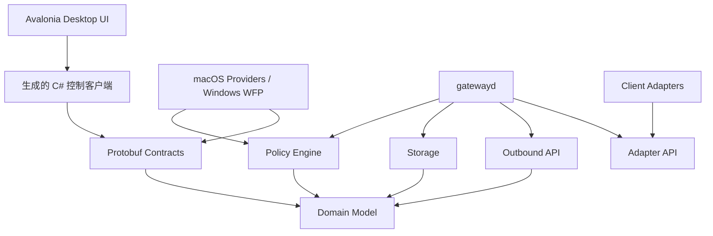
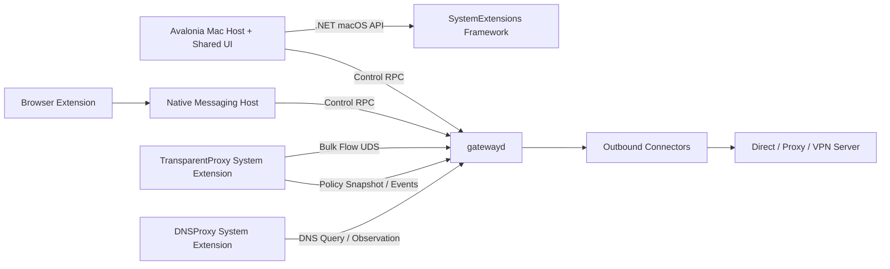
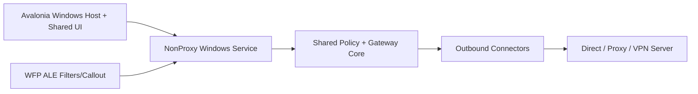

# NonProxy 技术实现文档

> 文档状态：实施基线
> 目标平台：macOS 首发，Windows 后续
> 仓库模式：Monorepo
> 关联产品文档：[NONPROXY_PRODUCT_SOLUTION.md](../NONPROXY_PRODUCT_SOLUTION.md)

## 1. 文档目的

本文把产品方案转换成可以直接用于编码、评审、测试和发布的技术规格，解决以下问题：

- macOS 上如何按应用和网站稳定区分 DIRECT/PROXY。
- 不知道软件请求域名时，如何通过应用身份完成全量直连。
- DNS、IPv4、IPv6、TCP、UDP、QUIC 如何保持一致决策。
- 如何接入不同代理/VPN，同时对封闭 VPN 保持诚实的能力边界。
- 如何建立可复用的跨平台核心，为 Windows WFP 实现保留清晰扩展点。
- 如何通过 Monorepo 管理 Swift、Rust、TypeScript、C# 和 Windows 驱动代码。
- 如何避免将 UI、规则、平台 API、协议和持久化耦合在单文件或单进程中。

本文是实现基线。改变组件边界、数据通路、策略优先级、IPC、失败语义或安全边界时，必须同步更新本文或新增 ADR。

## 2. 架构目标与约束

### 2.1 必须实现

- 用户选择应用后，该应用后续未知目标也能按应用规则处理。
- 用户从浏览器扩展添加网站后，当前站点和确认过的依赖域名按网站规则处理。
- DIRECT 流量在完整网关模式下不进入第三方 VPN。
- PROXY 流量在上游故障时遵循明确的 fail-closed/fail-open 策略。
- 每个连接决策都能追溯到策略版本、规则、应用身份、目标和实际数据路径。
- 数据面在 UI 退出后继续按最后一份有效策略工作。
- 配置切换必须原子化，可回滚。
- 敏感凭据不进入数据库明文字段、日志、崩溃报告或诊断包。

### 2.2 不实现

- 不做 TLS MITM，不安装根证书。
- 不读取 HTTP 正文、表单、Cookie 或请求体。
- 不绕过 MDM、Always-On VPN 或组织强制安全策略。
- 不以修改未公开的第三方客户端内部数据库作为正式兼容方案。
- 不把“配置写入成功”视为“实际直连成功”。

### 2.3 核心架构决策

| 编号 | 决策 |
|---|---|
| BASE-001 | 使用 Monorepo，平台应用、共享核心、协议网关、浏览器扩展和契约在同一仓库版本化 |
| BASE-002 | macOS 默认数据通路使用 Transparent Proxy + DNS Proxy System Extension |
| BASE-003 | 共享领域模型、策略引擎、规则编译器和网关接口使用 Rust |
| BASE-004 | 跨进程、跨语言控制契约使用版本化 Protobuf；大流量转发不走通用 RPC |
| BASE-005 | 完整网关模式捕获策略范围内的连接；DIRECT 由 NonProxy 绑定物理网卡转发，PROXY 进入独立出口 |
| BASE-006 | 数据面使用不可变策略快照，不为每条连接同步查询 UI 或数据库 |
| BASE-007 | Windows 使用 WFP ALE 识别应用；内核驱动只做不可由用户态完成的重定向 |
| BASE-008 | 平台捕获层不实现产品规则语义，协议网关不依赖平台 UI |
| BASE-009 | 所有生成代码集中到 `generated/`，不得手工编辑 |
| BASE-010 | 首发不使用 Bazel；使用 Cargo、SwiftPM/Xcode、pnpm、.NET 各自原生构建，再由根任务统一编排 |
| ADR-0001 | macOS 与 Windows 桌面 UI 统一使用 Avalonia 12 + .NET 10 LTS，平台高权限实现继续隔离 |

选择原生工作区而不是一开始引入 Bazel，是为了降低 Swift System Extension、Xcode 签名和 Windows 驱动构建的集成风险。根级任务只负责统一入口，不隐藏底层构建错误。

ADR-0001 的完整权衡见：

- [ADR-0001：桌面 UI 统一使用 Avalonia](ADR/0001-use-avalonia-for-cross-platform-desktop-ui.md)

## 3. 操作系统实现依据

### 3.1 macOS

`NETransparentProxyProvider` 可以按流决定由扩展处理，或交还系统继续连接；Apple 文档明确给出了按来源应用或目标 IP 决策的场景：

- [Handling Flow Copying](https://developer.apple.com/documentation/networkextension/handling-flow-copying)
- [NETransparentProxyNetworkSettings](https://developer.apple.com/documentation/networkextension/netransparentproxynetworksettings)
- [Network Extension provider deployment](https://developer.apple.com/documentation/technotes/tn3134-network-extension-provider-deployment)

但把 DIRECT flow 直接交还系统，仍可能被另一条已启用的 VPN 路由再次捕获，不能满足“明确不走第三方 VPN”的核心目标。因此完整网关模式由 NonProxy 接收 DIRECT flow，并使用 `NWConnection` 重新连接：

- `NWParameters.requiredInterface` 固定当前首选的有线、Wi-Fi 或蜂窝物理接口：
  [NWParameters.requiredInterface](https://developer.apple.com/documentation/network/nwparameters/requiredinterface)
- `prohibitedInterfaceTypes` 禁止 `.other` 和 `.loopback`，避免把 tunnel interface 当作 DIRECT 出口：
  [NWParameters](https://developer.apple.com/documentation/network/nwparameters)
- 所有 TCP/UDP relay 使用全局流数量、全局缓冲和单 flow 缓冲上限。
- 无可用物理接口时明确拒绝，不静默交回可能受 VPN 接管的系统路径。

该方案不承诺绕过 MDM、Always-On VPN 或系统强制的 `includeAllNetworks` 策略，也不假定多个 Network Extension 的执行顺序。与第三方 VPN 的兼容性必须通过真实软件矩阵和出口证据验收：
[TN3120](https://developer.apple.com/documentation/technotes/tn3120-expected-use-cases-for-network-extension-packet-tunnel-providers)。

`NEDNSProxyProvider` 用于接管系统 DNS 查询：

- [DNS proxy provider](https://developer.apple.com/documentation/networkextension/dns-proxy-provider)

首发采用 System Extension 直接分发路径：

- Avalonia 桌面应用负责跨平台状态展示和配置。
- macOS System Extension Controller 负责安装、启用、签名相关平台操作。
- Transparent Proxy Provider 负责 TCP/UDP 流捕获与流复制。
- DNS Proxy Provider 负责 DNS 观察和分流。
- `gatewayd` 负责策略持久化、上游协议、健康检查和审计。

### 3.2 Windows

Windows 后续使用 Windows Filtering Platform：

- WFP 支持 IPv4/IPv6、按应用、按用户和按连接处理流量：
  [About Windows Filtering Platform](https://learn.microsoft.com/en-us/windows/win32/fwp/about-windows-filtering-platform)
- ALE 是 WFP 中按应用身份分类连接的层：
  [Application Layer Enforcement](https://learn.microsoft.com/en-us/windows/win32/fwp/application-layer-enforcement--ale-)
- 连接重定向代理需要保留和传递 WFP redirect records：
  [SIO_SET_WFP_CONNECTION_REDIRECT_RECORDS](https://learn.microsoft.com/en-us/windows/win32/winsock/sio-set-wfp-connection-redirect-records)

Microsoft 建议：标准 WFP 过滤能完成的事情优先放在用户态，只有必须修改/重注入流量时才编写内核 Callout Driver：

- [Callout Driver Programming Considerations](https://learn.microsoft.com/en-us/windows-hardware/drivers/network/callout-driver-programming-considerations)

macOS 与 Windows UI 统一使用 Avalonia 12 + .NET 10 LTS：

- [Avalonia supported platforms](https://docs.avaloniaui.net/docs/supported-platforms)
- [Avalonia macOS platform guide](https://docs.avaloniaui.net/docs/platform-specific-guides/macos)
- [Avalonia TrayIcon](https://docs.avaloniaui.net/controls/navigation/trayicon)
- [.NET support policy](https://dotnet.microsoft.com/en-us/platform/support/policy)

统一的是 UI、ViewModel、主题和常规 UI 自动化，不是操作系统捕获层。Network Extension、WFP、Driver、安装、签名和系统权限仍然保留独立平台实现。

## 4. Monorepo 结构

目标结构如下：

```text
non_proxy/
├── AGENTS.md
├── NONPROXY_PRODUCT_SOLUTION.md
├── README.md
├── Cargo.toml
├── Cargo.lock
├── rust-toolchain.toml
├── NonProxy.slnx
├── global.json
├── Directory.Build.props
├── Directory.Packages.props
├── NuGet.Config
├── package.json
├── pnpm-lock.yaml
├── pnpm-workspace.yaml
├── justfile
├── buf.yaml
├── buf.gen.yaml
├── .editorconfig
├── .gitignore
├── .swift-format
├── rustfmt.toml
├── apps/
│   └── desktop/
│       ├── NonProxy.Desktop.slnx
│       ├── NonProxy.Desktop.Core/
│       │   ├── App/
│       │   ├── Features/
│       │   ├── Views/
│       │   ├── ViewModels/
│       │   ├── Controls/
│       │   ├── DesignSystem/
│       │   ├── Services/
│       │   ├── Platform/
│       │   └── Assets/
│       ├── NonProxy.Desktop.Mac/
│       │   ├── Program.cs
│       │   ├── MacPlatformServices.cs
│       │   └── SystemExtensionController.cs
│       ├── NonProxy.Desktop.Windows/
│       │   ├── Program.cs
│       │   └── WindowsPlatformServices.cs
│       ├── NonProxy.Desktop.Tests/
│       └── NonProxy.Desktop.E2E/
├── platform/
│   ├── macos/
│   │   ├── NonProxyPlatform.xcworkspace/
│   │   ├── TransparentProxyExtension/
│   │   ├── DNSProxyExtension/
│   │   ├── NativeMessagingHost/
│   │   └── Tests/
│   └── windows/
│       ├── wfp-callout/
│       ├── wfp-controller/
│       ├── dns-integration/
│       ├── service-installer/
│       └── tests/
├── services/
│   ├── gatewayd/
│   ├── adapter-host/
│   └── probe-server/
├── crates/
│   ├── nonproxy-model/
│   ├── nonproxy-policy/
│   ├── nonproxy-policy-compiler/
│   ├── nonproxy-dns/
│   ├── nonproxy-outbound-api/
│   ├── nonproxy-outbounds/
│   ├── nonproxy-storage/
│   ├── nonproxy-contracts/
│   ├── nonproxy-observability/
│   ├── nonproxy-security/
│   ├── nonproxy-adapter-api/
│   ├── nonproxy-config-import/
│   └── nonproxy-testkit/
├── adapters/
│   ├── surge/
│   ├── mihomo/
│   ├── sing-box/
│   ├── local-http/
│   └── local-socks/
├── packages/
│   ├── browser-extension/
│   │   ├── src/
│   │   │   ├── background/
│   │   │   ├── content/
│   │   │   ├── popup/
│   │   │   ├── learning/
│   │   │   └── shared/
│   │   ├── targets/
│   │   │   ├── chromium/
│   │   │   ├── firefox/
│   │   │   └── safari/
│   │   └── tests/
│   └── public-suffix/
├── proto/
│   └── nonproxy/
│       ├── common/v1/
│       ├── control/v1/
│       ├── policy/v1/
│       ├── provider/v1/
│       ├── adapter/v1/
│       └── events/v1/
├── generated/
│   ├── rust/
│   ├── swift/
│   ├── csharp/
│   └── typescript/
├── migrations/
│   └── sqlite/
├── fixtures/
│   ├── policies/
│   ├── dns/
│   ├── imports/
│   └── redacted/
├── tests/
│   ├── contract/
│   ├── integration/
│   ├── e2e-macos/
│   ├── e2e-windows/
│   ├── performance/
│   └── soak/
├── tools/
│   ├── xtask/
│   ├── codegen/
│   ├── fixture-builder/
│   └── release/
├── scripts/
│   ├── bootstrap/
│   ├── build/
│   ├── test/
│   └── release/
├── docs/
│   ├── TECHNICAL_IMPLEMENTATION.md
│   ├── ADR/
│   ├── protocols/
│   ├── testing/
│   ├── security/
│   └── operations/
└── third_party/
    ├── NOTICES.md
    └── licenses/
```

### 4.1 目录职责

`apps/`

- `Core` 只放一套 Avalonia 最终用户 UI；Mac/Windows 项目是薄启动宿主。
- UI 通过控制契约访问服务，不直接打开策略数据库。
- 不在 View/ViewModel 内编译规则、操作隧道或解析订阅。
- 平台差异通过小型接口注入，禁止在 ViewModel 中散布 `OperatingSystem.IsMacOS()`/`IsWindows()`。

`platform/`

- 只放操作系统捕获、系统扩展、驱动和平台安装集成。
- macOS Provider 不直接依赖 Avalonia。
- Windows Callout Driver 不包含产品策略或协议实现。

`crates/`

- 共享领域模型和跨平台核心。
- 不依赖 Avalonia、Swift、C# UI、AppKit、WFP 或 NetworkExtension 类型。
- 共享库通过纯 Rust API或显式 FFI/Protobuf 边界被消费。

`services/`

- 放可执行后台服务。
- `gatewayd` 是策略、持久化、上游网关和健康状态的权威进程。
- `adapter-host` 隔离第三方客户端适配器故障。

`packages/`

- TypeScript workspace。
- 浏览器扩展共享一套领域类型和逻辑，目标浏览器只处理打包差异。

`proto/`

- 是跨进程契约唯一来源。
- 包名必须版本化，例如 `nonproxy.control.v1`。
- 删除字段时必须保留字段号。

`generated/`

- 由固定工具版本生成。
- 可以提交仓库，方便 Xcode/Visual Studio 无网络构建。
- CI 重新生成并检查工作区必须保持干净。
- 任何人和 AI 都不得直接编辑。

`adapters/`

- 每个第三方客户端一个独立包。
- 适配器只能通过 `nonproxy-adapter-api` 与主服务交互。
- 适配器不得直接访问 UI 或策略数据库。

## 5. 构建与工作区管理

### 5.1 Rust

根 `Cargo.toml` 使用 Cargo workspace，所有 Rust 包共享 `Cargo.lock` 和构建配置。Cargo Workspace 官方支持跨包统一命令和共享 lockfile：

- [Cargo Workspaces](https://doc.rust-lang.org/cargo/reference/workspaces.html)

建议：

```toml
[workspace]
resolver = "3"
members = [
  "crates/*",
  "services/*",
  "tools/xtask"
]

[workspace.package]
edition = "2024"
```

实际 Rust 版本必须在 `rust-toolchain.toml` 固定；初始化仓库时再把同一精确版本写入 workspace 的 `rust-version`，不在架构文档中追逐“最新版”。项目总许可证也必须在开源/闭源路线确定后单独决策，不能从第三方内核许可证反推。

### 5.2 TypeScript

使用 pnpm workspace：

- 根 `pnpm-workspace.yaml` 只包含 `packages/*` 和需要 Node 工具的 `tools/*`。
- 根 lockfile 必须提交。
- 浏览器扩展使用共享包，不复制三套业务逻辑。
- [pnpm Workspace](https://pnpm.io/)

### 5.3 .NET/Avalonia

- 使用 Avalonia 12 和 .NET 10 LTS。
- `NonProxy.Desktop.Core` 保存唯一 C#/AXAML UI 源码。
- macOS 薄宿主目标为 `net10.0-macos`，以访问完整 macOS API；最终包必须在 macOS 构建。
- Windows 薄宿主目标为 `net10.0`。
- 使用 CommunityToolkit.Mvvm。
- 发布使用 self-contained 平台包，用户无需预装 .NET。
- 首发不启用 NativeAOT；待反射、序列化、诊断和打包链路稳定后再单独评估。
- C# 控制客户端由 Protobuf 生成，UI 不手写重复 DTO。
- NuGet 依赖集中管理并提交 lockfile。

### 5.4 Swift/Xcode

- Xcode workspace 只包含 Transparent Proxy、DNS Proxy、Native Messaging Host 和平台测试。
- 公共 Swift 平台支持放在本地 Swift Package。
- Xcode target 只负责 Network Extension、平台授权、安装和签名。
- 不在 Swift 平台工程中复制 Avalonia 页面或产品 ViewModel。

### 5.5 Windows

- 不再建立 WinUI 页面；桌面 UI 来自 `apps/desktop/NonProxy.Desktop.Core`。
- 服务宿主可以是 Rust 原生服务，也可以是极薄的 .NET ServiceHost 启动 Rust service。
- WFP Controller 使用 C++/Win32 或 Rust `windows` bindings，取决于 Phase Windows POC。
- Callout Driver 必须使用 WDK/C++，保持最小功能。
- Windows Service、MSIX/安装、驱动和签名配置放在 `platform/windows/`。

### 5.6 根任务

使用 `justfile` 提供清晰入口：

```text
just bootstrap
just generate
just format
just lint
just test
just check
just build-desktop
just test-desktop
just build-macos
just test-macos
just build-windows
just test-windows
just test-browser
just test-integration
just package-macos
just package-windows
```

`just` 只编排，不在一条 recipe 中塞入长脚本。超过约 20 行或包含复杂分支的逻辑放到 `scripts/` 或 `tools/xtask/`。

## 6. 依赖方向

允许的依赖方向：



禁止的依赖：

- `nonproxy-model` 依赖平台 SDK。
- UI 依赖 SQLite schema。
- System Extension 依赖 UI feature。
- Adapter 依赖某个平台 UI。
- Policy Engine 直接发送网络请求。
- Outbound 实现读取用户界面状态。
- Windows Driver 解析 Protobuf、JSON、SQLite 或第三方订阅。

## 7. 进程与组件拓扑

### 7.1 macOS



组件职责：

`NonProxy.Desktop.Core + NonProxy.Desktop.Mac`

- 用户策略、节点和状态界面。
- macOS 与 Windows 共享 Avalonia 页面、ViewModel 和主题。
- Mac 薄宿主从最终 containing app 内通过 .NET macOS API 请求安装/管理 System Extension。
- 不作为权威后台服务。
- 退出不影响既有数据面。

`SystemExtensionController`

- 位于 Mac 薄宿主，只执行 macOS System Extension 安装、授权、升级和卸载。
- 向 Avalonia UI 返回结构化状态和需要用户完成的系统操作。
- 不包含页面、策略、数据库或代理协议逻辑。

`gatewayd`

- 单写者策略数据库。
- 规则编译。
- 策略快照发布。
- 上游连接器生命周期。
- 适配器宿主协调。
- 健康检查、审计和诊断。

`TransparentProxyExtension`

- 接收 `NEAppProxyFlow`。
- 解析平台应用身份。
- 对不可变快照执行快速决策。
- DIRECT：返回 `true`，通过绑定物理网卡的本地 TCP/UDP relay 转发。
- PROXY：返回 `true`，通过本地数据通道交给 `gatewayd`。
- 不访问 SQLite，不调用远程 API，不加载订阅。

`DNSProxyExtension`

- 接收 DNS 流。
- 把查询映射到策略上下文。
- 使用直连/代理 DNS resolver。
- 维护短期必要缓存和与 `gatewayd` 的观察事件。

`NativeMessagingHost`

- 只负责浏览器 Native Messaging framing 和本地身份校验。
- 不存规则，不开放公网监听端口。

### 7.2 Windows



Windows Callout Driver 只负责：

- ALE Connect Redirect V4/V6 分类。
- 读取系统提供的应用标识和连接元数据。
- 应用已由用户态下发的紧凑策略。
- 把需代理连接重定向到本地服务。
- 保存/传递 WFP redirect records，防止递归重定向。

驱动不得：

- 解析域名订阅。
- 打开数据库。
- 运行代理协议。
- 发送遥测。
- 动态下载规则。
- 在内核中执行复杂正则表达式。

## 8. 控制面 IPC

### 8.1 契约技术

使用 Protobuf 定义跨语言契约：

- Rust：`prost`/`tonic` 或轻量本地 RPC 封装。
- Swift：SwiftProtobuf。
- C#：Google.Protobuf。
- TypeScript：生成只用于 Native Messaging payload 的类型。

使用 Buf 进行：

- 格式化。
- lint。
- 代码生成。
- breaking change 检查。

Buf 官方建议从一开始启用 lint 和 breaking 检查：

- [Buf lint quickstart](https://buf.build/docs/lint/quickstart/)
- [Buf breaking change detection](https://buf.build/docs/cli/quickstart)

### 8.2 控制服务

`ControlService` 最小方法：

```text
GetSystemStatus
GetCapabilities
ListPolicies
UpsertPolicy
DeletePolicy
ApplyPolicySnapshot
RollbackPolicySnapshot
ListOutbounds
ImportConfiguration
TestOutbound
StartLearningSession
StopLearningSession
SubscribeEvents
ExportDiagnostics
```

### 8.3 Provider 服务

`ProviderService` 最小方法：

```text
RegisterProvider
GetCurrentSnapshot
AcknowledgeSnapshot
ReportDecisionBatch
ReportHealth
ResolveDNS
OpenProxyFlow
CloseProxyFlow
```

### 8.4 版本约束

- 包名携带主版本：`nonproxy.control.v1`。
- 每条握手包含：
  - protocol version。
  - component version。
  - build ID。
  - supported capabilities。
  - minimum compatible version。
- 未知字段必须忽略。
- 删除字段时使用 `reserved`。
- breaking change 只能新增 `v2` 包，不能原地破坏 `v1`。

## 9. 大流量数据通道

Protobuf 控制 RPC 不承载网页、下载、视频等数据。

### 9.1 macOS 数据通道

推荐使用受权限保护的 Unix Domain Socket：

- Transparent Proxy Provider 与 `gatewayd` 建立本地 UDS。
- TCP 每个 flow 使用独立逻辑 stream；底层可以多路复用。
- UDP 使用按 flow ID 多路复用的数据报帧。
- Socket 路径不位于世界可写目录。
- 服务端验证对端代码签名/审计身份。

帧协议：

```text
magic        4 bytes  "NPF1"
version      2 bytes
frame_type   1 byte
flags        1 byte
flow_id      16 bytes
sequence     8 bytes
payload_len  4 bytes
payload      N bytes
```

`frame_type`：

- `OPEN_TCP`
- `OPEN_UDP`
- `DATA`
- `DATAGRAM`
- `HALF_CLOSE`
- `CLOSE`
- `WINDOW_UPDATE`
- `ERROR`
- `PING`
- `PONG`

`NPF1` 首版固定使用 36 字节大端序帧头，单帧 payload 上限 256 KiB，`flow_id` 不得全零，收发两个方向的 `sequence` 均从 0 开始严格递增。`OPEN_TCP`/`OPEN_UDP` payload 依次携带 32 字节 Provider capability、长度前缀的 outbound ID、SOCKS 地址格式的目标 endpoint 和 32 位初始接收窗口；该 payload 在解析后归零。`DATAGRAM` 每帧携带独立目标 endpoint，单个 UDP 内容上限 65,000 字节且不支持 SOCKS5 分片。`WINDOW_UPDATE` 只包含 32 位正整数增量。

首版每条 UDS 连接只承载一个 flow，但帧始终携带 `flow_id`，为后续经过独立压测的多路复用保留兼容空间。`gatewayd` 默认在状态目录创建权限为 `0600` 的 `gatewayd-flow.sock`，可通过 `NONPROXY_FLOW_SOCKET_PATH` 覆盖；覆盖路径仍必须与控制 Socket 同处私有状态目录且不能重名。服务端只在验证首个 OPEN 帧、Provider capability、严格序列、出口启用状态和连接上限后建立真实代理连接。

当前 Rust 数据面实现把每条 UDS 限定为一个 flow、全局最多 2,048 个活跃 flow，并以最多 64 个待写帧的有界队列隔离慢消费者。TCP 支持 HTTP CONNECT 与 SOCKS5、保持 `HALF_CLOSE`；UDP 只允许支持 UDP ASSOCIATE 的 SOCKS5 出口。凭据按引用从系统凭据库临时读取，不进入数据库或日志。Provider 侧代码签名/审计身份校验仍是启用真实 System Extension 前的发布门禁，不能用 `0600` 与 capability token 代替。

macOS Transparent Proxy 在每条 PROXY flow 上使用独立 `NWConnection(.unix)` 连接该数据 Socket。Swift 通道在 OPEN 后才向应用侧继续读取，并分别维护双向序列、256 KiB 初始窗口、16 MiB 窗口上限和 64 帧写队列；TCP 保留应用侧与远端半关闭，UDP 每帧保留自己的目标地址。所有 relay 共享 2,048 flow 和 32 MiB 待处理数据预算，停止 Provider 时统一撤销。仓库冒烟会启动真实 `gatewayd` 和本地 HTTP CONNECT 回显夹具，由 Swift 完成 NPF1 OPEN、窗口、数据确认和 CLOSE；该证据覆盖跨语言 Unix Socket 数据面，但不替代签名 System Extension 的真实设备验收。

### 9.2 背压

- 每个 flow 有独立发送窗口。
- Provider 不无限读取本地 flow。
- `gatewayd` 未确认窗口前停止读取。
- TCP 保持半关闭语义。
- UDP 设置单 flow 和全局队列上限。
- 超限记录结构化错误，不阻塞 Provider 主回调线程。

### 9.3 防回环

- loopback/UDS 不进入透明代理。
- `gatewayd` 的代理服务器连接由 Provider 识别为系统组件并交还物理网络。
- 每个 flow 携带 origin marker。
- Windows 使用 WFP redirect context/records 识别已重定向连接。
- 检测同一目标的递归深度，超过 1 立即失败并报告 `NP_FLOW_LOOP_DETECTED`。

## 10. 领域模型

### 10.1 AppIdentity

跨平台规范：

```text
AppIdentity
  platform
  stable_id
  signer_id
  executable_hash
  executable_path_hint
  display_name
  parent_identity
  helper_group_id
```

macOS：

- `stable_id`：Bundle Identifier 或 Code Signing Identifier。
- `signer_id`：Designated Requirement/Team Identifier 的规范化摘要。
- PID 和路径只作为一次连接的观测信息，不作为唯一长期身份。
- Helper、XPC 和子进程通过签名、父应用和已知 bundle 关系归组。

Windows：

- `stable_id`：WFP ALE App ID 规范化路径或包身份。
- `signer_id`：代码签名发布者/包发布者。
- UWP/MSIX 使用 Package Family Name。
- Win32 可补充文件 hash，但更新后需要签名身份迁移。

### 10.2 Destination

```text
Destination
  hostname
  normalized_domain
  ip
  port
  transport
  ip_family
  interface
```

域名规范化：

- 小写。
- 移除末尾点。
- IDN 使用明确的 U-label/A-label 转换。
- 规则存储使用规范化 ASCII。
- 使用 Public Suffix List 计算 registrable domain。
- 不使用“最后两个标签”这种错误算法。

### 10.3 Decision

```text
Decision
  action: DIRECT | PROXY | BLOCK
  outbound_id
  failure_mode
  matched_policy_id
  matched_rule_id
  snapshot_version
  reason_code
```

### 10.4 Capability

平台和适配器都必须声明能力：

```text
Capability
  app_match
  domain_match
  cidr_match
  tcp
  udp
  ipv4
  ipv6
  dns_split
  hot_reload
  path_evidence
  exit_probe
```

UI 只能根据能力展示可用功能，不能假设所有后端支持相同语义。

## 11. 策略引擎

### 11.1 模块拆分

`nonproxy-policy`

- 纯决策逻辑。
- 输入 `ConnectionContext + CompiledSnapshot`。
- 输出 `Decision`。
- 无 IO、无数据库、无日志副作用。

`nonproxy-policy-compiler`

- 把数据库 Policy 编译成紧凑不可变快照。
- 执行冲突检测、语义校验和能力降级检查。
- 生成版本、内容哈希和统计信息。

`nonproxy-model`

- 领域类型、枚举、ID 和验证规则。

### 11.2 快照结构

```text
CompiledPolicySnapshot
  schema_version
  snapshot_version
  created_at
  content_hash
  default_decision
  system_rules
  scoped_app_destination_rules
  app_rules
  domain_trie
  cidr_radix_v4
  cidr_radix_v6
  network_profile_rules
  outbound_capabilities
```

索引：

- App rule：hash map。
- Domain/suffix：反向标签 trie。
- IPv4/IPv6 CIDR：radix tree。
- App + Destination：两级索引。
- 正则域名不进入小白默认功能；高级规则单独分组并限制数量。

### 11.3 优先级

固定优先级：

1. 安全系统规则。
2. App + Destination。
3. App。
4. Domain / CIDR。
5. Network Profile。
6. 内置规则。
7. Default。

优先级不是数据库行顺序。任何 UI 拖动排序都必须映射为显式优先级或 scope，不能依赖偶然顺序。

同一固定层级内先比较显式 `priority`，数值越大越优先；再比较选择器特异性。目标选择器按 Exact Domain、Registrable Domain、Domain Suffix、CIDR 的顺序比较，同类中更深的域名后缀或更长的 CIDR 前缀优先；带签名约束的应用、显式传输协议和更窄的端口范围更具体。最后仅使用稳定 Policy ID 保证确定性。同一层级、同一显式优先级且选择器完全相同的规则属于配置冲突，Compiler 必须拒绝发布，不能依赖插入或数据库行顺序决定结果。

Adapter 输入不拥有单独的优先级层。Compiler 根据它实际包含的维度映射到 App + Destination、App 或 Domain / CIDR 层，避免外部订阅通过来源类型绕过固定优先级。

### 11.4 编译发布

1. UI 调用 Upsert/Delete。
2. `gatewayd` 在事务中写入草稿。
3. Compiler 读取一致性视图。
4. 执行语义校验。
5. 生成快照和 hash。
6. 写入 `policy_snapshot`。
7. 发布给 Provider。
8. Provider 加载后返回 ACK。
9. 达到所需 ACK 策略后标记 active。
10. 失败则继续使用上一份快照。

Rust 服务使用 `Arc`，Swift Provider 使用不可变值和同步只读引用完成原子切换；两端都不得为切换快照暂停全部流量。

## 12. macOS Transparent Proxy 实现

### 12.1 文件拆分

建议结构：

```text
TransparentProxyExtension/
├── ExtensionEntry.swift
├── Provider/
│   ├── TransparentProxyProvider.swift
│   ├── ProviderLifecycle.swift
│   └── NetworkSettingsFactory.swift
├── Flow/
│   ├── FlowClassifier.swift
│   ├── TCPFlowRelay.swift
│   ├── UDPFlowRelay.swift
│   ├── FlowBackpressure.swift
│   └── FlowErrorMapper.swift
├── Identity/
│   ├── AppIdentityResolver.swift
│   ├── CodeSignatureResolver.swift
│   └── IdentityCache.swift
├── Policy/
│   ├── PolicySnapshotStore.swift
│   ├── SnapshotValidator.swift
│   ├── CanonicalSnapshotHasher.swift
│   ├── ProviderPolicyEngine.swift
│   └── DecisionMapper.swift
├── IPC/
│   ├── GatewayConnection.swift
│   ├── FrameCodec.swift
│   └── ProviderControlClient.swift
└── Diagnostics/
    ├── ProviderHealth.swift
    └── DecisionBatcher.swift
```

不得把以上内容合并进一个 `PacketTunnelProvider.swift` 或 `TransparentProxyProvider.swift`。

### 12.2 生命周期

状态：

```text
stopped
starting
loadingSnapshot
ready
degraded
stopping
failed
```

`startProxy`：

1. 初始化本地结构化日志。
2. 连接 `gatewayd`。
3. 获取最新已激活快照。
4. 验证快照版本和 hash。
5. 创建 included/excluded network rules。
6. 调用 `setTunnelNetworkSettings`。
7. 健康状态变为 ready。

若 `gatewayd` 不可用：

- 可以加载经过验证的本地缓存快照。
- DIRECT 规则可继续工作。
- PROXY 流量按 fail-closed/fail-open 处理。
- 不得无提示全部直连。

### 12.3 `handleNewFlow`

逻辑：

1. 提取 TCP/UDP、远端 endpoint、hostname。
2. 解析来源应用身份。
3. 构造 `ConnectionContext`。
4. 调用经过跨语言黄金向量验证的 Swift 纯函数策略运行时。
5. 记录轻量 decision event。
6. DIRECT：
   - 返回 `true`。
   - 选择当前首选物理网卡。
   - 使用设置了 `requiredInterface` 且禁止 tunnel/loopback 类型的连接转发。
   - 没有物理网卡或达到有界资源上限时以稳定错误码关闭。
7. PROXY：
   - 返回 `true`。
   - 建立本地 flow relay。
8. BLOCK：
   - 返回 `true` 后用明确错误关闭。

回调必须快速返回；代码签名解析和磁盘 IO 不得阻塞回调线程。身份解析使用缓存和异步预热。

### 12.4 应用身份

- 优先使用系统 flow metadata/audit token。
- 从 audit token 获取签名身份。
- 缓存键包含可执行文件签名标识，不仅是 PID。
- PID 复用后必须重新校验。
- 无法识别时使用 `unknown-app`，按默认策略处理并显示证据不足。
- 不因身份解析失败而擅自把 PROXY 流量变为 DIRECT。

### 12.5 Network Settings

- included rules 覆盖所需 outbound TCP/UDP。
- excluded rules 排除 loopback、必要本地控制通道和明确系统控制流量。
- 局域网策略由 Policy 决定，不使用一个隐式全局布尔值掩盖行为。
- Provider 启动前解析代理服务器 endpoints，避免隧道回环。
- 网卡变化时重建设置并保持快照版本不变。

## 13. macOS DNS Proxy 实现

建议结构：

```text
DNSProxyExtension/
├── ExtensionEntry.swift
├── Provider/
│   ├── DNSProxyProvider.swift
│   └── DNSProviderLifecycle.swift
├── Protocol/
│   ├── DNSMessageParser.swift
│   ├── DNSMessageEncoder.swift
│   └── DNSErrorMapper.swift
├── Routing/
│   ├── DNSDecisionEngine.swift
│   ├── ResolverSelector.swift
│   └── AppDNSContextResolver.swift
├── Resolver/
│   ├── DirectResolver.swift
│   ├── ProxyResolver.swift
│   ├── DoHResolver.swift
│   └── DoTResolver.swift
├── Cache/
│   ├── PartitionedDNSCache.swift
│   ├── CNAMEGraph.swift
│   └── DomainIPObservationStore.swift
└── IPC/
    └── DNSControlClient.swift
```

### 13.1 缓存隔离

DNS cache key 必须包含：

```text
qname + qtype + route_kind + outbound_id + network_profile
```

DIRECT 与 PROXY 不共享解析结果缓存，避免：

- 代理 DNS 结果被直连使用。
- 直连 DNS 查询泄漏代理域名。
- 不同企业/家庭网络的 split DNS 混用。

DIRECT DNS 请求必须携带当前首选物理网卡索引，`gatewayd` 在 UDP 和
TCP socket 建连前绑定该网卡。Provider 无法确定物理网卡时返回
`SERVFAIL`，不得退回未绑定的系统路由或偷偷经过 VPN。

### 13.2 观察映射

保存：

- qname。
- CNAME 链。
- A/AAAA。
- TTL。
- route kind。
- app identity（若可用）。
- resolver。
- network profile。

IP 映射只在 TTL 内作为辅助证据，不转化为永久域名规则。

### 13.3 自带 DoH/ECH

- 浏览器扩展提供标签页域名上下文。
- Transparent Proxy 的 hostname metadata 作为主信号。
- TLS SNI 只能作为补充，不作为必需条件。
- 不为获取域名而解密 TLS。
- 完全无法归属时退回 app policy 或 IP policy。

## 14. Gateway Daemon

建议结构：

```text
services/gatewayd/src/
├── main.rs
├── bootstrap.rs
├── config.rs
├── runtime/
│   ├── mod.rs
│   ├── lifecycle.rs
│   └── shutdown.rs
├── control/
│   ├── mod.rs
│   ├── service.rs
│   ├── authorization.rs
│   └── event_stream.rs
├── provider/
│   ├── mod.rs
│   ├── registry.rs
│   ├── snapshot_delivery.rs
│   └── health.rs
├── flow/
│   ├── mod.rs
│   ├── listener.rs
│   ├── session.rs
│   ├── tcp.rs
│   ├── udp.rs
│   └── backpressure.rs
├── policy/
│   ├── mod.rs
│   ├── application.rs
│   └── rollback.rs
├── outbound/
│   ├── mod.rs
│   ├── registry.rs
│   ├── health_check.rs
│   └── failover.rs
├── learning/
│   ├── mod.rs
│   ├── session.rs
│   ├── app_learning.rs
│   └── site_learning.rs
├── storage/
│   ├── mod.rs
│   └── repositories.rs
└── diagnostics/
    ├── mod.rs
    ├── exporter.rs
    └── redaction.rs
```

`main.rs` 只能创建 runtime 并调用 bootstrap，不包含业务逻辑。

### 14.1 生命周期

```text
stopped -> starting -> migrating -> loading -> ready
                                      |
                                      v
                                  degraded
                                      |
                                      v
                                    failed
```

启动顺序：

1. 读取最小本地配置。
2. 初始化安全日志。
3. 打开数据库。
4. 执行迁移。
5. 加载 Keychain/凭据引用。
6. 校验最后策略快照。
7. 初始化 outbounds。
8. 启动本地控制服务。
9. 启动 Provider 服务和 flow socket。
10. 发布 ready。

停止顺序：

1. 停止接收新控制写入。
2. 标记 draining。
3. 停止新 PROXY flow。
4. 给现有 flow 限时排空。
5. 刷新审计批次。
6. 关闭数据库。

## 15. Outbound 接口

共享接口示意：

```rust
pub trait OutboundConnector: Send + Sync {
    fn id(&self) -> &OutboundId;
    fn capabilities(&self) -> OutboundCapabilities;
    async fn connect_tcp(
        &self,
        request: TcpConnectRequest,
    ) -> Result<Box<dyn AsyncStream>, OutboundError>;
    async fn open_udp(
        &self,
        request: UdpSessionRequest,
    ) -> Result<Box<dyn DatagramSession>, OutboundError>;
    async fn health_check(&self) -> HealthResult;
    async fn shutdown(&self);
}
```

每种协议一个独立 crate/module，不在 registry 中写协议细节。

首发实现顺序：

1. Direct。
2. Local HTTP CONNECT。
3. Local SOCKS5。
4. WireGuard 或选定标准 VPN。
5. 订阅型代理核心。

### 15.1 Failover

- Failover 是 outbound group 的职责。
- Policy 决定 group，不直接选择瞬时节点。
- 健康检查不得用用户真实目标。
- 节点切换产生审计事件。
- 已建立 TCP 不自动迁移。
- UDP session 根据协议能力决定重建。

### 15.2 标准本地代理导入

首版导入契约固定为 `nonproxy-json-v1`，请求体上限 256 KiB，单次最多 100 个出口，未知字段、重复标识和不完整凭据对均被拒绝。桌面端不要求普通用户编写 JSON，而是把结构化表单转换为该内部契约：

```json
{
  "version": 1,
  "outbounds": [
    {
      "id": "local-proxy",
      "kind": "socks5",
      "host": "127.0.0.1",
      "port": 1080,
      "username": "alice",
      "password": "secret",
      "enabled": true
    }
  ]
}
```

导入采用补偿事务：先把新凭据写入 macOS Keychain、Windows Credential Manager 或对应平台安全存储，再在一个 `BEGIN IMMEDIATE` 事务中校验全部 revision 并保存全部出口；数据库失败时删除新凭据，数据库成功后再清理旧凭据。SQLite、审计日志、RPC 响应和出口列表只包含版本化凭据引用，不包含用户名或密码。配置缓冲区在客户端和服务端完成处理后归零。

`SOCKS5` 声明 TCP、UDP、IPv4 和 IPv6 能力；`HTTP CONNECT` 只声明 TCP、IPv4 和 IPv6，并在导入结果中给出 TCP-only 提示。这里只表示协议能力，不表示健康检查已通过；在真实 connector 和探针完成前，出口健康状态保持 `stopped`。

## 16. 第三方客户端适配器

适配器接口：

```text
detect
read_capabilities
read_current_configuration
prepare_change
validate_change
apply_change
reload
verify
rollback
```

事务语义：

1. 只读检测。
2. 建立带 hash 的备份。
3. 生成候选配置。
4. 使用客户端原生 parser/API 校验。
5. 原子替换或调用公开 API。
6. 热重载。
7. 发起真实路径验证。
8. 验证失败自动回滚。

禁止：

- 修改不透明数据库。
- 猜测客户端配置目录。
- 在升级后继续套用未经版本校验的 patch。
- 日志打印订阅 URL、Token、节点密码。

每个适配器包含：

```text
adapters/<name>/
├── manifest.yaml
├── src/
├── fixtures/
├── tests/
└── README.md
```

`manifest.yaml` 声明支持的客户端版本和能力。

## 17. Avalonia 桌面 UI

### 17.1 技术栈

- Avalonia 12。
- .NET 10 LTS。
- C#。
- AXAML。
- CommunityToolkit.Mvvm。
- Microsoft.Extensions.DependencyInjection。
- Microsoft.Extensions.Hosting 只用于应用生命周期、配置和依赖注入，不承载后台数据面。
- 生成的 Google.Protobuf 控制客户端。

Avalonia UI 核心使用 MIT 许可证；任何额外商业组件必须单独登记许可证。Avalonia 12 推荐 .NET 10，项目发布使用 self-contained runtime。

### 17.2 项目结构

```text
apps/desktop/
├── NonProxy.Desktop.Core/
│   ├── App.axaml
│   ├── App.axaml.cs
│   ├── App/
│   │   ├── Bootstrapper.cs
│   │   ├── ServiceRegistration.cs
│   │   ├── ApplicationLifetime.cs
│   │   ├── NavigationService.cs
│   │   └── UnhandledExceptionHandler.cs
│   ├── Features/
│   │   ├── Dashboard/
│   │   ├── Policies/
│   │   ├── Applications/
│   │   ├── Websites/
│   │   ├── Outbounds/
│   │   ├── Learning/
│   │   ├── Diagnostics/
│   │   └── Settings/
│   ├── Controls/
│   ├── DesignSystem/
│   │   ├── Colors.axaml
│   │   ├── Typography.axaml
│   │   ├── Spacing.axaml
│   │   ├── Icons/
│   │   └── Themes/
│   ├── Services/
│   │   ├── Control/
│   │   ├── Events/
│   │   ├── Dialogs/
│   │   └── Localization/
│   ├── Platform/
│   │   ├── IPlatformShell.cs
│   │   ├── ISystemComponentInstaller.cs
│   │   ├── IAutoStartService.cs
│   │   └── IAppDiscoveryService.cs
│   └── Assets/
├── NonProxy.Desktop.Mac/
│   ├── Program.cs
│   ├── MacPlatformServices.cs
│   └── SystemExtensionController.cs
└── NonProxy.Desktop.Windows/
    ├── Program.cs
    └── WindowsPlatformServices.cs
```

每个 Feature 可以包含：

```text
Dashboard/
├── DashboardView.axaml
├── DashboardView.axaml.cs
├── DashboardViewModel.cs
├── DashboardState.cs
├── DashboardMapper.cs
└── DashboardViewModelTests.cs
```

禁止建立覆盖全部功能的 `MainViewModel.cs`、`AppManager.cs` 或 `NetworkManager.cs`。

### 17.3 MVVM 边界

View：

- 只负责布局、绑定、动画和纯 UI 生命周期。
- code-behind 只处理无法合理表达为绑定的焦点、窗口或控件行为。
- 不调用控制 RPC、不访问数据库、不判断策略。

ViewModel：

- 依赖用例级 service interface。
- 暴露不可变或可观察 UI state。
- 命令全部支持取消、重复点击保护和用户可理解错误。
- 不直接引用 NetworkExtension、WFP、Keychain、注册表或驱动类型。
- 不在 ViewModel 中散布平台分支。

Service：

- `ControlClient` 封装 Protobuf RPC。
- `EventStreamClient` 负责连接事件流、重连和 backpressure。
- `Platform` 接口只封装 UI 所需的系统外壳能力。
- 产品规则、导入、持久化和代理协议仍在 `gatewayd`。

### 17.4 平台接口

允许的 UI 平台接口保持小而稳定：

```csharp
public interface IPlatformShell
{
    PlatformKind Platform { get; }
    Task ShowMainWindowAsync(CancellationToken cancellationToken);
    Task RevealFileAsync(string path, CancellationToken cancellationToken);
}

public interface ISystemComponentInstaller
{
    Task<SystemComponentState> GetStateAsync(CancellationToken cancellationToken);
    Task<InstallResult> InstallAsync(CancellationToken cancellationToken);
    Task<InstallResult> UninstallAsync(CancellationToken cancellationToken);
}
```

Mac 宿主目标为 `net10.0-macos`，在最终 containing app 进程中通过 SystemExtensions framework 提交激活/卸载请求；Windows 宿主调用 Windows Service/Installer。接口返回领域 DTO，不泄漏 `OSSystemExtensionRequest`、Win32 handle 或 WFP struct。

### 17.5 托盘、菜单和窗口

- 使用 Avalonia `TrayIcon` 共享基本菜单。
- 使用 `NativeMenu` 提供 macOS 原生菜单栏。
- Windows 使用系统通知区域菜单。
- 菜单命令绑定到共享 ViewModel/application command。
- 菜单项文案和快捷键允许平台资源覆盖。
- macOS 可配置不在 Dock 显示，但必须验证启动、激活和窗口恢复。
- 托盘退出只停止 UI；是否停止 `gatewayd` 和数据面由明确用户动作决定。

### 17.6 状态同步

- UI 启动先读取 `GetSystemStatus` 快照，再订阅事件。
- Event stream 断开时显示“状态更新中断”，不假设网络已停止。
- 重连后使用 sequence/cursor 补齐或重新读取完整快照。
- ViewModel 不把 transient UI state 写回权威策略库。
- 策略编辑使用 draft，服务器确认 active snapshot 后再显示“已应用”。

### 17.7 主题、可访问性和本地化

- 支持浅色、深色和系统主题。
- 不只依靠颜色表达 DIRECT/PROXY/ERROR。
- 所有交互控件有可访问名称。
- 键盘可完成主要流程。
- macOS VoiceOver 和 Windows Narrator 分别验收。
- 文案通过资源文件本地化，错误码与用户文案分离。
- UI 缩放和高 DPI 在两平台分别测试。

### 17.8 发布

macOS：

- `dotnet publish` 从 `NonProxy.Desktop.Mac` 生成 `osx-arm64`/需要时 `osx-x64` self-contained UI。
- 发布脚本组装 Avalonia `.app`、Swift 平台组件、System Extension、Native Messaging Host 和 `gatewayd`。
- 按嵌套组件到外层 App 的顺序签名，最后 notarize。
- System Extension 必须位于 containing `.app/Contents/Library/SystemExtensions/`。
- 激活请求必须由 containing app 的 Mac 宿主提交。
- 共享 UI 可以跨平台编译，但 `net10.0-macos` 宿主及最终签名包必须在 macOS 构建和验证。

当前 System Extension 打包实现：

- `NonProxyTransparentSystemExtension` 与 `NonProxyDNSSystemExtension` 是只负责启动 Provider 的独立 Swift 可执行 target，业务实现仍留在对应 Provider 模块。
- `NonProxy.Desktop.Mac` 构建完成后调用 `scripts/macos/package-system-extensions.sh`，把两个 `SYSX` Bundle 放入最终 `.app/Contents/Library/SystemExtensions/`。
- Debug 构建生成当前机器架构；不指定 RID 的 Release 构建同时生成 `arm64` 与 `x86_64`，并要求宿主和两个扩展的架构集合完全一致。
- 默认使用临时签名验证开发包结构，不代表系统会批准真实激活。正式包必须设置 `NONPROXY_RESTRICTED_SIGNING=1`，并提供 `NONPROXY_CODESIGN_IDENTITY`、`NONPROXY_HOST_PROFILE`、`NONPROXY_TRANSPARENT_PROFILE` 与 `NONPROXY_DNS_PROFILE`。
- 正式签名按 Transparent Proxy、DNS Proxy、外层 App 的顺序执行；外层 App 只在正式受限签名时应用安装 System Extension 所需 entitlement。
- `scripts/macos/verify-system-extension-bundle.sh` 校验 Bundle 标识、Extension Point、Principal Class、Mach-O 架构、NetworkExtension 链接、Provider Objective-C 符号、签名 entitlement 和嵌套签名完整性。
- 当前证据只证明可执行 Bundle 可构建、可嵌入且签名结构自洽；Developer ID 签名、系统审批、Network Extension 配置、启动、升级、卸载和真实流量路径仍按系统测试门禁验收。

Windows：

- `dotnet publish` 从 `NonProxy.Desktop.Windows` 生成 `win-x64`/`win-arm64` self-contained UI。
- 安装器组合 Avalonia UI、Windows Service、WFP 组件和 Native Messaging Host。
- 驱动签名与普通应用签名分开验证。

### 17.9 UI 测试

- ViewModel 单元测试不启动 Avalonia runtime。
- AXAML 编译作为构建门禁。
- 关键控件做渲染/主题测试。
- 公共流程在 macOS 与 Windows 各运行 UI 自动化：
  - 首次启动。
  - System Component 状态。
  - 添加直连应用。
  - 添加直连网站。
  - 策略应用与回滚。
  - 上游故障。
  - 托盘隐藏/恢复。
- UI 通过不能替代 Provider/WFP 的真实网络路径验证。

## 18. 浏览器扩展

### 18.1 共享逻辑

共享：

- 当前标签页域名规范化。
- 学习 session。
- initiator 关系。
- 依赖域名评分。
- Native Messaging 消息。
- UI 状态模型。

平台差异：

- Safari 权限和宿主打包。
- Chromium Manifest V3 service worker。
- Firefox API 差异。

### 18.2 最小权限

- 默认请求 `activeTab`。
- 只有用户开启学习时才申请所需 host permission。
- 不申请读取历史记录。
- 不读取页面正文。
- 不保存完整 URL query。
- 发送给主应用的 URL 先去除 query 和 fragment。

### 18.3 标签页学习

事件：

```text
LearningSessionStarted
MainFrameObserved
SubresourceObserved
RedirectObserved
LearningCandidateUpdated
LearningSessionStopped
```

评分输出不是直接写规则：

```text
required_first_party
likely_api
likely_auth
likely_cdn
third_party
unknown
```

除主域名和高可信一方依赖外，默认要求用户确认。

## 19. 存储

SQLite 是本地权威配置库，只有 `gatewayd` 写入。

首发 Rust 存储层使用随应用构建的 SQLite，文件连接启用 `WAL`、`synchronous=FULL`、`foreign_keys=ON` 和 `trusted_schema=OFF`。`gatewayd` 打开数据库前必须取得同目录写租约；数据库、租约文件和迁移 metadata 备份在 Unix 上使用 `0600`。数据库文件或租约文件为符号链接时拒绝启动。UI、Provider、浏览器扩展和 Adapter 不得绕过控制面直接打开数据库。

核心表：

```text
policy
app_identity
app_identity_alias
domain_target
outbound
outbound_group
network_profile
policy_snapshot
policy_snapshot_ack
connection_decision
dns_observation
learning_session
learning_candidate
adapter_state
health_probe
schema_migration
```

### 19.1 迁移

- 每次 schema 变化新增 migration 文件。
- 已发布 migration 不得修改。
- migration 文件带单调版本号和说明。
- 启动前备份数据库 metadata。
- 迁移失败时不启动写服务，不静默重建数据库。
- 降级只支持经过明确设计的逆向迁移或从备份恢复。

迁移文件嵌入服务二进制，`schema_migration` 保存版本、名称和 SHA-256；已应用迁移的名称或内容哈希发生变化时启动失败。一次启动中的全部待执行 migration 放在同一个 `BEGIN IMMEDIATE` 事务中，任一条失败则整组回滚。发现无迁移历史但已有业务表的数据库时视为外部或损坏数据库，不自动接管。

策略、出口和网络画像写入使用显式 revision 乐观锁。Wi-Fi 网络画像只保存 SHA-256 指纹，不保存原始 SSID。出口 endpoint 只接受规范化主机名或 IP，不接受可能携带用户名、密码或 Token 的 URI。

### 19.2 快照发布事务

- 快照版本严格单调递增，同时最多一份 `pending` 和一份 `active`。
- 快照 payload 上限 16 MiB，数据库和领域构造器双重校验。
- Provider ACK 同时绑定 snapshot version、content hash、provider ID 和单调 generation；同代相同 ACK 可幂等重放，同代不同内容或低代 ACK 被拒绝。
- 只有全部必需 Provider 返回 `loaded` 后，单个事务才把旧 active 标为 `superseded` 并激活新快照。
- 任一 Provider 拒绝或控制面主动判定失败时，只把 pending 标为 `rejected`，旧 active 保持不变。
- 回滚不得重新激活旧版本；必须复制已验证的旧 payload/hash，创建更高的新 snapshot version，重新投递、ACK 后激活。

### 19.3 日志保留

- 决策日志默认 24 小时。
- DNS observation 默认 24 小时。
- 聚合指标可保留更久，但不得保留完整域名明细。
- 清理任务分批执行，避免长事务。
- 每张明细表单批最多删除 10,000 条，默认保留窗口为 24 小时。

### 19.4 凭据

SQLite 只保存：

- Keychain item reference。
- credential kind。
- display label。
- version。

不保存私钥、Token、订阅 URL 密钥或密码明文。

## 20. 可观测性

### 20.1 结构化事件

所有事件包含：

```text
event_id
timestamp
component
component_version
severity
error_code
snapshot_version
flow_id (optional)
redaction_level
```

### 20.2 错误码

格式：

```text
NP_<SUBSYSTEM>_<REASON>
```

示例：

- `NP_POLICY_CONFLICT`
- `NP_POLICY_SNAPSHOT_INVALID`
- `NP_FLOW_LOOP_DETECTED`
- `NP_FLOW_BACKPRESSURE_TIMEOUT`
- `NP_DNS_RESOLVER_UNAVAILABLE`
- `NP_OUTBOUND_AUTH_FAILED`
- `NP_ADAPTER_VERSION_UNSUPPORTED`
- `NP_PLATFORM_MANAGED_VPN_DETECTED`

用户文案与错误码分离，便于本地化。

### 20.3 决策批处理

Provider 不逐条同步写日志：

- 内存 ring buffer。
- 按数量或时间批量上报。
- 队列满时丢弃低价值 debug 事件，保留 health/error 计数。
- 不因日志服务不可用阻断流量。

### 20.4 诊断包

包含：

- 组件版本。
- OS/芯片。
- capability。
- 策略统计，不包含完整秘密。
- 最近错误。
- System Extension 状态。
- 网络接口和路由摘要。
- 已脱敏连接样本。

导出前：

- 自动脱敏。
- 用户可预览。
- 不包含 Keychain。
- 不自动上传。

## 21. 安全模型

### 21.1 信任边界

高权限：

- macOS System Extension。
- Windows Service。
- Windows Callout Driver。
- `gatewayd`。

低权限：

- UI。
- 浏览器扩展。
- Native Messaging Host。
- 外部订阅和规则文件。

低权限输入进入高权限组件前必须：

- 验证 schema。
- 限制大小和数量。
- 规范化域名、路径和 ID。
- 拒绝路径穿越。
- 限制正则复杂度。
- 对配置导入设置 CPU/内存/时间上限。

### 21.2 IPC

- 只监听本地 UDS/named pipe。
- 验证调用者代码签名或用户 SID。
- 不使用无认证的 localhost HTTP 管理口。
- 每次连接有 nonce 和版本协商。
- 高风险写操作需要 UI session capability token。
- Control 与 Provider 使用不同的 `0600` 引导能力文件，不能互相代用。
- Provider 注册使用一次性 32 字节启动 nonce，成功后换取 15 分钟短会话；每个请求携带严格递增序号以拒绝重放。
- Provider generation 跨 `gatewayd` 重启持久化，旧代 ACK 和健康状态不能覆盖新会话。
- 引导能力不能替代发行包中的 UDS 对端代码签名校验；最终 System Extension 验收必须同时证明签名身份。

### 21.3 更新

- 更新 manifest 签名。
- 包 hash 校验。
- 防回滚版本。
- System Extension/Driver 与主应用兼容性检查。
- 升级前保留上一版本和最后有效策略。
- 驱动升级失败不得留下系统无网络状态。

### 21.4 供应链

- Cargo、pnpm、SwiftPM、NuGet 依赖全部锁定。
- CI 运行许可证和漏洞扫描。
- 第三方二进制记录来源、版本、hash 和许可证。
- `third_party/NOTICES.md` 随包发布。

## 22. Windows 实现预留

### 22.1 用户态优先

Windows POC 先验证：

- WFP 用户态管理 API 是否能完成所需分类和过滤。
- ALE App ID 到 `AppIdentity` 的稳定映射。
- TCP connect redirect。
- UDP 的处理边界。
- DNS 客户端归属。

只有实际重定向无法用标准功能完成时，才引入 Callout Driver。

### 22.2 WFP 层

计划评估：

- `FWPM_LAYER_ALE_AUTH_CONNECT_V4/V6`
- `FWPM_LAYER_ALE_CONNECT_REDIRECT_V4/V6`
- `FWPM_LAYER_ALE_FLOW_ESTABLISHED_V4/V6`
- DNS 所需 datagram/stream 层

最终层选择必须通过 WDK POC、性能和 Driver Verifier 结果确认，不能只依据文档命名决定。

### 22.3 共享复用

直接复用：

- `nonproxy-model`
- `nonproxy-policy`
- `nonproxy-policy-compiler`
- `nonproxy-dns` 的非平台部分
- `nonproxy-outbound-api`
- `nonproxy-outbounds`
- `nonproxy-storage`
- `nonproxy-contracts`
- `gatewayd` 的大部分功能
- 浏览器扩展

平台实现：

- Avalonia 桌面 UI 直接复用。
- WFP 捕获/重定向。
- Windows DNS 集成。
- Windows Service 安装。
- MSIX/驱动签名和升级。

## 23. 测试策略

### 23.1 单元测试

必须覆盖：

- 规则优先级。
- 域名规范化。
- Public Suffix。
- AppIdentity alias。
- IPv4/IPv6 CIDR。
- 默认 fail mode。
- snapshot hash。
- config import。
- DNS cache partition。
- adapter capability downgrade。
- credential redaction。

### 23.2 Contract 测试

- Protobuf round-trip。
- 旧 client 与新 service 兼容。
- 未知字段。
- reserved 字段。
- Buf breaking check。
- UDS frame 编解码。
- 帧大小、截断和乱序。

### 23.3 集成测试

使用本地 fixture services：

- HTTP echo。
- HTTPS exit probe。
- UDP echo。
- DNS authoritative fixture。
- DoH/DoT fixture。
- SOCKS/HTTP proxy fixture。
- 故障和延迟注入。

默认测试不得依赖付费节点或公共生产服务。

### 23.4 macOS 系统测试

真实 System Extension 环境验证：

- 应用身份。
- DIRECT relay 的 socket 确实绑定物理网卡。
- 第三方 VPN 开启时 DIRECT 与 PROXY 的出口 IP 证据不同。
- PROXY flow copy。
- TCP/UDP。
- IPv4/IPv6。
- DNS 分流。
- QUIC。
- sleep/wake。
- Wi-Fi/热点切换。
- UI/gateway/provider 分别崩溃。
- System Extension 升级和卸载。

构建通过不等于 System Extension 实际运行通过。

### 23.5 Windows 系统测试

- WFP filter 安装/卸载。
- App ID。
- redirect record。
- TCP/UDP。
- IPv4/IPv6。
- 服务/驱动崩溃恢复。
- Driver Verifier。
- Windows Update 后兼容。
- MSIX/驱动签名。

### 23.6 性能与长期测试

- 10,000 并发 flow。
- 大文件下载。
- 高速 UDP/QUIC。
- 7 天 soak。
- 100 次 sleep/wake。
- 100 次网络切换。
- 100 次策略热更新。
- 数据库日志持续清理。
- 内存增长检查。

## 24. CI/CD

建议 jobs：

```text
contracts
rust-check
rust-test
rust-security
dotnet-check
avalonia-unit-test
avalonia-ui-test
typescript-check
browser-test
macos-build
macos-unit-test
macos-system-test
windows-build
windows-unit-test
windows-driver-test
integration
performance-smoke
package-macos
package-windows
license-notices
```

### 24.1 必需门禁

- `buf lint`
- `buf breaking`
- code generation 后工作区无差异
- `cargo fmt --check`
- `cargo clippy --workspace --all-targets -- -D warnings`
- `cargo test --workspace`
- `dotnet format --verify-no-changes`
- `dotnet build apps/desktop/NonProxy.Desktop.slnx -c Release --no-restore`
- `dotnet test apps/desktop/NonProxy.Desktop.Tests -c Release --no-restore`
- Swift format/lint
- macOS System Extension unit tests
- TypeScript lint/typecheck/test
- secret scan
- dependency/license scan
- 文档链接和 Mermaid 语法检查

### 24.2 发布

macOS：

- Release build。
- Developer ID 签名。
- System Extension entitlement 校验。
- Notarization。
- 安装、升级、卸载 smoke test。
- 独立机器验证。

Windows：

- Release build。
- Driver signing。
- MSIX/installer signing。
- Windows 10/11 VM 安装测试。
- 升级/回滚/卸载验证。

## 25. 性能预算

| 组件 | 预算 |
|---|---|
| Policy 决策 | p99 < 2 ms |
| Provider 回调初始处理 | p99 < 5 ms |
| 策略发布 | < 500 ms |
| DIRECT 额外延迟 | 目标 < 2 ms |
| 常驻空闲 CPU | 合计 < 1% |
| 常驻内存 | 合计目标 < 200 MB |
| 日志事件丢失 | error/health 不丢；debug 可有界丢弃 |
| sleep/wake 恢复 | < 5 秒 |

性能优化必须基于 trace/profile，不为了减少文件数把组件重新耦合。

## 26. 代码组织规则

### 26.1 文件大小

- 生产代码目标不超过 400 行。
- 超过 500 行必须在评审中解释。
- 超过 600 行原则上不允许，生成代码、固定数据表和测试 fixture 除外。
- Avalonia 顶层 AXAML View 目标不超过 250 行，View code-behind 只处理纯 UI 生命周期。
- `main.rs`、App entry 和 Extension entry 只做组装。

### 26.2 模块原则

- 一个文件一个清晰责任，不机械要求一个类型一个文件。
- 按领域能力拆分，不按“helpers”“utils”“managers”堆放。
- `common`, `misc`, `shared_utils` 不得成为垃圾桶。
- 平台类型在边界转换成领域类型。
- 错误必须包含稳定错误码和 source chain。
- 禁止跨层访问内部数据库表。

### 26.3 依赖注入

- Rust 使用构造函数和 trait。
- Swift 使用 protocol + initializer injection。
- C# 使用明确接口和 DI composition root。
- 不使用全局可变 singleton 保存策略或连接状态。

## 27. 开发顺序

### Milestone 0：仓库和契约

- 初始化 Monorepo。
- Rust workspace。
- pnpm workspace。
- .NET solution 和 Avalonia Desktop 项目。
- macOS 平台 Xcode workspace。
- Protobuf + Buf。
- 根任务。
- CI 基础门禁。
- 空壳 `gatewayd`、Avalonia app、macOS Provider targets。

### Milestone 1：策略核心

- 领域模型。
- Policy compiler。
- Snapshot。
- App/domain/CIDR 规则。
- 冲突检测。
- 单元和 property tests。

### Milestone 2：macOS 透明代理 POC

- Provider 生命周期。
- 来源应用身份。
- DIRECT flow。
- Local SOCKS PROXY flow。
- 防回环。
- 路径证据。

### Milestone 3：DNS

- DNS Proxy。
- Direct/Proxy resolver。
- cache partition。
- CNAME/TTL。
- 与连接决策关联。

### Milestone 4：UI 与浏览器

- Avalonia 跨平台主应用状态。
- 添加应用。
- 添加网站。
- macOS/Windows 托盘和原生菜单。
- Safari/Chromium 扩展。
- 学习 session。

### Milestone 5：协议和适配器

- 标准配置导入。
- 选定协议核心。
- Surge/Mihomo/sing-box adapter。
- 健康检查和 failover。

### Milestone 6：生产化

- 安全审计。
- 性能/soak。
- 签名和 Notarization。
- 升级/卸载/回滚。
- 隐私文档和诊断。

### Milestone 7：Windows

- WFP POC。
- Windows Service。
- 复用 Avalonia Desktop UI，补 Windows 平台桥接。
- Callout Driver（若 POC 证明必须）。
- Windows DNS。
- MSIX/驱动签名。

## 28. Definition of Done

一项功能只有同时满足以下条件才完成：

- 行为符合产品和技术文档。
- 未破坏依赖方向。
- 有针对性单元测试。
- 跨进程变更有 contract 测试。
- 平台功能在真实目标系统运行。
- DIRECT/PROXY 有路径证据。
- 失败和回滚路径经过验证。
- 日志无敏感信息。
- 相关文档更新。
- 格式、lint、测试和构建通过。
- 对不能在当前环境验证的内容明确标注未验收，不用编译通过替代运行证据。

## 29. 首个技术 Spike 的验收输出

开始大规模编码前，Phase 0 必须产出一份可复现报告，至少包含：

1. macOS 和 Xcode 版本。
2. entitlement 和签名状态。
3. Transparent Proxy Provider 实际启动日志。
4. 两个不同应用的身份识别证据。
5. 一个应用 DIRECT、另一个应用 PROXY 的连接证据。
6. TCP、UDP、IPv4、IPv6 结果。
7. DNS direct/proxy 分流结果。
8. Provider、daemon、UI 分别退出后的行为。
9. 当前性能和内存基线。
10. Avalonia macOS self-contained `.app` 的启动、托盘、NativeMenu、主题和窗口恢复证据。
11. Avalonia UI 通过平台桥接查询、安装和卸载 System Extension 的证据。
12. macOS 15/26 实际支持矩阵，无法获取的系统版本明确标记未验收。
13. 未解决限制及是否阻塞正式开发。

只有 Spike 证明系统通路成立，才进入完整 UI、协议和适配器开发。
